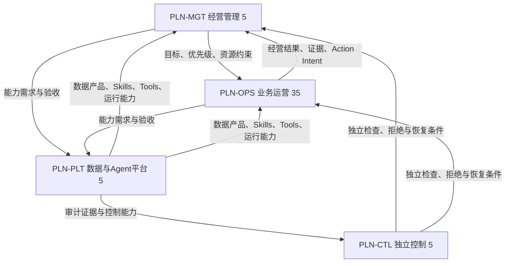

# AI组织变革 · 经营侧（需求侧）组织模型精确抽取

> 用途：作为 `paper2skills` 论文→算法卡 库存与本组织模型的 **join 输入**。
> 唯一事实源：`/Users/lute/project/AI组织变革/`。抽取时间：本次会话。
> 口径声明：本文所有数字与名单均逐条从源文件读出，未做归一化或去重合并；源文件之间的不一致单列于 [§H](#h-源文件之间的不一致已核验)。

来源文件：

- `docs/05-agents/role-catalog.json`
- `docs/04-organization/AI-ORGANIZATION-MAP.md`
- `docs/04-organization/organization-graph.json`
- `docs/03-scenarios/CATALOG.md`
- `docs/03-scenarios/FLOW-CATALOG.md`
- `docs/06-playbooks/PLAYBOOKS.md`
- `docs/07-orchestration/COLLABORATION-GRAPH.md`
- `docs/07-orchestration/collaboration-graph.json`
- `docs/05-agents/EXISTING-AGENT-CONSOLIDATION.md`
- `docs/10-platform/deepseek-harness/CAPABILITY-MATRIX.md`

---

## A. 岗位 × 责任名 全表（50 岗位 / 151 责任名）

`role-catalog.json` 声明 `role_count = 50`；逐条读出的 `roles` 数组长度 **50**；`skills` 数组条目合计 **151**；去重后 **151**（无重名，故 151 条 责任名 与 151 个唯一名一一对应）。

`skills` 不是「一岗位一个责任名」：每个岗位有 2–4 个 `skills` 条目，全部 151 条互不重名，即 151 个 责任名 全表。`group` 取自 role-catalog 的 `group` 字段（8 个责任域）。

| AGT | group | alias | title | 责任名（skills，全部列出） | 核心交付（artifact） | metrics | flows | scenarios | playbooks |
| --- | --- | --- | --- | --- | --- | --- | --- | --- | --- |
| AGT-001 | 经营与组织 | 衡远 | 经营目标与资源统筹 | 经营目标拆解、资源情景比较、月度经营复盘 | 目标与资源决策包 | 目标执行偏差与决策等待 | FLOW-02、FLOW-08 | SCN-001、SCN-017、SCN-019 | PB-002、PB-008 |
| AGT-002 | 经营与组织 | 枢衡 | 场景自主编排与异常协调 | 需求分诊、能力匹配、依赖协调、异常冻结与恢复 | 场景规则、装配决策依据、Case状态与自治异常分析 | 未归属Case数、装配错误率、阶段返工率与异常闭环时间 | FLOW-01、FLOW-02、FLOW-03、FLOW-04、FLOW-05、FLOW-06、FLOW-07、FLOW-08 | SCN-001、SCN-002、SCN-003、SCN-004、SCN-005、SCN-006、SCN-007、SCN-008、SCN-009、SCN-010、SCN-011、SCN-012、SCN-013、SCN-014、SCN-015、SCN-016、SCN-017、SCN-018、SCN-019、SCN-020 | PB-001、PB-002、PB-003、PB-004、PB-005、PB-006、PB-007、PB-008 |
| AGT-003 | 经营与组织 | 明镜 | 经营分析与决策支持 | GMV归因分析、经营预测、情景模拟 | 带来源的经营分析包 | 口径一致性与预测偏差 | FLOW-01、FLOW-06、FLOW-08 | SCN-001、SCN-016 | PB-001、PB-006、PB-008 |
| AGT-004 | 经营与组织 | 知人 | 组织能力与人事行政 | 岗位能力分析、培训与招聘支持、人事行政流程 | 能力矩阵与组织调整建议 | 能力缺口闭合与服务时效 | FLOW-08 | SCN-019 | PB-008 |
| AGT-005 | 经营与组织 | 守衡 | 内控审计与独立复核 | 抽样审计、证据复核、利益冲突检查 | 复核结论与整改清单 | 缺陷发现、漏检与整改完成 | FLOW-07、FLOW-08 | SCN-001、SCN-016、SCN-019 | PB-007、PB-008 |
| AGT-006 | 产品与创新 | 听澜 | 消费者需求与VOC研究 | 用户访谈分析、需求分群、VOC编码 | 需求证据与问题地图 | 可验证需求质量与覆盖 | FLOW-02、FLOW-05 | SCN-002、SCN-003 | PB-002、PB-005 |
| AGT-007 | 产品与创新 | 望野 | 市场竞争与机会研究 | 竞品研究、趋势监测、市场机会评估 | 机会证据包与反证 | 信号到验证速度 | FLOW-02、FLOW-04 | SCN-002、SCN-003 | PB-002、PB-004 |
| AGT-008 | 产品与创新 | 拓新 | 产品组合与新品孵化 | 组合取舍、实验组合、阶段投资建议 | 新品组合与继续停止建议 | 验证周期与被验证机会 | FLOW-02、FLOW-08 | SCN-002、SCN-003、SCN-004 | PB-002、PB-008 |
| AGT-009 | 产品与创新 | 定形 | 产品定义与商业立项 | 产品需求定义、商业案例、产品范围管理 | 产品定义与立项包 | 需求到验证的闭合率 | FLOW-02、FLOW-04 | SCN-003、SCN-004 | PB-002、PB-004 |
| AGT-010 | 产品与创新 | 映物 | 工业设计与用户体验 | 使用旅程、工业设计简报、可用性验证 | 设计方案与体验验证计划 | 可用性问题闭合 | FLOW-02 | SCN-004、SCN-013 | PB-002 |
| AGT-011 | 产品与创新 | 砺器 | 硬件结构与材料工程 | 工程需求审查、BOM与材料分析、可制造性分析 | 技术风险与工程验证清单 | 技术风险消除与返工 | FLOW-02、FLOW-07 | SCN-004、SCN-006 | PB-002、PB-007 |
| AGT-012 | 产品与创新 | 灵枢 | 软件算法与应用生态 | 软件需求分析、算法评估设计、应用生态规划 | 软件方案与验证证据 | 用户任务成功与软件质量 | FLOW-02、FLOW-07 | SCN-004、SCN-013、SCN-020 | PB-002、PB-007 |
| AGT-013 | 产品与创新 | 求证 | 产品验证与研发项目 | 研发计划、测试方案、阶段验证 | 验证报告与缺陷闭合记录 | 验证完整性与项目等待 | FLOW-02、FLOW-07 | SCN-004、SCN-005 | PB-002、PB-007 |
| AGT-014 | 供应与履约 | 择源 | OEM供应商开发与协同 | 供应商评估、产能调查、OEM协作 | 供应商能力与风险档案 | 供给可靠性与验证质量 | FLOW-02、FLOW-03、FLOW-07 | SCN-006 | PB-002、PB-003、PB-007 |
| AGT-015 | 供应与履约 | 契约 | 采购与合同履约 | 采购比价、订单协调、履约跟踪 | 采购建议与交期异常记录 | 履约偏差与总采购成本 | FLOW-03 | SCN-006 | PB-003 |
| AGT-016 | 供应与履约 | 知量 | 需求预测与补货计划 | 需求预测、补货模拟、供需协调 | 补货方案与预测区间 | 缺货损失与预测偏差 | FLOW-01、FLOW-03 | SCN-007 | PB-001、PB-003 |
| AGT-017 | 供应与履约 | 衡仓 | 库存与商品生命周期 | 库存分层、生命周期分析、调拨清货建议 | 库存风险与处置方案 | 可售率、库龄与占用 | FLOW-01、FLOW-03、FLOW-07 | SCN-007、SCN-010 | PB-001、PB-003、PB-007 |
| AGT-018 | 供应与履约 | 质守 | 生产协同与质量控制 | 质量分析、生产异常协调、纠正预防措施 | 质量事件与纠正措施包 | 缺陷复发与处理时效 | FLOW-02、FLOW-03、FLOW-07 | SCN-004、SCN-006、SCN-015 | PB-002、PB-003、PB-007 |
| AGT-019 | 供应与履约 | 通途 | 跨境物流与关务 | 物流方案、关务资料检查、到货异常追踪 | 运输方案与异常处置建议 | 到货偏差与物流成本 | FLOW-03、FLOW-04 | SCN-008 | PB-003、PB-004 |
| AGT-020 | 供应与履约 | 行舟 | 仓储履约与退货处置 | 履约异常、退货分流、仓储协作 | 履约与退货处置记录 | 交付时效与退货处理周期 | FLOW-03、FLOW-05、FLOW-07 | SCN-008、SCN-014、SCN-015 | PB-003、PB-005、PB-007 |
| AGT-021 | 渠道经营 | 北辰 | Amazon业务经营 | 渠道经营分析、行动组合、经营复盘 | Amazon场景行动包 | 范围内GMV与约束满足 | FLOW-01、FLOW-02、FLOW-03、FLOW-04、FLOW-06、FLOW-07、FLOW-08 | SCN-001、SCN-009、SCN-010、SCN-011、SCN-018 | PB-001、PB-002、PB-003、PB-004、PB-006、PB-007、PB-008 |
| AGT-022 | 渠道经营 | 觅位 | Amazon商品与搜索运营 | 商品诊断、搜索意图分析、Listing优化 | 商品与搜索优化包 | 有效流量、转化与内容质量 | FLOW-01、FLOW-04 | SCN-009、SCN-018 | PB-001、PB-004 |
| AGT-023 | 渠道经营 | 自航 | 独立站经营与转化 | 漏斗诊断、站点运营、转化优化 | 独立站经营与实验包 | 站点GMV、转化与客户质量 | FLOW-01、FLOW-04、FLOW-05、FLOW-06 | SCN-009、SCN-010、SCN-013 | PB-001、PB-004、PB-005、PB-006 |
| AGT-024 | 渠道经营 | 拓域 | 其他平台与新市场经营 | 渠道研究、市场进入、平台运营 | 新渠道进入与验证方案 | 已验证渠道GMV与试错成本 | FLOW-01、FLOW-02、FLOW-04 | SCN-009、SCN-012、SCN-018 | PB-001、PB-002、PB-004 |
| AGT-025 | 渠道经营 | 联商 | 零售渠道与B2B拓展 | 线索评估、渠道方案、商务交付协调 | 渠道机会与合作建议 | 有效渠道贡献与履约 | FLOW-01、FLOW-04 | SCN-012、SCN-014、SCN-016 | PB-001、PB-004 |
| AGT-026 | 渠道经营 | 衡价 | 定价促销与商品组合 | 价格敏感性、促销规划、组合设计 | 价格与促销决策包 | 增量GMV和经营约束 | FLOW-01、FLOW-03 | SCN-010 | PB-001、PB-003 |
| AGT-027 | 渠道经营 | 守店 | 店铺账号健康与规则 | 账号诊断、规则监测、申诉材料准备 | 账号健康与处置建议 | 有效售卖时间和问题闭合 | FLOW-01、FLOW-04、FLOW-07 | SCN-018 | PB-001、PB-004、PB-007 |
| AGT-028 | 渠道经营 | 译境 | 本地化与市场适配 | 本地化、市场语境审查、术语治理 | 本地化内容与差异清单 | 语言质量与当地理解 | FLOW-01、FLOW-02、FLOW-04、FLOW-05 | SCN-005、SCN-009、SCN-012 | PB-001、PB-002、PB-004、PB-005 |
| AGT-029 | 品牌与增长 | 立言 | 品牌战略与传播 | 品牌定位、传播规划、品牌反馈 | 品牌原则与传播方案 | 品牌需求信号与承诺一致性 | FLOW-02、FLOW-04、FLOW-05、FLOW-07、FLOW-08 | SCN-002、SCN-012 | PB-002、PB-004、PB-005、PB-007、PB-008 |
| AGT-030 | 品牌与增长 | 叙事 | 内容与创意策划 | 内容策划、创意简报、内容实验 | 内容方案与证据引用 | 内容有效性与事实准确 | FLOW-01、FLOW-02、FLOW-04 | SCN-009、SCN-012 | PB-001、PB-002、PB-004 |
| AGT-031 | 品牌与增长 | 绘影 | 视觉视频与素材生产 | 视觉简报、视频制作协作、素材版本管理 | 带版本的渠道素材包 | 素材交付时间与通过率 | FLOW-01、FLOW-02、FLOW-04 | SCN-009、SCN-012 | PB-001、PB-002、PB-004 |
| AGT-032 | 品牌与增长 | 点火 | 效果广告投放 | 投放诊断、预算分配、广告实验 | 广告行动与效果报告 | 增量GMV、消耗与缺货联动 | FLOW-01 | SCN-011 | PB-001 |
| AGT-033 | 品牌与增长 | 结伴 | 达人与联盟合作 | 达人筛选、联盟运营、合作复盘 | 合作候选与效果归因包 | 有效合作产出与全成本 | FLOW-02、FLOW-04 | SCN-012 | PB-002、PB-004 |
| AGT-034 | 品牌与增长 | 续缘 | CRM留存与复购 | 分群、生命周期触达、复购实验 | 用户经营计划与实验结果 | 复购GMV与退订投诉 | FLOW-05 | SCN-013、SCN-015 | PB-005 |
| AGT-035 | 品牌与增长 | 试真 | 增长实验与增量评估 | 实验设计、增量分析、因果局限审查 | 实验协议与继续停止结论 | 有效实验与可信增量 | FLOW-01、FLOW-02、FLOW-05、FLOW-08 | SCN-003、SCN-011、SCN-013 | PB-001、PB-002、PB-005、PB-008 |
| AGT-036 | 服务与体验 | 安心 | 售前服务与购买指导 | 产品问答、选购指导、需求识别 | 有依据的售前答复与线索 | 问题解决与购买体验 | FLOW-04、FLOW-05、FLOW-07 | SCN-015 | PB-004、PB-005、PB-007 |
| AGT-037 | 服务与体验 | 解忧 | 售后客诉与服务补救 | 客诉分诊、售后处理、服务补救 | 客诉工单与补救建议 | 解决周期、复发和客户反馈 | FLOW-05、FLOW-07 | SCN-014、SCN-015 | PB-005、PB-007 |
| AGT-038 | 服务与体验 | 回声 | 体验洞察与质量反馈 | 客诉聚类、体验分析、改进验证 | 体验问题与根因假设 | 问题复发和改进闭合 | FLOW-02、FLOW-05、FLOW-07 | SCN-002、SCN-004、SCN-015 | PB-002、PB-005、PB-007 |
| AGT-039 | 服务与体验 | 同行 | 用户教育与会员社区 | 使用教育、会员活动、用户反馈 | 教育内容与服务反馈 | 使用问题减少与会员价值 | FLOW-02、FLOW-05 | SCN-012、SCN-013、SCN-015 | PB-002、PB-005 |
| AGT-040 | 财务与合规 | 清账 | GMV结算与会计对账 | 渠道对账、收入与费用核对、差异追踪 | 对账表与差异处理包 | 未解释差异和关账时效 | FLOW-01、FLOW-03、FLOW-05、FLOW-06、FLOW-08 | SCN-016 | PB-001、PB-003、PB-005、PB-006、PB-008 |
| AGT-041 | 财务与合规 | 守金 | 经营财务与资金 | 资金预测、经营预算、经济性分析 | 现金与资源约束方案 | 资金预测偏差和约束满足 | FLOW-01、FLOW-02、FLOW-03、FLOW-07、FLOW-08 | SCN-001、SCN-016、SCN-017 | PB-001、PB-002、PB-003、PB-007、PB-008 |
| AGT-042 | 财务与合规 | 合账 | 税务与跨境实体协作 | 税务资料、实体口径核对、申报协作 | 税务与实体事项清单 | 资料完整和事项及时完成 | FLOW-03、FLOW-04、FLOW-08 | SCN-005、SCN-016、SCN-017 | PB-003、PB-004、PB-008 |
| AGT-043 | 财务与合规 | 律衡 | 法务与知识产权 | 合同审查支持、知识产权检索、争议证据组织 | 法律风险与处理建议 | 问题发现与关闭 | FLOW-02、FLOW-04、FLOW-07、FLOW-08 | SCN-003、SCN-005、SCN-006、SCN-012 | PB-002、PB-004、PB-007、PB-008 |
| AGT-044 | 财务与合规 | 安界 | 产品合规与隐私 | 产品准入核对、宣称审查、隐私需求分析 | 合规矩阵与证据缺口 | 覆盖完整性与违规阻断 | FLOW-02、FLOW-04、FLOW-05、FLOW-06、FLOW-07 | SCN-004、SCN-005、SCN-009 | PB-002、PB-004、PB-005、PB-006、PB-007 |
| AGT-045 | 数据与AI运行 | 同尺 | 业务口径与主数据 | 指标契约、账号商品映射、主数据治理 | 数据口径与对象关系契约 | 口径冲突、映射覆盖和质量 | FLOW-01、FLOW-06、FLOW-08 | SCN-001、SCN-016、SCN-020 | PB-001、PB-006、PB-008 |
| AGT-046 | 数据与AI运行 | 清源 | 数据工程与质量 | 数据质量、数据管道、溯源监测 | 带质量状态的数据产物 | 新鲜度、完整性与故障恢复 | FLOW-06 | SCN-020 | PB-006 |
| AGT-047 | 数据与AI运行 | 接桥 | 系统集成与业务工具 | 接口契约、业务工具实现、集成验证 | 工具能力与验收包 | 需求到验收时间和复用率 | FLOW-06 | SCN-020 | PB-006 |
| AGT-048 | 数据与AI运行 | 积知 | 知识技能与Playbook治理 | 知识溯源、技能版本、Playbook评估 | 能力版本与评估记录 | 复用效果和过期知识控制 | FLOW-02、FLOW-06、FLOW-08 | SCN-004、SCN-019、SCN-020 | PB-002、PB-006、PB-008 |
| AGT-049 | 数据与AI运行 | 稳行 | Agent平台与可靠运行 | 运行监测、容量管理、失败恢复 | 运行状态与恢复证据 | 任务成功、接管与实际运行成本 | FLOW-06、FLOW-08 | SCN-020 | PB-006、PB-008 |
| AGT-050 | 数据与AI运行 | 门卫 | 信息安全与权限 | 访问控制、授权审查、安全事件处理 | 权限矩阵与访问证据 | 越权拒绝与授权漂移 | FLOW-04、FLOW-06、FLOW-07、FLOW-08 | SCN-018、SCN-020 | PB-004、PB-006、PB-007、PB-008 |

**每岗位责任名条数统计**（供切分粒度核对）：

| 条数 | 岗位 |
| --- | --- |
| 3 条 | AGT-001、AGT-003、AGT-004、AGT-005、AGT-006、AGT-007、AGT-008、AGT-009、AGT-010、AGT-011、AGT-012、AGT-013、AGT-014、AGT-015、AGT-016、AGT-017、AGT-018、AGT-019、AGT-020、AGT-021、AGT-022、AGT-023、AGT-024、AGT-025、AGT-026、AGT-027、AGT-028、AGT-029、AGT-030、AGT-031、AGT-032、AGT-033、AGT-034、AGT-035、AGT-036、AGT-037、AGT-038、AGT-039、AGT-040、AGT-041、AGT-042、AGT-043、AGT-044、AGT-045、AGT-046、AGT-047、AGT-048、AGT-049、AGT-050 |
| 4 条 | AGT-002 |

**责任域（group）分布**：

| 责任域 | 岗位数 | 岗位 |
| --- | --- | --- |
| 经营与组织 | 5 | AGT-001、AGT-002、AGT-003、AGT-004、AGT-005 |
| 产品与创新 | 8 | AGT-006、AGT-007、AGT-008、AGT-009、AGT-010、AGT-011、AGT-012、AGT-013 |
| 供应与履约 | 7 | AGT-014、AGT-015、AGT-016、AGT-017、AGT-018、AGT-019、AGT-020 |
| 渠道经营 | 8 | AGT-021、AGT-022、AGT-023、AGT-024、AGT-025、AGT-026、AGT-027、AGT-028 |
| 品牌与增长 | 7 | AGT-029、AGT-030、AGT-031、AGT-032、AGT-033、AGT-034、AGT-035 |
| 服务与体验 | 4 | AGT-036、AGT-037、AGT-038、AGT-039 |
| 财务与合规 | 5 | AGT-040、AGT-041、AGT-042、AGT-043、AGT-044 |
| 数据与AI运行 | 6 | AGT-045、AGT-046、AGT-047、AGT-048、AGT-049、AGT-050 |

---

## B. 四平面（Plane）与 8 责任域的关系

### B.1 四个平面

| plane_id | name | purpose | role_count | role_ids |
| --- | --- | --- | --- | --- |
| PLN-MGT | 经营管理 | 目标、优先级、资源约束、经营判断与组织能力 | 5 | AGT-001、AGT-002、AGT-003、AGT-004、AGT-041 |
| PLN-OPS | 业务运营 | 产品、供应、渠道、增长、服务和GMV事实闭环 | 35 | AGT-006、AGT-007、AGT-008、AGT-009、AGT-010、AGT-011、AGT-012、AGT-013、AGT-014、AGT-015、AGT-016、AGT-017、AGT-018、AGT-019、AGT-020、AGT-021、AGT-022、AGT-023、AGT-024、AGT-025、AGT-026、AGT-027、AGT-028、AGT-029、AGT-030、AGT-031、AGT-032、AGT-033、AGT-034、AGT-035、AGT-036、AGT-037、AGT-038、AGT-039、AGT-040 |
| PLN-CTL | 独立控制 | 审计、税务、法务、产品合规、隐私、安全与权限边界 | 5 | AGT-005、AGT-042、AGT-043、AGT-044、AGT-050 |
| PLN-PLT | 数据与Agent平台 | 数据口径、质量、集成工具、Skills、Memory、Model与可靠性 | 5 | AGT-045、AGT-046、AGT-047、AGT-048、AGT-049 |

四平面 `role_count` 合计 = 50；并集去重 = 50；无重叠、无遗漏（覆盖 AGT-001..AGT-050 全体）。

`organization-graph.json` 的组织邻接（`edges`，100 条，非授权边）：

### B.2 8 责任域（第二视角 / domain_view）

| domain_view_id | name | role_count | role_ids |
| --- | --- | --- | --- |
| DOM-01 | 经营与组织 | 5 | AGT-001、AGT-002、AGT-003、AGT-004、AGT-005 |
| DOM-02 | 产品与创新 | 8 | AGT-006、AGT-007、AGT-008、AGT-009、AGT-010、AGT-011、AGT-012、AGT-013 |
| DOM-03 | 供应与履约 | 7 | AGT-014、AGT-015、AGT-016、AGT-017、AGT-018、AGT-019、AGT-020 |
| DOM-04 | 渠道经营 | 8 | AGT-021、AGT-022、AGT-023、AGT-024、AGT-025、AGT-026、AGT-027、AGT-028 |
| DOM-05 | 品牌与增长 | 7 | AGT-029、AGT-030、AGT-031、AGT-032、AGT-033、AGT-034、AGT-035 |
| DOM-06 | 服务与体验 | 4 | AGT-036、AGT-037、AGT-038、AGT-039 |
| DOM-07 | 财务与合规 | 5 | AGT-040、AGT-041、AGT-042、AGT-043、AGT-044 |
| DOM-08 | 数据与AI运行 | 6 | AGT-045、AGT-046、AGT-047、AGT-048、AGT-049、AGT-050 |

### B.3 责任域（8）与平面（4）如何关联

两者是**正交的两个视角**，不是层级关系：

1. **四平面 = 第一视角**，回答「岗位在经营系统中承担什么**性质**的责任」（经营决策 / 业务交付 / 独立控制 / 平台供给）。用于网站与治理。
2. **8 责任域 = 第二视角**，回答「岗位具备什么**业务专业能力**」。来自 v1.1，作为 `domain_view` 被 v2.0 继承（`semantics.domain_view = "An orthogonal business capability classification inherited from v1.1"`）。
3. **一个岗位恰好属于 1 个平面 + 1 个责任域**。`role-catalog.json` 只携带 `group`（=责任域），平面归属只存在于 `organization-graph.json` 的 `roles[].plane_id`。**join 时必须以 `organization-graph.json` 为准补 `plane_id`，不能从 `group` 推导平面。**
4. **两个视角刻意错位**，源文件给出两个例子：
   - `AGT-050`（信息安全与权限）：责任域 = 数据与AI运行，平面 = **独立控制**（避免信息安全成为平台交付团队的自我验收）。
   - `AGT-040`（GMV结算与会计对账）：责任域 = 财务与合规，平面 = **业务运营**（其交付是 GMV 结算与日常对账事实）。
5. 因此**交错发生在 财务与合规 域**：该域 5 个岗位里，AGT-040 落在 PLN-OPS、AGT-041 落在 PLN-MGT、AGT-042/043/044 落在 PLN-CTL。同理 经营与组织 域的 AGT-001..004 落 PLN-MGT，而 AGT-005 落 PLN-CTL。

**岗位级平面归属全表**（源：`organization-graph.json/roles`）：

| AGT | plane_id | plane | domain_view_id | 责任域 |
| --- | --- | --- | --- | --- |
| AGT-001 | PLN-MGT | 经营管理 | DOM-01 | 经营与组织 |
| AGT-002 | PLN-MGT | 经营管理 | DOM-01 | 经营与组织 |
| AGT-003 | PLN-MGT | 经营管理 | DOM-01 | 经营与组织 |
| AGT-004 | PLN-MGT | 经营管理 | DOM-01 | 经营与组织 |
| AGT-005 | PLN-CTL | 独立控制 | DOM-01 | 经营与组织 |
| AGT-006 | PLN-OPS | 业务运营 | DOM-02 | 产品与创新 |
| AGT-007 | PLN-OPS | 业务运营 | DOM-02 | 产品与创新 |
| AGT-008 | PLN-OPS | 业务运营 | DOM-02 | 产品与创新 |
| AGT-009 | PLN-OPS | 业务运营 | DOM-02 | 产品与创新 |
| AGT-010 | PLN-OPS | 业务运营 | DOM-02 | 产品与创新 |
| AGT-011 | PLN-OPS | 业务运营 | DOM-02 | 产品与创新 |
| AGT-012 | PLN-OPS | 业务运营 | DOM-02 | 产品与创新 |
| AGT-013 | PLN-OPS | 业务运营 | DOM-02 | 产品与创新 |
| AGT-014 | PLN-OPS | 业务运营 | DOM-03 | 供应与履约 |
| AGT-015 | PLN-OPS | 业务运营 | DOM-03 | 供应与履约 |
| AGT-016 | PLN-OPS | 业务运营 | DOM-03 | 供应与履约 |
| AGT-017 | PLN-OPS | 业务运营 | DOM-03 | 供应与履约 |
| AGT-018 | PLN-OPS | 业务运营 | DOM-03 | 供应与履约 |
| AGT-019 | PLN-OPS | 业务运营 | DOM-03 | 供应与履约 |
| AGT-020 | PLN-OPS | 业务运营 | DOM-03 | 供应与履约 |
| AGT-021 | PLN-OPS | 业务运营 | DOM-04 | 渠道经营 |
| AGT-022 | PLN-OPS | 业务运营 | DOM-04 | 渠道经营 |
| AGT-023 | PLN-OPS | 业务运营 | DOM-04 | 渠道经营 |
| AGT-024 | PLN-OPS | 业务运营 | DOM-04 | 渠道经营 |
| AGT-025 | PLN-OPS | 业务运营 | DOM-04 | 渠道经营 |
| AGT-026 | PLN-OPS | 业务运营 | DOM-04 | 渠道经营 |
| AGT-027 | PLN-OPS | 业务运营 | DOM-04 | 渠道经营 |
| AGT-028 | PLN-OPS | 业务运营 | DOM-04 | 渠道经营 |
| AGT-029 | PLN-OPS | 业务运营 | DOM-05 | 品牌与增长 |
| AGT-030 | PLN-OPS | 业务运营 | DOM-05 | 品牌与增长 |
| AGT-031 | PLN-OPS | 业务运营 | DOM-05 | 品牌与增长 |
| AGT-032 | PLN-OPS | 业务运营 | DOM-05 | 品牌与增长 |
| AGT-033 | PLN-OPS | 业务运营 | DOM-05 | 品牌与增长 |
| AGT-034 | PLN-OPS | 业务运营 | DOM-05 | 品牌与增长 |
| AGT-035 | PLN-OPS | 业务运营 | DOM-05 | 品牌与增长 |
| AGT-036 | PLN-OPS | 业务运营 | DOM-06 | 服务与体验 |
| AGT-037 | PLN-OPS | 业务运营 | DOM-06 | 服务与体验 |
| AGT-038 | PLN-OPS | 业务运营 | DOM-06 | 服务与体验 |
| AGT-039 | PLN-OPS | 业务运营 | DOM-06 | 服务与体验 |
| AGT-040 | PLN-OPS | 业务运营 | DOM-07 | 财务与合规 |
| AGT-041 | PLN-MGT | 经营管理 | DOM-07 | 财务与合规 |
| AGT-042 | PLN-CTL | 独立控制 | DOM-07 | 财务与合规 |
| AGT-043 | PLN-CTL | 独立控制 | DOM-07 | 财务与合规 |
| AGT-044 | PLN-CTL | 独立控制 | DOM-07 | 财务与合规 |
| AGT-045 | PLN-PLT | 数据与Agent平台 | DOM-08 | 数据与AI运行 |
| AGT-046 | PLN-PLT | 数据与Agent平台 | DOM-08 | 数据与AI运行 |
| AGT-047 | PLN-PLT | 数据与Agent平台 | DOM-08 | 数据与AI运行 |
| AGT-048 | PLN-PLT | 数据与Agent平台 | DOM-08 | 数据与AI运行 |
| AGT-049 | PLN-PLT | 数据与Agent平台 | DOM-08 | 数据与AI运行 |
| AGT-050 | PLN-CTL | 独立控制 | DOM-08 | 数据与AI运行 |

---

## C. 场景层（20 个 SCN）

### C.1 20 个场景与其闭环观察结果

`闭环观察结果` 取自 `CATALOG.md` 的「闭环应观察的结果」列；`collaboration-graph.json/scenarios[].expected_result` 与之逐字一致（已核验）。

| SCN | 候选场景 | 闭环应观察的结果 | 可选价值流（eligible_flow_ids） | 绑定该场景的岗位数 | status |
| --- | --- | --- | --- | --- | --- |
| SCN-001 | 经营目标、预算与资源分配 | 目标分解后有执行、复盘与资源调整 | FLOW-01、FLOW-06、FLOW-08 | 7 | candidate_business_catalog_unvalidated |
| SCN-002 | 市场、竞品与用户需求发现 | 信号转为有依据的机会判断 | FLOW-02、FLOW-04、FLOW-05 | 6 | candidate_business_catalog_unvalidated |
| SCN-003 | 产品机会评估与立项 | 商业假设、风险与投资选择有结论 | FLOW-02、FLOW-08 | 7 | candidate_business_catalog_unvalidated |
| SCN-004 | 产品定义、开发与质量 | 产品满足要求并反馈真实质量问题 | FLOW-02、FLOW-07 | 11 | candidate_business_catalog_unvalidated |
| SCN-005 | 产品及市场准入、知识产权 | 有依据地决定可以销售的对象和市场 | FLOW-02、FLOW-04、FLOW-07 | 6 | candidate_business_catalog_unvalidated |
| SCN-006 | 供应商、采购与生产协作 | 采购承诺与质量、成本、交期结果闭环 | FLOW-02、FLOW-03、FLOW-07 | 6 | candidate_business_catalog_unvalidated |
| SCN-007 | 需求预测、补货与库存调拨 | 库存可用性与占用资金共同受控 | FLOW-01、FLOW-03 | 3 | candidate_business_catalog_unvalidated |
| SCN-008 | 跨境运输与仓储履约 | 货物到达、异常处理与成本可追踪 | FLOW-03、FLOW-04 | 3 | candidate_business_catalog_unvalidated |
| SCN-009 | 商品内容、本地化与上架 | 正确内容发布并反馈转化和问题 | FLOW-01、FLOW-02、FLOW-04 | 9 | candidate_business_catalog_unvalidated |
| SCN-010 | 定价、促销与利润管理 | 价格动作对应销量、贡献和库存结果 | FLOW-01、FLOW-03 | 5 | candidate_business_catalog_unvalidated |
| SCN-011 | 广告投放与预算调整 | 投放动作对应可解释的增量经营结果 | FLOW-01 | 4 | candidate_business_catalog_unvalidated |
| SCN-012 | 品牌内容、站外营销与活动 | 内容与活动反馈经营或品牌目标 | FLOW-02、FLOW-04、FLOW-05 | 10 | candidate_business_catalog_unvalidated |
| SCN-013 | 独立站体验、转化与复购 | 问题识别、改进、实验与效果判断闭环 | FLOW-01、FLOW-02、FLOW-05 | 7 | candidate_business_catalog_unvalidated |
| SCN-014 | 订单、交付与渠道异常 | 异常被定位、处理并反馈原因 | FLOW-03、FLOW-04、FLOW-05、FLOW-07 | 4 | candidate_business_catalog_unvalidated |
| SCN-015 | 客服、退换货、评价与客诉 | 客户问题解决并反馈产品和运营 | FLOW-05、FLOW-07 | 8 | candidate_business_catalog_unvalidated |
| SCN-016 | 渠道结算、对账与财务经营 | 回款、差异、费用与经营损益可解释 | FLOW-01、FLOW-03、FLOW-05、FLOW-06、FLOW-08 | 8 | candidate_business_catalog_unvalidated |
| SCN-017 | 现金、汇率与资金安排 | 资金需求与经授权动作相符 | FLOW-03、FLOW-08 | 4 | candidate_business_catalog_unvalidated |
| SCN-018 | 店铺账号健康与渠道规则变化 | 风险信号得到核实、处置和复盘 | FLOW-01、FLOW-04、FLOW-07 | 6 | candidate_business_catalog_unvalidated |
| SCN-019 | 组织、人员与绩效改进 | 职责、能力、负荷与经营结果相符 | FLOW-08 | 5 | candidate_business_catalog_unvalidated |
| SCN-020 | 数据质量、知识、系统与 AI 运行 | 关键依赖可用，错误可发现和恢复 | FLOW-06、FLOW-08 | 8 | candidate_business_catalog_unvalidated |

### C.2 每个 SCN 绑定的 FLOW 与岗位

说明：岗位↔场景的绑定有两套口径，**必须区分**——

- **直连口径**：`role-catalog.json` 每个岗位的 `scenarios` 字段（显式声明，合计 118 条岗位-场景对）。
- **经流程口径**：岗位的 `flows` 中任一条 FLOW 的 `scenario_ids` 含该 SCN（传递闭包，合计 927 条岗位-流程-场景对）。

下表两列都给，避免下游误用。

| SCN | 标题 | 可选 FLOW | 直连岗位（role.scenarios） | 经流程可达岗位（flows→scenario_ids） |
| --- | --- | --- | --- | --- |
| SCN-001 | 经营目标、预算与资源分配 | FLOW-01、FLOW-06、FLOW-08 | AGT-001、AGT-002、AGT-003、AGT-005、AGT-021、AGT-041、AGT-045 | AGT-001、AGT-002、AGT-003、AGT-004、AGT-005、AGT-008、AGT-016、AGT-017、AGT-021、AGT-022、AGT-023、AGT-024、AGT-025、AGT-026、AGT-027、AGT-028、AGT-029、AGT-030、AGT-031、AGT-032、AGT-035、AGT-040、AGT-041、AGT-042、AGT-043、AGT-044、AGT-045、AGT-046、AGT-047、AGT-048、AGT-049、AGT-050 |
| SCN-002 | 市场、竞品与用户需求发现 | FLOW-02、FLOW-04、FLOW-05 | AGT-002、AGT-006、AGT-007、AGT-008、AGT-029、AGT-038 | AGT-001、AGT-002、AGT-006、AGT-007、AGT-008、AGT-009、AGT-010、AGT-011、AGT-012、AGT-013、AGT-014、AGT-018、AGT-019、AGT-020、AGT-021、AGT-022、AGT-023、AGT-024、AGT-025、AGT-027、AGT-028、AGT-029、AGT-030、AGT-031、AGT-033、AGT-034、AGT-035、AGT-036、AGT-037、AGT-038、AGT-039、AGT-040、AGT-041、AGT-042、AGT-043、AGT-044、AGT-048、AGT-050 |
| SCN-003 | 产品机会评估与立项 | FLOW-02、FLOW-08 | AGT-002、AGT-006、AGT-007、AGT-008、AGT-009、AGT-035、AGT-043 | AGT-001、AGT-002、AGT-003、AGT-004、AGT-005、AGT-006、AGT-007、AGT-008、AGT-009、AGT-010、AGT-011、AGT-012、AGT-013、AGT-014、AGT-018、AGT-021、AGT-024、AGT-028、AGT-029、AGT-030、AGT-031、AGT-033、AGT-035、AGT-038、AGT-039、AGT-040、AGT-041、AGT-042、AGT-043、AGT-044、AGT-045、AGT-048、AGT-049、AGT-050 |
| SCN-004 | 产品定义、开发与质量 | FLOW-02、FLOW-07 | AGT-002、AGT-008、AGT-009、AGT-010、AGT-011、AGT-012、AGT-013、AGT-018、AGT-038、AGT-044、AGT-048 | AGT-001、AGT-002、AGT-005、AGT-006、AGT-007、AGT-008、AGT-009、AGT-010、AGT-011、AGT-012、AGT-013、AGT-014、AGT-017、AGT-018、AGT-020、AGT-021、AGT-024、AGT-027、AGT-028、AGT-029、AGT-030、AGT-031、AGT-033、AGT-035、AGT-036、AGT-037、AGT-038、AGT-039、AGT-041、AGT-043、AGT-044、AGT-048、AGT-050 |
| SCN-005 | 产品及市场准入、知识产权 | FLOW-02、FLOW-04、FLOW-07 | AGT-002、AGT-013、AGT-028、AGT-042、AGT-043、AGT-044 | AGT-001、AGT-002、AGT-005、AGT-006、AGT-007、AGT-008、AGT-009、AGT-010、AGT-011、AGT-012、AGT-013、AGT-014、AGT-017、AGT-018、AGT-019、AGT-020、AGT-021、AGT-022、AGT-023、AGT-024、AGT-025、AGT-027、AGT-028、AGT-029、AGT-030、AGT-031、AGT-033、AGT-035、AGT-036、AGT-037、AGT-038、AGT-039、AGT-041、AGT-042、AGT-043、AGT-044、AGT-048、AGT-050 |
| SCN-006 | 供应商、采购与生产协作 | FLOW-02、FLOW-03、FLOW-07 | AGT-002、AGT-011、AGT-014、AGT-015、AGT-018、AGT-043 | AGT-001、AGT-002、AGT-005、AGT-006、AGT-007、AGT-008、AGT-009、AGT-010、AGT-011、AGT-012、AGT-013、AGT-014、AGT-015、AGT-016、AGT-017、AGT-018、AGT-019、AGT-020、AGT-021、AGT-024、AGT-026、AGT-027、AGT-028、AGT-029、AGT-030、AGT-031、AGT-033、AGT-035、AGT-036、AGT-037、AGT-038、AGT-039、AGT-040、AGT-041、AGT-042、AGT-043、AGT-044、AGT-048、AGT-050 |
| SCN-007 | 需求预测、补货与库存调拨 | FLOW-01、FLOW-03 | AGT-002、AGT-016、AGT-017 | AGT-002、AGT-003、AGT-014、AGT-015、AGT-016、AGT-017、AGT-018、AGT-019、AGT-020、AGT-021、AGT-022、AGT-023、AGT-024、AGT-025、AGT-026、AGT-027、AGT-028、AGT-030、AGT-031、AGT-032、AGT-035、AGT-040、AGT-041、AGT-042、AGT-045 |
| SCN-008 | 跨境运输与仓储履约 | FLOW-03、FLOW-04 | AGT-002、AGT-019、AGT-020 | AGT-002、AGT-007、AGT-009、AGT-014、AGT-015、AGT-016、AGT-017、AGT-018、AGT-019、AGT-020、AGT-021、AGT-022、AGT-023、AGT-024、AGT-025、AGT-026、AGT-027、AGT-028、AGT-029、AGT-030、AGT-031、AGT-033、AGT-036、AGT-040、AGT-041、AGT-042、AGT-043、AGT-044、AGT-050 |
| SCN-009 | 商品内容、本地化与上架 | FLOW-01、FLOW-02、FLOW-04 | AGT-002、AGT-021、AGT-022、AGT-023、AGT-024、AGT-028、AGT-030、AGT-031、AGT-044 | AGT-001、AGT-002、AGT-003、AGT-006、AGT-007、AGT-008、AGT-009、AGT-010、AGT-011、AGT-012、AGT-013、AGT-014、AGT-016、AGT-017、AGT-018、AGT-019、AGT-021、AGT-022、AGT-023、AGT-024、AGT-025、AGT-026、AGT-027、AGT-028、AGT-029、AGT-030、AGT-031、AGT-032、AGT-033、AGT-035、AGT-036、AGT-038、AGT-039、AGT-040、AGT-041、AGT-042、AGT-043、AGT-044、AGT-045、AGT-048、AGT-050 |
| SCN-010 | 定价、促销与利润管理 | FLOW-01、FLOW-03 | AGT-002、AGT-017、AGT-021、AGT-023、AGT-026 | AGT-002、AGT-003、AGT-014、AGT-015、AGT-016、AGT-017、AGT-018、AGT-019、AGT-020、AGT-021、AGT-022、AGT-023、AGT-024、AGT-025、AGT-026、AGT-027、AGT-028、AGT-030、AGT-031、AGT-032、AGT-035、AGT-040、AGT-041、AGT-042、AGT-045 |
| SCN-011 | 广告投放与预算调整 | FLOW-01 | AGT-002、AGT-021、AGT-032、AGT-035 | AGT-002、AGT-003、AGT-016、AGT-017、AGT-021、AGT-022、AGT-023、AGT-024、AGT-025、AGT-026、AGT-027、AGT-028、AGT-030、AGT-031、AGT-032、AGT-035、AGT-040、AGT-041、AGT-045 |
| SCN-012 | 品牌内容、站外营销与活动 | FLOW-02、FLOW-04、FLOW-05 | AGT-002、AGT-024、AGT-025、AGT-028、AGT-029、AGT-030、AGT-031、AGT-033、AGT-039、AGT-043 | AGT-001、AGT-002、AGT-006、AGT-007、AGT-008、AGT-009、AGT-010、AGT-011、AGT-012、AGT-013、AGT-014、AGT-018、AGT-019、AGT-020、AGT-021、AGT-022、AGT-023、AGT-024、AGT-025、AGT-027、AGT-028、AGT-029、AGT-030、AGT-031、AGT-033、AGT-034、AGT-035、AGT-036、AGT-037、AGT-038、AGT-039、AGT-040、AGT-041、AGT-042、AGT-043、AGT-044、AGT-048、AGT-050 |
| SCN-013 | 独立站体验、转化与复购 | FLOW-01、FLOW-02、FLOW-05 | AGT-002、AGT-010、AGT-012、AGT-023、AGT-034、AGT-035、AGT-039 | AGT-001、AGT-002、AGT-003、AGT-006、AGT-007、AGT-008、AGT-009、AGT-010、AGT-011、AGT-012、AGT-013、AGT-014、AGT-016、AGT-017、AGT-018、AGT-020、AGT-021、AGT-022、AGT-023、AGT-024、AGT-025、AGT-026、AGT-027、AGT-028、AGT-029、AGT-030、AGT-031、AGT-032、AGT-033、AGT-034、AGT-035、AGT-036、AGT-037、AGT-038、AGT-039、AGT-040、AGT-041、AGT-043、AGT-044、AGT-045、AGT-048 |
| SCN-014 | 订单、交付与渠道异常 | FLOW-03、FLOW-04、FLOW-05、FLOW-07 | AGT-002、AGT-020、AGT-025、AGT-037 | AGT-002、AGT-005、AGT-006、AGT-007、AGT-009、AGT-011、AGT-012、AGT-013、AGT-014、AGT-015、AGT-016、AGT-017、AGT-018、AGT-019、AGT-020、AGT-021、AGT-022、AGT-023、AGT-024、AGT-025、AGT-026、AGT-027、AGT-028、AGT-029、AGT-030、AGT-031、AGT-033、AGT-034、AGT-035、AGT-036、AGT-037、AGT-038、AGT-039、AGT-040、AGT-041、AGT-042、AGT-043、AGT-044、AGT-050 |
| SCN-015 | 客服、退换货、评价与客诉 | FLOW-05、FLOW-07 | AGT-002、AGT-018、AGT-020、AGT-034、AGT-036、AGT-037、AGT-038、AGT-039 | AGT-002、AGT-005、AGT-006、AGT-011、AGT-012、AGT-013、AGT-014、AGT-017、AGT-018、AGT-020、AGT-021、AGT-023、AGT-027、AGT-028、AGT-029、AGT-034、AGT-035、AGT-036、AGT-037、AGT-038、AGT-039、AGT-040、AGT-041、AGT-043、AGT-044、AGT-050 |
| SCN-016 | 渠道结算、对账与财务经营 | FLOW-01、FLOW-03、FLOW-05、FLOW-06、FLOW-08 | AGT-002、AGT-003、AGT-005、AGT-025、AGT-040、AGT-041、AGT-042、AGT-045 | AGT-001、AGT-002、AGT-003、AGT-004、AGT-005、AGT-006、AGT-008、AGT-014、AGT-015、AGT-016、AGT-017、AGT-018、AGT-019、AGT-020、AGT-021、AGT-022、AGT-023、AGT-024、AGT-025、AGT-026、AGT-027、AGT-028、AGT-029、AGT-030、AGT-031、AGT-032、AGT-034、AGT-035、AGT-036、AGT-037、AGT-038、AGT-039、AGT-040、AGT-041、AGT-042、AGT-043、AGT-044、AGT-045、AGT-046、AGT-047、AGT-048、AGT-049、AGT-050 |
| SCN-017 | 现金、汇率与资金安排 | FLOW-03、FLOW-08 | AGT-001、AGT-002、AGT-041、AGT-042 | AGT-001、AGT-002、AGT-003、AGT-004、AGT-005、AGT-008、AGT-014、AGT-015、AGT-016、AGT-017、AGT-018、AGT-019、AGT-020、AGT-021、AGT-026、AGT-029、AGT-035、AGT-040、AGT-041、AGT-042、AGT-043、AGT-045、AGT-048、AGT-049、AGT-050 |
| SCN-018 | 店铺账号健康与渠道规则变化 | FLOW-01、FLOW-04、FLOW-07 | AGT-002、AGT-021、AGT-022、AGT-024、AGT-027、AGT-050 | AGT-002、AGT-003、AGT-005、AGT-007、AGT-009、AGT-011、AGT-012、AGT-013、AGT-014、AGT-016、AGT-017、AGT-018、AGT-019、AGT-020、AGT-021、AGT-022、AGT-023、AGT-024、AGT-025、AGT-026、AGT-027、AGT-028、AGT-029、AGT-030、AGT-031、AGT-032、AGT-033、AGT-035、AGT-036、AGT-037、AGT-038、AGT-040、AGT-041、AGT-042、AGT-043、AGT-044、AGT-045、AGT-050 |
| SCN-019 | 组织、人员与绩效改进 | FLOW-08 | AGT-001、AGT-002、AGT-004、AGT-005、AGT-048 | AGT-001、AGT-002、AGT-003、AGT-004、AGT-005、AGT-008、AGT-021、AGT-029、AGT-035、AGT-040、AGT-041、AGT-042、AGT-043、AGT-045、AGT-048、AGT-049、AGT-050 |
| SCN-020 | 数据质量、知识、系统与 AI 运行 | FLOW-06、FLOW-08 | AGT-002、AGT-012、AGT-045、AGT-046、AGT-047、AGT-048、AGT-049、AGT-050 | AGT-001、AGT-002、AGT-003、AGT-004、AGT-005、AGT-008、AGT-021、AGT-023、AGT-029、AGT-035、AGT-040、AGT-041、AGT-042、AGT-043、AGT-044、AGT-045、AGT-046、AGT-047、AGT-048、AGT-049、AGT-050 |

### C.3 51 条候选 FLOW×SCN 兼容关系（`flow_scenario_bindings`）

声明 51 条；`validation_rules` 亦要求 `exactly_51_candidate_flow_scenario_bindings`，已一致。

| FLOW | SCN 列表（条数） |
| --- | --- |
| FLOW-01 | SCN-001、SCN-007、SCN-009、SCN-010、SCN-011、SCN-013、SCN-016、SCN-018（8） |
| FLOW-02 | SCN-002、SCN-003、SCN-004、SCN-005、SCN-006、SCN-009、SCN-012、SCN-013（8） |
| FLOW-03 | SCN-006、SCN-007、SCN-008、SCN-010、SCN-014、SCN-016、SCN-017（7） |
| FLOW-04 | SCN-002、SCN-005、SCN-008、SCN-009、SCN-012、SCN-014、SCN-018（7） |
| FLOW-05 | SCN-002、SCN-012、SCN-013、SCN-014、SCN-015、SCN-016（6） |
| FLOW-06 | SCN-001、SCN-016、SCN-020（3） |
| FLOW-07 | SCN-004、SCN-005、SCN-006、SCN-014、SCN-015、SCN-018（6） |
| FLOW-08 | SCN-001、SCN-003、SCN-016、SCN-017、SCN-019、SCN-020（6） |

**反向（SCN → FLOW）**：

| SCN | FLOW |
| --- | --- |
| SCN-001 | FLOW-01、FLOW-06、FLOW-08 |
| SCN-002 | FLOW-02、FLOW-04、FLOW-05 |
| SCN-003 | FLOW-02、FLOW-08 |
| SCN-004 | FLOW-02、FLOW-07 |
| SCN-005 | FLOW-02、FLOW-04、FLOW-07 |
| SCN-006 | FLOW-02、FLOW-03、FLOW-07 |
| SCN-007 | FLOW-01、FLOW-03 |
| SCN-008 | FLOW-03、FLOW-04 |
| SCN-009 | FLOW-01、FLOW-02、FLOW-04 |
| SCN-010 | FLOW-01、FLOW-03 |
| SCN-011 | FLOW-01 |
| SCN-012 | FLOW-02、FLOW-04、FLOW-05 |
| SCN-013 | FLOW-01、FLOW-02、FLOW-05 |
| SCN-014 | FLOW-03、FLOW-04、FLOW-05、FLOW-07 |
| SCN-015 | FLOW-05、FLOW-07 |
| SCN-016 | FLOW-01、FLOW-03、FLOW-05、FLOW-06、FLOW-08 |
| SCN-017 | FLOW-03、FLOW-08 |
| SCN-018 | FLOW-01、FLOW-04、FLOW-07 |
| SCN-019 | FLOW-08 |
| SCN-020 | FLOW-06、FLOW-08 |

---

## D. 流程层（FLOW-01..08）与 Playbook 层（PB-001..008）

### D.1 FLOW 全表

| FLOW | 经营闭环 | 默认AI结果负责人 | 自治控制 | 完成条件 | 主岗位 selector | 业务场景（scenario_ids） | 能力贡献岗位（legacy_candidate_contributor_role_ids） |
| --- | --- | --- | --- | --- | --- | --- | --- |
| FLOW-01 | 存量GMV增长：投放、价格、库存联动 | AGT-021（Amazon默认；独立站AGT-023/其他平台AGT-024/B2B·零售AGT-025） | 场景动作策略、预算/库存校验、回执 | 在已确认范围内形成、执行和复核一份联合经营行动包 | SELECTOR-FLOW-01（amazon_scope→AGT-021; direct_to_consumer_scope→AGT-023; other_marketplace_scope→AGT-024; retail_or_b2b_scope→AGT-025；零/多匹配=WAIT；production_ready=False） | SCN-001、SCN-007、SCN-009、SCN-010、SCN-011、SCN-013、SCN-016、SCN-018 | AGT-002、AGT-003、AGT-016、AGT-017、AGT-021、AGT-022、AGT-023、AGT-024、AGT-025、AGT-026、AGT-027、AGT-028、AGT-030、AGT-031、AGT-032、AGT-035、AGT-040、AGT-041、AGT-045（19） |
| FLOW-02 | 新品：需求证据到商业验证 | AGT-008 | 假设/停止条件、外部验证回执、准入策略 | 得到有证据的继续、转向或停止结论 | SELECTOR-FLOW-02（default→AGT-008；零/多匹配=WAIT；production_ready=False） | SCN-002、SCN-003、SCN-004、SCN-005、SCN-006、SCN-009、SCN-012、SCN-013 | AGT-001、AGT-002、AGT-006、AGT-007、AGT-008、AGT-009、AGT-010、AGT-011、AGT-012、AGT-013、AGT-014、AGT-018、AGT-021、AGT-024、AGT-028、AGT-029、AGT-030、AGT-031、AGT-033、AGT-035、AGT-038、AGT-039、AGT-041、AGT-043、AGT-044、AGT-048（26） |
| FLOW-03 | 供需：补货、采购与交付 | AGT-016 | system-of-record、动作策略、幂等与到货回执 | 供应计划与实际到货、可售库存对齐 | SELECTOR-FLOW-03（default→AGT-016；零/多匹配=WAIT；production_ready=False） | SCN-006、SCN-007、SCN-008、SCN-010、SCN-014、SCN-016、SCN-017 | AGT-002、AGT-014、AGT-015、AGT-016、AGT-017、AGT-018、AGT-019、AGT-020、AGT-021、AGT-026、AGT-040、AGT-041、AGT-042（13） |
| FLOW-04 | 新市场、新渠道与合规上架 | AGT-024 | 市场/账号范围、准入策略、上线回执 | 在适用策略和履约条件下验证市场进入 | SELECTOR-FLOW-04（default→AGT-024；零/多匹配=WAIT；production_ready=False） | SCN-002、SCN-005、SCN-008、SCN-009、SCN-012、SCN-014、SCN-018 | AGT-002、AGT-007、AGT-009、AGT-019、AGT-021、AGT-022、AGT-023、AGT-024、AGT-025、AGT-027、AGT-028、AGT-029、AGT-030、AGT-031、AGT-033、AGT-036、AGT-042、AGT-043、AGT-044、AGT-050（20） |
| FLOW-05 | 客户旅程：服务、留存与复购 | AGT-034（生命周期默认；单一客诉AGT-037） | 客户数据范围、服务/触达策略、结果回执 | 客户问题被解决，并验证相关复购改善 | SELECTOR-FLOW-05（lifecycle_or_retention_scope→AGT-034; single_service_case→AGT-037；零/多匹配=WAIT；production_ready=False） | SCN-002、SCN-012、SCN-013、SCN-014、SCN-015、SCN-016 | AGT-002、AGT-006、AGT-020、AGT-023、AGT-028、AGT-029、AGT-034、AGT-035、AGT-036、AGT-037、AGT-038、AGT-039、AGT-040、AGT-044（14） |
| FLOW-06 | 需求到数据产品与业务工具 | AGT-047 | 数据契约、工具范围、运行/安全校验 | 口径、数据质量和工具闭环 | SELECTOR-FLOW-06（default→AGT-047；零/多匹配=WAIT；production_ready=False） | SCN-001、SCN-016、SCN-020 | AGT-002、AGT-003、AGT-021、AGT-023、AGT-040、AGT-044、AGT-045、AGT-046、AGT-047、AGT-048、AGT-049、AGT-050（12） |
| FLOW-07 | 质量和账号重大事件处理 | AGT-018（质量事件；账号事件AGT-027） | 隔离范围、质量/账号动作策略、恢复证据 | 事件范围、处置、根因和恢复证据闭合 | SELECTOR-FLOW-07（quality_incident→AGT-018; account_incident→AGT-027；零/多匹配=WAIT；production_ready=False） | SCN-004、SCN-005、SCN-006、SCN-014、SCN-015、SCN-018 | AGT-002、AGT-005、AGT-011、AGT-012、AGT-013、AGT-014、AGT-017、AGT-018、AGT-020、AGT-021、AGT-027、AGT-029、AGT-036、AGT-037、AGT-038、AGT-041、AGT-043、AGT-044、AGT-050（19） |
| FLOW-08 | 经营复盘、资源和组织能力更新 | AGT-001 | 版本化策略、独立复核、能力回退 | 形成有依据的资源与能力版本变更建议或动作结果 | SELECTOR-FLOW-08（default→AGT-001；零/多匹配=WAIT；production_ready=False） | SCN-001、SCN-003、SCN-016、SCN-017、SCN-019、SCN-020 | AGT-001、AGT-002、AGT-003、AGT-004、AGT-005、AGT-008、AGT-021、AGT-029、AGT-035、AGT-040、AGT-041、AGT-042、AGT-043、AGT-045、AGT-048、AGT-049、AGT-050（17） |

**关键缺口（源文件自述）**：FLOW-02/03/04/06/08 已有单一默认主岗位基线；FLOW-01/05/07 **只有自然语言分类条件，尚无已发布、可执行、互斥且有优先级的 selector**；八条 FLOW 的 `production_ready` 全部为 `false`。

#### FLOW 的八阶段业务步骤（`flow_stage_bindings`，64 条）

**FLOW-01 存量GMV增长：投放、价格、库存联动**（Playbook PB-001）

| STG | 业务步骤 | 该阶段业务产物 | no_action_allowed |
| --- | --- | --- | --- |
| STG-01 | 接收日常经营节奏或销量、转化、库存、广告异常 | 经营信号记录 | False |
| STG-02 | 确定渠道、市场、账号、商品集合、时间窗、GMV口径与完成条件 | 经营Case Charter | False |
| STG-03 | 按渠道选择主岗位，装配GMV、库存、价格、广告、财务和增量评估能力 | FLOW-01 Context Manifest | False |
| STG-04 | 核对同口径订单/GMV、可售/在途库存、价格、促销、广告、供应与账号健康 | 经营证据与偏差诊断 | False |
| STG-05 | 比较价格、广告、库存与停止条件，形成联合经营行动包 | 联合经营行动包 | False |
| STG-06 | 检查数据质量、库存、预算、现金、账号范围和增量判断 | FLOW-01 Assurance Decision | False |
| STG-07 | 提交受策略约束的价格/广告Action Intent，或形成NoActionRecord | 动作尝试或无动作记录 | True |
| STG-08 | 核对逐对象回执、GMV、取消退款、库存、现金与增量结果 | 经营关闭记录 | False |

**FLOW-02 新品：需求证据到商业验证**（Playbook PB-002）

| STG | 业务步骤 | 该阶段业务产物 | no_action_allowed |
| --- | --- | --- | --- |
| STG-01 | 接收需求证据、使用问题或产品组合缺口 | 新品机会信号 | False |
| STG-02 | 确定用户问题、市场、产品范围、验证目标与停止条件 | 新品验证Case Charter | False |
| STG-03 | 装配需求、竞品、产品定义、工程、OEM、质量、合规和验证能力 | FLOW-02 Context Manifest | False |
| STG-04 | 区分事实与假设，核对VOC、替代方案、技术/OEM/质量/准入证据 | 机会与可行性诊断 | False |
| STG-05 | 形成商业假设、产品定义和验证方案 | 新品验证证据包 | False |
| STG-06 | 检查可证伪性、实物/专业证据来源、合规、资源与混杂因素 | FLOW-02 Assurance Decision | False |
| STG-07 | 发起受控外部验证Intent或记录无需动作；不得把模型判断当实物回执 | 验证尝试或无动作记录 | True |
| STG-08 | 核对验证结果并形成继续、转向或停止结论 | 新品验证关闭记录 | False |

**FLOW-03 供需：补货、采购与交付**（Playbook PB-003）

| STG | 业务步骤 | 该阶段业务产物 | no_action_allowed |
| --- | --- | --- | --- |
| STG-01 | 接收库存、预测、交期、采购或履约变化 | 供需信号 | False |
| STG-02 | 确定账号、SKU/商品、仓库、供应商、时间窗和供需目标 | 供需Case Charter | False |
| STG-03 | 装配预测、库存、采购、OEM、物流、财务与质量能力 | FLOW-03 Context Manifest | False |
| STG-04 | 核对可售/预留/在途、已有订单、需求区间、交付周期、产能、条款和现金 | 供需证据与约束诊断 | False |
| STG-05 | 比较补货、调拨、控投放和清货方案 | 供应计划与动作方案 | False |
| STG-06 | 检查重复订单、MOQ、产能、现金、质量、合同和对象状态 | FLOW-03 Assurance Decision | False |
| STG-07 | 提交采购/调拨Intent或NoActionRecord；具体策略和ERP schema待配置 | 执行尝试或无动作记录 | True |
| STG-08 | 核对订单、到货、质检、可售、结算和资金影响 | 供需关闭记录 | False |

**FLOW-04 新市场、新渠道与合规上架**（Playbook PB-004）

| STG | 业务步骤 | 该阶段业务产物 | no_action_allowed |
| --- | --- | --- | --- |
| STG-01 | 接收新市场、平台、店铺或商品上线请求 | 市场进入信号 | False |
| STG-02 | 确定市场、渠道账号、商品集合、时间窗和进入成功条件 | 市场进入Case Charter | False |
| STG-03 | 装配市场机会、准入、IP/合规、本地化、履约、售后、结算和品牌能力 | FLOW-04 Context Manifest | False |
| STG-04 | 核对机会、商品主数据、证据、宣称、税务、履约、售后和账号准备 | 市场进入诊断 | False |
| STG-05 | 形成准入证据矩阵、本地化内容和市场进入包 | 市场进入包 | False |
| STG-06 | 检查适用策略、市场规则、账号主体、内容、履约和结算准备 | FLOW-04 Assurance Decision | False |
| STG-07 | 提交受控上架Intent或NoActionRecord；具体市场和接口待配置 | 上架尝试或无动作记录 | True |
| STG-08 | 核对逐商品上线回执、异常和初步经营结果 | 市场进入关闭记录 | False |

**FLOW-05 客户旅程：服务、留存与复购**（Playbook PB-005）

| STG | 业务步骤 | 该阶段业务产物 | no_action_allowed |
| --- | --- | --- | --- |
| STG-01 | 接收咨询、订单异常、售后或获许可的生命周期事件 | 客户旅程信号 | False |
| STG-02 | 确定客户/订单最小范围、问题类型、许可状态和完成条件 | 客户Case Charter | False |
| STG-03 | 按事件类型选择主岗位，装配服务、体验、教育、CRM、隐私和质量能力 | FLOW-05 Context Manifest | False |
| STG-04 | 核对客户与订单事实、历史问题、服务规则、触达许可和产品适用性 | 客户问题诊断 | False |
| STG-05 | 形成答复、补救、教育或复购实验方案 | 服务与留存方案 | False |
| STG-06 | 检查许可、隐私、健康风险、质量事件、补偿和触达边界 | FLOW-05 Assurance Decision | False |
| STG-07 | 提交退款/补救/触达Intent或NoActionRecord | 客户动作尝试或无动作记录 | True |
| STG-08 | 核对问题解决、补救回执、根因反馈和复购结果 | 客户旅程关闭记录 | False |

**FLOW-06 需求到数据产品与业务工具**（Playbook PB-006）

| STG | 业务步骤 | 该阶段业务产物 | no_action_allowed |
| --- | --- | --- | --- |
| STG-01 | 接收真实业务能力需求或数据错误 | 数据与工具需求信号 | False |
| STG-02 | 确定业务任务、对象、现有方法、优先级、约束和验收结果 | 能力交付Case Charter | False |
| STG-03 | 装配口径、数据质量、集成、访问、安全、可靠性和能力治理Skills | FLOW-06 Context Manifest | False |
| STG-04 | 核对业务语义、对象映射、数据来源/质量、现有系统和复用可能 | 能力缺口诊断 | False |
| STG-05 | 形成需求契约、数据契约或工具交付方案 | 数据/工具交付包 | False |
| STG-06 | 检查Access、数据质量、运行恢复、安全和经营验收设计 | FLOW-06 Assurance Decision | False |
| STG-07 | 提交受控发布Change Proposal或NoActionRecord；Bundle变更转入发布生命周期 | 发布尝试或变更提案 | True |
| STG-08 | 核对业务验收、质量、运行结果并发出异步学习候选 | 能力交付关闭记录 | False |

**FLOW-07 质量和账号重大事件处理**（Playbook PB-007）

| STG | 业务步骤 | 该阶段业务产物 | no_action_allowed |
| --- | --- | --- | --- |
| STG-01 | 接收并验证质量、严重客诉或账号重大风险信号；符合D-026候选条件时交由模型外Emergency Guard评估 | 重大事件信号与Guard评估入口 | False |
| STG-02 | 按已发布规则形成唯一FLOW-07 Case Charter；PROTECT或FREEZE时原子写入Case、STG-01/02接收记录与Guard证据 | 重大事件Case Charter与本地原子提交记录 | False |
| STG-03 | 按事件类型选择主岗位，装配产品、供应、服务、渠道、法务、合规和安全能力 | FLOW-07 Context Manifest | False |
| STG-04 | 核对事件时间线、受影响批次/商品/账号、已发生动作、库存和客户范围 | 事件范围与根因诊断 | False |
| STG-05 | 形成隔离、处置、客户影响和恢复方案 | 重大事件处置包 | False |
| STG-06 | 检查证据、范围、适用策略、外部承诺和恢复条件 | FLOW-07 Assurance Decision | False |
| STG-07 | 处理正常处置Intent或NoActionRecord；恢复、重新开放、扩大范围、外部承诺、退款、召回、销毁和永久变更只能在本阶段执行 | 正常处置、恢复尝试或无动作记录 | True |
| STG-08 | 核对紧急保护与正常处置的逐对象权威回执、影响受控、根因和恢复证据 | 重大事件关闭与全动作对账记录 | False |

**FLOW-08 经营复盘、资源和组织能力更新**（Playbook PB-008）

| STG | 业务步骤 | 该阶段业务产物 | no_action_allowed |
| --- | --- | --- | --- |
| STG-01 | 接收经营复盘节奏、重大目标偏差或能力退化信号 | 经营复盘信号 | False |
| STG-02 | 确定经营范围、观察窗、资源/能力问题和完成条件 | 经营复盘Case Charter | False |
| STG-03 | 装配经营分析、增量、财务、审计、组织、知识和运行能力 | FLOW-08 Context Manifest | False |
| STG-04 | 核对经营结果、全成本、自治异常、新品验证和能力表现 | 经营与能力诊断 | False |
| STG-05 | 形成资源调整、停止事项、策略或能力Change Proposal | 经营与能力变更建议 | False |
| STG-06 | 检查口径、现金、利益冲突、独立审计和观察窗口 | FLOW-08 Assurance Decision | False |
| STG-07 | 提交已有策略范围内的资源动作或Change Proposal；Bundle只能走D-023生命周期 | 受控动作或无动作记录 | True |
| STG-08 | 核对资源/能力结果、观察窗和回退证据 | 经营复盘关闭记录 | False |

### D.2 PB-001..008 摘要（每个 ≤5 条）

#### PB-001 存量GMV联合经营（FLOW-01）

- **触发/责任**：日常经营节奏或销量、转化、库存、广告异常；Case Control 固定范围、主岗位和 Bundle；Amazon 默认 AGT-021，独立站等用对应渠道岗位。
- **输入**：同口径订单/GMV、可售与在途库存、价格与促销、广告数据、供应计划、渠道健康与适用动作策略；每项记统计窗与新鲜度。
- **步骤**：AGT-003 定位偏差 → AGT-022/023 解释渠道 → AGT-016/017 给供应区间 → AGT-026/032 提价格/广告候选 → AGT-041 查现金约束 → AGT-035 给对照与效果判断 → 负责人选定一份联合行动包。
- **产物与验收**：行动包须写清对象、预期 GMV 变化、成本、库存影响、不确定性与停止条件；执行后核对系统回执与真实经营结果，平台归因与可支持增量结论分开记录。
- **异常与恢复**：库存缺失、多场景争预算、429、价格被他人修改、回执丢失时冻结受影响动作并核实；已成功动作不得随整单重跑。必须回放：广告好但缺货风险高／其他工单占预算／重复信号／回执丢失／数据更新后方案失效。

#### PB-002 新品需求到商业验证（FLOW-02）

- **触发/责任**：新需求证据、使用问题或产品组合缺口；AGT-008 主岗位，Case Control 按阶段装配研究、工程、供应、合规与验证 Skills。
- **输入**：用户使用情境、VOC 与售后证据、竞争与替代方案、已有产品能力、OEM 约束、知识产权与准入要求、可用验证资源。
- **步骤**：AGT-006/007 区分需求事实与假设 → AGT-009 定义用户问题与商业假设 → AGT-010/011/012 比较体验与技术路径 → AGT-014/018 查供应与质量 → AGT-043/044 核对权利与合规 → AGT-013 定验证 → AGT-035 设计小规模市场验证；先定成功与停止条件。
- **产物与验收**：机会证据、产品定义、工程与供应风险、验证方案、观察结果、继续/转向/停止结论；停止无效假设也是有效交付（以概念数或报告数评价创新会形成错误激励）。
- **异常与恢复**：只有竞品动作无需求证据、实验受大促混杂、OEM 不满足要求、功效证据不足时修改或停止相应假设；未经验证的实物与宣称不得进入销售动作。必须回放：高声量低需求／小样本高转化／技术可行但用户不买／需求强但合规或制造未通过。

#### PB-003 补货采购与交付（FLOW-03）

- **触发/责任**：库存、需求预测或交期变化；AGT-016 担任 AI 结果负责人。
- **输入**：可售、预留、在途、库龄、需求区间、交付周期、产能、采购条款、现金与已有采购承诺。
- **步骤**：先核对对象与已有订单 → 比较补货、调拨、控投放与清货方案 → 供应/财务/约束能力独立检查 → 仅在动作策略允许范围内生成或执行采购/调拨 → 跟踪到货、质检、可售与结算回执。
- **产物与验收**：计划、策略、订单、运输、入库、差异与资金影响关联到同一业务事件；验收看缺货与积压、交付偏差、占用与自治异常劳动。
- **异常与恢复**：MOQ、产能或现金约束不满足时返回方案阶段缩小/重组或冻结范围，**不得拆单绕过阈值**；取消与重下单前查核实际合同与履约状态。必须回放：预测突变／两渠道争库存／采购重复／在途延期及部分到货。

#### PB-004 市场进入与合规上架（FLOW-04）

- **触发/责任**：新市场、平台、店铺或商品上线请求；AGT-024 担任 AI 结果负责人。
- **输入**：市场/账号身份、商品主数据、产品证据、平台规则、税务与履约准备、品牌资产与数据使用范围。
- **步骤**：确认市场机会及闭环供给 → 核对产品准入与宣称 → 完成本地化与渠道内容 → 验证履约、售后、结算及账号权限 → 在策略允许范围内上线并回收结果。
- **产物与验收**：市场进入包、准入证据矩阵、商品内容版本、上线回执与初步经营结果；**候选新市场不能仅因英文内容已有就被认定准备就绪**。
- **异常与恢复**：某市场资料缺失只冻结相应范围；账号主体、币种或商品映射错误时阻止写入；回退需处理已产生订单与客户承诺。必须回放：同商品在不同市场可用宣称不同／错误账号／部分商品上线成功／售后履约能力不足。

#### PB-005 服务留存与复购（FLOW-05）

- **触发/责任**：客户咨询、订单异常、售后或获许可的生命周期事件；AGT-034 担任用户经营结果负责人，单一客诉可由 AGT-037 承担该工单。
- **输入**：最小必要客户与订单数据、产品说明、服务规则、触达许可、历史问题与已提供的补救。
- **步骤**：AGT-036/037 解决眼前问题 → AGT-038 把重复问题交给产品/质量能力 → AGT-039 提供使用教育 → AGT-034 与 035 仅在许可与适用范围内验证复购方案。
- **产物与验收**：有依据的答复、实际补救、问题解决回执、根因反馈与复购实验结果；服务解决、触达效果与长期复购分别评估。
- **异常与恢复**：健康类专业问题、潜在伤害、重大质量或超授权补偿进入 FLOW-07 或已配置的合格服务渠道；退款回执不明先对账不重复退款；撤销触达许可即时停止相应动作。必须回放：重复客诉／退款部分成功／许可撤回／错误订单归属／需求不适用产品。

#### PB-006 业务需求到数据产品与工具（FLOW-06）

- **触发/责任**：业务场景需要新能力或发现数据错误；AGT-047 担任 AI 结果负责人。
- **输入**：一件真实业务任务、当前方法及耗时、业务对象、输入与标准产物、现有数据/系统、优先级理由与约束。
- **步骤**：Case Control 按场景契约分诊 → Case Agent 依次加载 AGT-045 口径、AGT-046 数据质量、AGT-047 工具交付、AGT-050 访问边界、AGT-049 运行恢复、AGT-048 能力治理 Skills → 形成阶段产物并通过对应门禁。
- **产物与验收**：需求契约、数据契约、质量状态、工具能力、失败边界与经营验收记录；绩效看需求到验收周期、复用、数据可信度与实际业务结果。
- **异常与恢复**：语义争议按数据契约与口径策略处理；技术故障归工具异常；优先级冲突由 Case Control 按场景目标与确定性规则进入等待或冻结；新工具失败时恢复已知可用流程并保留影响范围，**不重写原始事实凑齐报表**。必须回放：两部门 GMV 口径冲突／SKU 映射缺失／过期数据／跨账号读写拒绝／外部接口限流／工具版本回退。

#### PB-007 重大质量与账号事件（FLOW-07）

- **触发/责任**：明确质量异常、严重客诉或账号重大风险；质量由 AGT-018、账号事件由 AGT-027 担任结果负责人。
- **输入**：事件证据、影响商品/批次/账号、已产生订单与动作、适用策略、库存及客户范围与可执行工具。
- **步骤**：STG-01 先接收并核验权威信号 → 命中 D-026 已发布规则时由**模型外 Emergency Guard** 固定唯一场景、Case Charter、最小范围、保护模板、Policy、TTL、幂等与最大影响边界 → Case Control 原子提交 STG-02 的 Case/Guard/Policy/Outbox 记录 → Execution Broker 执行并对账；无论是否紧急执行，Case 都从 STG-03 继续走完诊断、方案、Assurance、正常处置、根因与恢复验证。
- **产物与验收**：事件时间线、范围、处置策略、执行回执、根因与恢复验证；以影响受控、事实完整及不复发评价，**不能通过少报问题提高指标**。
- **异常与恢复**：规则/主场景/范围在绑定前不唯一时只记 Pre-Case Exception 并冻结信号范围，不创建 Guard Decision、残缺 Case 或任何动作记录；零匹配记为 NO_MATCH 后继续正常建单；Policy DENY/HOLD 不产生 Outbox；TTL 过期禁止首次执行且不自动恢复；恢复、重开、扩围、召回、外部声明、退款、销毁库存与永久变更**只能在正常 STG-07**。必须回放 15 类场景（误报／零匹配/多匹配／残缺 Case／非权威信号／事务中断／Outbox 重复派发／TTL 过期／模型改参／紧急通道尝试恢复等）。

#### PB-008 经营资源与组织能力复盘（FLOW-08）

- **触发/责任**：经营复盘节奏或重大目标偏差；AGT-001 担任 AI 结果负责人。
- **输入**：经营结果、场景成本、自治异常、创新验证、数据与工具交付、审计结论与能力缺口。
- **步骤**：AGT-003/040 核对结果 → AGT-035 区分增量与相关性 → AGT-041 核对资金与成本 → AGT-005 独立复核 → AGT-004 提组织能力建议 → AGT-048 将通过评估的经验变成能力版本；只围绕重要例外与资源取舍形成策略建议或受控变更。
- **产物与验收**：资源调整、能力升级、停止事项、策略版本与观察窗口；岗位扩张、未来真人组织与长期规则变更**均单独版本化**。
- **异常与恢复**：数据口径未统一时保留无法比较的结论；释放工时若未降低峰值或责任负荷**不得直接换算为人员变化**；能力新版本失败时回退版本并保留业务效果记录。必须回放：GMV 增长但现金恶化／任务完成量高而自治异常增加／新品实验无效／审查者存在利益冲突／能力升级造成退化。

---

## E. 八阶段协同协议（CASE-PROTOCOL-8 / STG-01..08）

协议：`CASE-PROTOCOL-8` — 八阶段、产物驱动、门禁推进协同协议；`stage_count = 8`；`logical_stage_skipping_allowed = False`；`primary_role_count_per_case = 1`；`role_agent_chat = False`；`stage_acceptance_record_required_for_each_stage = True`。

第一性原理（源文件原话）：**协同的最小单位不是两个岗位 Agent 互发消息，而是一个 Stage Artifact 被下一阶段按 Acceptance Gate 正式接收。** 每张 Case 只有一个上下文所有者；到 STG-03 时固定唯一主岗位人格与一个 Role Release Bundle。相邻逻辑阶段可共用一次模型回合或工具事务，但产物与 Stage Acceptance Record 必须分别落入 Case/Event Ledger。

| STG | 阶段名 | 控制/执行主体 | 正式产物（artifact_type_ids） | 门禁：最低接收条件 |
| --- | --- | --- | --- | --- |
| STG-01 | 信号接收 | CMP-CASE-CONTROL、CMP-SYSTEM-OF-RECORD | `ART-SIGNAL-ENVELOPE` | stable_signal_id_and_correlation_id；source_occurred_at_received_at_and_payload_hash_recorded；dedupe_key_present；data_classification_recorded；scope_hint_optional_and_not_required_to_be_complete |
| STG-02 | 范围确定与Case创建 | CMP-CASE-CONTROL、CMP-CASE-EVENT-LEDGER | `ART-CASE-CHARTER` | exactly_one_primary_flow_and_one_primary_scenario；scenario_and_flow_are_compatible；explicit_business_scope；objective_and_completion_condition_present；case_dedupe_key_present_and_replayable；case_dedupe_rule_ref_and_version_present；resource_reservation_refs_present_as_case_owned_list_even_when_empty；resource_conflict_inputs_recorded |
| STG-03 | 上下文装配 | CMP-CASE-CONTROL、CMP-SKILL-REGISTRY | `ART-CONTEXT-MANIFEST` | exactly_one_primary_role_selected_from_flow_and_scope_rule；role_release_bundle_pinned；one_primary_persona_only；bundle_hash_matches；skills_and_tools_within_contracts；all_context_refs_replayable；no_credentials_exposed |
| STG-04 | 证据收集与诊断 | CMP-CASE-AGENT、CMP-SYSTEM-OF-RECORD | `ART-EVIDENCE-PACK`、`ART-DIAGNOSIS-RECORD` | sources_and_versions_recorded；freshness_and_quality_status_recorded；conflicts_and_missing_data_explicit；claims_trace_to_evidence；uncertainty_explicit |
| STG-05 | 方案与标准产物 | CMP-CASE-AGENT | `ART-DECISION-PACKAGE` | matches_flow_artifact_schema；objective_and_constraints_addressed；scope_and_assumptions_explicit；expected_result_and_stop_conditions_present；proposed_actions_separated_from_executed_results |
| STG-06 | Assurance接收门禁 | CMP-ASSURANCE-GATE、CMP-EVALUATOR-DELEGATE | `ART-ASSURANCE-DECISION` | deterministic_checks_pass；semantic_findings_resolved_or_explicit；initiator_cannot_override_rejection；evaluator_cannot_expand_access_or_authorize_assets |
| STG-07 | 受控动作 | CMP-CASE-AGENT、CMP-POLICY-GATE、CMP-EXECUTION-BROKER | `ART-ACTION-INTENT`（条件性）、`ART-POLICY-DECISION`（条件性）、`ART-EXECUTION-ATTEMPT`（条件性）、`ART-NO-ACTION-RECORD`（条件性） | one_artifact_path_is_complete；every_action_intent_has_policy_decision；service_identity_remains_outside_model；idempotency_and_object_version_checked_before_execution；execution_attempt_has_provider_request_reference_or_case_is_frozen；no_action_path_explicit |
| STG-08 | 结果核验、关闭与异步学习 | CMP-CASE-CONTROL、CMP-CASE-AGENT、CMP-CASE-EVENT-LEDGER | `ART-EXECUTION-RECEIPT`（条件性）、`ART-CASE-CLOSURE` | completion_condition_evaluated；business_result_and_constraints_recorded；every_execution_attempt_reconciled_to_authoritative_external_state；exceptions_and_costs_recorded；case_closed_event_persisted_before_async_learning |

另有 `ART-STAGE-ACCEPTANCE`（Stage Acceptance Record，`produced_at = ALL-STAGES`）为**每个阶段**的验收记录，控制状态转换；它**不是**资产授权。STG-06 的 `Assurance Decision` 只是其业务输入之一。

### E.1 阶段产物类型清单（15 种）

| artifact_type_id | name | produced_at_stage_id |
| --- | --- | --- |
| ART-SIGNAL-ENVELOPE | Signal Envelope | STG-01 |
| ART-CASE-CHARTER | Case Charter | STG-02 |
| ART-CONTEXT-MANIFEST | Context Manifest | STG-03 |
| ART-EVIDENCE-PACK | Evidence Pack | STG-04 |
| ART-DIAGNOSIS-RECORD | Diagnosis Record | STG-04 |
| ART-DECISION-PACKAGE | Decision Package | STG-05 |
| ART-ASSURANCE-DECISION | Assurance Decision | STG-06 |
| ART-ACTION-INTENT | Action Intent | STG-07 |
| ART-POLICY-DECISION | Policy Decision | STG-07 |
| ART-EXECUTION-ATTEMPT | Execution Attempt | STG-07 |
| ART-NO-ACTION-RECORD | No Action Record | STG-07 |
| ART-EXECUTION-RECEIPT | Verified Execution Receipt | STG-08 |
| ART-CASE-CLOSURE | Case Closure Record | STG-08 |
| ART-LEARNING-CANDIDATE | Learning Candidate | POST-CASE-CLOSED |
| ART-STAGE-ACCEPTANCE | Stage Acceptance Record | ALL-STAGES |

### E.2 阶段推进的判定（outcome_transitions）与 Case 状态机

Case 状态：OPEN、WAITING、REWORK_REQUIRED、FROZEN、CLOSED；Stage Acceptance 处置：ACCEPT、RETURN、WAIT、FREEZE、CLOSE；Stage Attempt 状态：PENDING、ACTIVE、BLOCKED、COMPLETED、SUPERSEDED；关闭结果：SUCCESS、PARTIAL、NO_ACTION、STOPPED_VALID_RESULT、FAILED、CANCELLED。

| STG | ACCEPT → | RETURN / REWORK → | WAIT / FREEZE |
| --- | --- | --- | --- |
| STG-01 | SIGNAL_VALID→STG-02 | - | CLOSE:DUPLICATE_LINKED→no_case_created_link_signal_to_existing_record；CLOSE:SIGNAL_REJECTED→no_case_created |
| STG-02 | CASE_CHARTER_VALID→STG-03 | - | WAIT:SCOPE_OR_SELECTOR_INPUT_MISSING→STG-02；FREEZE:UNRESOLVED_RESOURCE_OR_CASE_CONFLICT→STG-02 |
| STG-03 | CONTEXT_AND_BUNDLE_VALID→STG-04 | RETURN:CONTEXT_MANIFEST_INVALID→STG-03 | WAIT:BUNDLE_OR_REQUIRED_CONTRACT_NOT_INSTANTIATED→STG-03；FREEZE:BUNDLE_INVALID_OR_QUARANTINED→STG-03 |
| STG-04 | EVIDENCE_AND_DIAGNOSIS_ACCEPTED→STG-05 | RETURN:DIAGNOSIS_NOT_SUPPORTED→STG-04 | WAIT:REQUIRED_EVIDENCE_MISSING_OR_STALE→STG-04；FREEZE:EVIDENCE_SCOPE_OR_INTEGRITY_INCIDENT→STG-04 |
| STG-05 | DECISION_PACKAGE_SCHEMA_VALID→STG-06 | RETURN:DECISION_PACKAGE_INCOMPLETE→STG-04 | WAIT:DEPENDENCY_OR_OBSERVATION_PENDING→STG-05 |
| STG-06 | ASSURANCE_PASSED→STG-07 | RETURN:ASSURANCE_REJECTED→REWORK_REQUIRED | WAIT:ASSURANCE_DEPENDENCY_PENDING→STG-06；FREEZE:ASSURANCE_INTEGRITY_OR_SCOPE_INCIDENT→STG-06 |
| STG-07 | NO_ACTION_RECORDED→STG-08；ACTION_DENIED_AND_NO_ACTION_RECORDED→STG-08；ACTION_ALLOWED_AND_ATTEMPT_RECORDED→STG-08 | RETURN:POLICY_DENIED_REPLAN_REQUIRED→STG-05 | WAIT:POLICY_HOLD_OR_EXECUTION_NOT_STARTED→STG-07；FREEZE:EXECUTION_ATTEMPT_STATE_UNKNOWN→STG-07 |
| STG-08 |  | RETURN:RESULT_REQUIRES_REDIAGNOSIS_OR_REPLAN→REWORK_REQUIRED | CLOSE:COMPLETION_ACCEPTED→CLOSED；CLOSE:VALID_STOP_OR_NO_ACTION_OUTCOME→CLOSED；WAIT:OBSERVATION_WINDOW_PENDING→STG-08；FREEZE:EXTERNAL_RESULT_UNRESOLVED→STG-08 |

### E.3 异常、返工与隔离

| 触发 | Case 状态 | 恢复条件 |
| --- | --- | --- |
| required_input_missing_stale_or_unavailable | WAITING | resume_same_stage_only_after_dependency_and_freshness_recheck |
| artifact_or_assurance_rejected | REWORK_REQUIRED | return_to_explicit_stage_and_create_new_artifact_version |
| policy_gate_denies_action_intent | REWORK_REQUIRED | return_to_STG-05_or_close_with_no_action_record_never_bypass_denial |
| execution_result_or_external_state_unknown | FROZEN | query_external_state_by_idempotency_key_before_retry_compensation_or_close |
| resource_conflict_detected_before_reservation_or_external_attempt | WAITING | deterministic_priority_and_reservation_rule_must_resolve_conflict |
| resource_ownership_or_external_state_becomes_uncertain_after_reservation_or_attempt | FROZEN | reconcile_reservation_and_external_state_before_any_new_action |
| pinned_role_release_bundle_enters_QUARANTINED | FROZEN | no_new_action_controlled_bundle_migration_or_new_case_required_by_lifecycle_policy |
| proven_committed_case_has_emergency_execution_or_receipt_state_unknown | FROZEN | query_authoritative_external_state_then_pass_recovery_guard_before_resume_or_replay |
| guard_rule_multiple_match_or_primary_scenario_business_scope_template_or_policy_not_unique_before_case_creation_or_local_transaction_commit_not_yet_proven | None | recovery_guard_proves_exact_D_025_binding_or_ledger_query_proves_committed_or_rolled_back_transaction_before_case_level_processing |

说明：`Waiting`（输入缺失/过期/依赖不可用）、`Rework Required`（产物或 Assurance 被拒）、`Frozen`（回执不明、资源争用、Bundle 被隔离）是 **Case 状态**；`Quarantined` 是 **Role Release Bundle 状态**。每次等待/返工/冻结都必须形成 `REC-CASE-EXCEPTION`。

### E.4 FLOW-07 模型外紧急保护通道（D-026 / EMERGENCY-PROTECTION-FLOW-07）

- `model_controlled = False`；`scope = FLOW-07_only`；`status = confirmed_architecture_rules_not_compiled_no_instances`
- 位置：`out_of_band_after_accepted_STG_01_during_STG_02_atomic_opening_before_STG_03_without_completing_or_skipping_any_case_stage`——**不是第九阶段**。
- 仅有全部 9 个条件成立才可 `PROTECT`；模型不得选参、改模板或扩围（`model_may_select_or_expand_action_scope_or_parameters = False`）。
- 执行链：CMP-EMERGENCY-GUARD → CMP-POLICY-GATE → CMP-CASE-CONTROL → CMP-CASE-EVENT-LEDGER → CMP-EXECUTION-BROKER → CMP-SYSTEM-OF-RECORD；`policy_rule = only_ALLOW_creates_committed_emergency_execution_outbox`。
- 允许的效果仅为：`fixed_minimal_restrictive_reversible_exposure_reduction_only`；禁止：restore_or_reopen、expand_scope_or_exposure、external_statement_or_commitment、refund、recall、inventory_destruction、permanent_change、model_selected_or_model_expanded_parameters。
- TTL 语义：`first_dispatch_eligibility_only_never_automatic_business_restoration`；紧急 Attempt **不**充当 STG-07 尝试（`emergency_attempt_counts_as_STG_07_attempt = False`）。

---

## F. 算法可服务性判定（151 个责任名）

### F.1 判定标准（先定标准，再定名单）

- **A-可算法化**：该类责任的核心产出是**机器可核验的量化值/排序/参数集**，且论文衍生算法（预测、因果推断、优化、推荐、NLP 表征、异常检测）可以**作为该项责任的主引擎**承接，而不是只做边角辅助。
- **B-半可算法化**：同一族方法能**实质支撑**该项责任，但交付物还必须叠加（a）人的专业判断、或（b）无法从内部数据推导的外部事实/实物回执、或（c）法律与治理层面的签署。
- **C-难算法化**：本质是组织程序、人际协作、法定程序或创造性专业判断，**没有**论文衍生算法能实质帮助。

> ⚠️ **口径必须写清**：本判定的 A 类阈值为「算法可作主引擎」，因此 A 类 73 个；若把「算法可作重要辅助」的 B 类也算进来，可服务面达 139/151。**A 类名单会随阈值变化，B 类名单不会**——下游 join 时应把 A 视为「优先匹配」，B 视为「需补外部证据后匹配」。

| 类别 | 数量 | 占 151 比例 |
| --- | --- | --- |
| A-可算法化 | 73 | 48.3% |
| B-半可算法化 | 66 | 43.7% |
| C-难算法化 | 12 | 7.9% |
| **合计** | 151 | 100% |

### F.2 A 类名单（按岗位分组）

| AGT | title | A 类责任名 | 条数 |
| --- | --- | --- | --- |
| AGT-001 | 经营目标与资源统筹 | 资源情景比较 | 1 |
| AGT-002 | 场景自主编排与异常协调 | 能力匹配、依赖协调 | 2 |
| AGT-003 | 经营分析与决策支持 | GMV归因分析、经营预测、情景模拟 | 3 |
| AGT-005 | 内控审计与独立复核 | 抽样审计 | 1 |
| AGT-006 | 消费者需求与VOC研究 | 需求分群、VOC编码 | 2 |
| AGT-007 | 市场竞争与机会研究 | 趋势监测 | 1 |
| AGT-008 | 产品组合与新品孵化 | 组合取舍 | 1 |
| AGT-009 | 产品定义与商业立项 | 商业案例 | 1 |
| AGT-010 | 工业设计与用户体验 | 可用性验证 | 1 |
| AGT-011 | 硬件结构与材料工程 | BOM与材料分析 | 1 |
| AGT-012 | 软件算法与应用生态 | 算法评估设计 | 1 |
| AGT-013 | 产品验证与研发项目 | 研发计划、测试方案 | 2 |
| AGT-014 | OEM供应商开发与协同 | 供应商评估 | 1 |
| AGT-015 | 采购与合同履约 | 采购比价、订单协调、履约跟踪 | 3 |
| AGT-016 | 需求预测与补货计划 | 需求预测、补货模拟、供需协调 | 3 |
| AGT-017 | 库存与商品生命周期 | 库存分层、生命周期分析、调拨清货建议 | 3 |
| AGT-018 | 生产协同与质量控制 | 质量分析 | 1 |
| AGT-019 | 跨境物流与关务 | 物流方案、到货异常追踪 | 2 |
| AGT-020 | 仓储履约与退货处置 | 履约异常、退货分流 | 2 |
| AGT-021 | Amazon业务经营 | 渠道经营分析、行动组合 | 2 |
| AGT-022 | Amazon商品与搜索运营 | 商品诊断、搜索意图分析、Listing优化 | 3 |
| AGT-023 | 独立站经营与转化 | 漏斗诊断、转化优化 | 2 |
| AGT-024 | 其他平台与新市场经营 | 平台运营 | 1 |
| AGT-025 | 零售渠道与B2B拓展 | 线索评估 | 1 |
| AGT-026 | 定价促销与商品组合 | 价格敏感性、促销规划、组合设计 | 3 |
| AGT-027 | 店铺账号健康与规则 | 账号诊断 | 1 |
| AGT-028 | 本地化与市场适配 | 术语治理 | 1 |
| AGT-029 | 品牌战略与传播 | 品牌反馈 | 1 |
| AGT-030 | 内容与创意策划 | 内容实验 | 1 |
| AGT-032 | 效果广告投放 | 投放诊断、预算分配、广告实验 | 3 |
| AGT-033 | 达人与联盟合作 | 达人筛选 | 1 |
| AGT-034 | CRM留存与复购 | 分群、生命周期触达、复购实验 | 3 |
| AGT-035 | 增长实验与增量评估 | 实验设计、增量分析 | 2 |
| AGT-040 | GMV结算与会计对账 | 渠道对账、收入与费用核对、差异追踪 | 3 |
| AGT-041 | 经营财务与资金 | 资金预测、经营预算、经济性分析 | 3 |
| AGT-043 | 法务与知识产权 | 知识产权检索 | 1 |
| AGT-045 | 业务口径与主数据 | 指标契约、账号商品映射、主数据治理 | 3 |
| AGT-046 | 数据工程与质量 | 数据质量、溯源监测 | 2 |
| AGT-048 | 知识技能与Playbook治理 | 知识溯源 | 1 |
| AGT-049 | Agent平台与可靠运行 | 运行监测、容量管理、失败恢复 | 3 |

### F.3 逐条判定（151 条，含 A/B 一行理由）

| AGT | title | 责任名 | 类别 | 一行理由（仅 A / B） |
| --- | --- | --- | --- | --- |
| AGT-001 | 经营目标与资源统筹 | 经营目标拆解 | B | 目标分解可写成多目标/约束优化，但权重、放弃项与责任归属是战略与政治取舍，须人设定。 |
| AGT-001 | 经营目标与资源统筹 | 资源情景比较 | A | 资源约束下的情景比较可解为线性/整数规划+蒙特卡洛仿真，直接输出候选方案的量化前沿。 |
| AGT-001 | 经营目标与资源统筹 | 月度经营复盘 | B | 差异归因可用因果推断与方差分解，但复盘结论与责任认定需经营判断。 |
| AGT-002 | 场景自主编排与异常协调 | 需求分诊 | B | 分诊可建成文本分类/路由模型，但主价值流与主场景的唯一绑定必须服从已发布规则，零/多匹配须WAIT。 |
| AGT-002 | 场景自主编排与异常协调 | 能力匹配 | A | 能力-需求匹配可建成向量检索/推荐排序问题，直接输出Skill与岗位装配的候选集。 |
| AGT-002 | 场景自主编排与异常协调 | 依赖协调 | A | 任务依赖与资源冲突是经典调度/约束满足问题（RCPSP/CP），可输出可行序与预留方案。 |
| AGT-002 | 场景自主编排与异常协调 | 异常冻结与恢复 | B | 异常检测可用统计/时序离群方法，但冻结范围与恢复门禁是确定性治理规则，模型不得选参。 |
| AGT-003 | 经营分析与决策支持 | GMV归因分析 | A | 多维GMV拆解与增量归因有成熟方法（Shapley/Markov归因、MMM、因果森林），输出可归因的贡献分解。 |
| AGT-003 | 经营分析与决策支持 | 经营预测 | A | 销量/收入/现金的时序与层级预测是标准预测问题，可直接输出预测值与区间。 |
| AGT-003 | 经营分析与决策支持 | 情景模拟 | A | what-if情景可借仿真、弹性估计与反事实模型输出结果分布，替代人工推演。 |
| AGT-004 | 组织能力与人事行政 | 岗位能力分析 | B | 能力盘点可借技能图谱与嵌入度量半量化，但能力标准与胜任判定依赖组织证据与人事程序。 |
| AGT-004 | 组织能力与人事行政 | 培训与招聘支持 | C | （C 类按要求不给理由） |
| AGT-004 | 组织能力与人事行政 | 人事行政流程 | C | （C 类按要求不给理由） |
| AGT-005 | 内控审计与独立复核 | 抽样审计 | A | 审计抽样与风险导向选样有标准统计方法（分层抽样、MUS/PPS、贝叶斯风险评分）。 |
| AGT-005 | 内控审计与独立复核 | 证据复核 | B | 证据一致性与伪造检测可NLP预筛，但缺陷定性与结论须独立审计师判断。 |
| AGT-005 | 内控审计与独立复核 | 利益冲突检查 | B | 关联方可用图挖掘发现，但冲突披露与回避决定属治理判断。 |
| AGT-006 | 消费者需求与VOC研究 | 用户访谈分析 | B | 访谈文本可用主题建模/LLM编码，但需求真实性依赖样本设计与外部验证，模型判断不能替代实物回执。 |
| AGT-006 | 消费者需求与VOC研究 | 需求分群 | A | 需求/用户分群是标准聚类与混合模型问题（LCA、k-prototypes、行为嵌入聚类）。 |
| AGT-006 | 消费者需求与VOC研究 | VOC编码 | A | 评论/工单编码可用弱监督多标签分类与LLM+校验流水线，编码一致性可量化。 |
| AGT-007 | 市场竞争与机会研究 | 竞品研究 | B | 结构化抓取与差异比对可自动化，但竞争意图与可持续性判断需外部证据。 |
| AGT-007 | 市场竞争与机会研究 | 趋势监测 | A | 趋势、突变与季节性检测有成熟的时序分解与在线变点方法（BSTS、CUSUM）。 |
| AGT-007 | 市场竞争与机会研究 | 市场机会评估 | B | 规模可用类比与市场模型估算，但结论依赖数据可得性假设与专家反证。 |
| AGT-008 | 产品组合与新品孵化 | 组合取舍 | A | 产品组合取舍是带约束的资源配置优化（组合优化、风险-回报前沿、ROI排序）。 |
| AGT-008 | 产品组合与新品孵化 | 实验组合 | B | 实验排期可解为组合设计问题，但实验对象选择与资源承诺需立项治理。 |
| AGT-008 | 产品组合与新品孵化 | 阶段投资建议 | B | 阶段门可用实物期权/概率模型量化，但继续-停止门槛与战略容忍度须人裁定。 |
| AGT-009 | 产品定义与商业立项 | 产品需求定义 | B | 需求到规格可用QFD/偏好模型辅助排序，但定义本身是跨职能取舍，需用户与工程证据。 |
| AGT-009 | 产品定义与商业立项 | 商业案例 | A | 单位经济、盈亏平衡与NPV/IRR是可完全算法化的财务建模，并可做敏感性分析。 |
| AGT-009 | 产品定义与商业立项 | 产品范围管理 | B | 范围变更影响可估算，但裁剪与承诺变更属立项治理决定。 |
| AGT-010 | 工业设计与用户体验 | 使用旅程 | B | 旅程可用序列挖掘/路径分析量化，但触点定义与体验缺口判定需用户研究证据。 |
| AGT-010 | 工业设计与用户体验 | 工业设计简报 | C | （C 类按要求不给理由） |
| AGT-010 | 工业设计与用户体验 | 可用性验证 | A | 任务成功、时长与错误率可用统计检验与序贯实验量化，是标准HCI度量。 |
| AGT-011 | 硬件结构与材料工程 | 工程需求审查 | B | 需求追溯与冲突检测可半自动化，但工程可行性判定需实物试验。 |
| AGT-011 | 硬件结构与材料工程 | BOM与材料分析 | A | BOM成本滚动、材料替代与规格比对是结构化计算与约束匹配问题。 |
| AGT-011 | 硬件结构与材料工程 | 可制造性分析 | B | DFM规则可编码为规则引擎+良率模型，但结论须产线实测与工艺证据。 |
| AGT-012 | 软件算法与应用生态 | 软件需求分析 | B | 需求歧义与一致性可NLP/形式化辅助，但需求确认依赖业务与架构判断。 |
| AGT-012 | 软件算法与应用生态 | 算法评估设计 | A | 评估协议、离线指标与离线-在线一致性检验是标准机器学习评估工程。 |
| AGT-012 | 软件算法与应用生态 | 应用生态规划 | B | 生态适配可用依赖图与兼容性矩阵分析，但伙伴策略与路线选择属战略判断。 |
| AGT-013 | 产品验证与研发项目 | 研发计划 | A | 研发排期是资源受限项目调度（RCPSP）与关键链问题，可求解并输出可行计划。 |
| AGT-013 | 产品验证与研发项目 | 测试方案 | A | 测试覆盖与抽样可用组合测试（pairwise/正交表）与统计抽样设计直接生成。 |
| AGT-013 | 产品验证与研发项目 | 阶段验证 | B | 缺陷收敛可用可靠性统计量化，但放行判定是治理门。 |
| AGT-014 | OEM供应商开发与协同 | 供应商评估 | A | 供应商打分可建成多准则决策/AHP-TOPSIS模型并输出可复核的评分与分级。 |
| AGT-014 | OEM供应商开发与协同 | 产能调查 | B | 产能与节拍可建模（排队论/瓶颈分析），但输入依赖供方声明，需审核验证。 |
| AGT-014 | OEM供应商开发与协同 | OEM协作 | C | （C 类按要求不给理由） |
| AGT-015 | 采购与合同履约 | 采购比价 | A | 比价与最优采购批量是标准运筹问题（EOQ、供应商组合优化、价格指数比对）。 |
| AGT-015 | 采购与合同履约 | 订单协调 | A | 订单-交期对齐与缺口分配可算法化（分配/匹配优化、ATP计算）。 |
| AGT-015 | 采购与合同履约 | 履约跟踪 | A | 交期偏差可用在途时序预测与异常预警模型持续监测。 |
| AGT-016 | 需求预测与补货计划 | 需求预测 | A | 需求预测是教科书级时序/层级/概率预测问题（含促销与新品冷启动）。 |
| AGT-016 | 需求预测与补货计划 | 补货模拟 | A | 补货策略可用(s,S)/报童/多级库存仿真直接求解并输出服务水平-成本前沿。 |
| AGT-016 | 需求预测与补货计划 | 供需协调 | A | 供需平衡可建为多仓多期分配与S&OP优化模型。 |
| AGT-017 | 库存与商品生命周期 | 库存分层 | A | ABC/XYZ分层与安全库存分位计算是标准库存分析，可直接产出分层与目标库存。 |
| AGT-017 | 库存与商品生命周期 | 生命周期分析 | A | 产品生命周期阶段可用生长曲线/变点/生存分析识别并驱动清货时点。 |
| AGT-017 | 库存与商品生命周期 | 调拨清货建议 | A | 调拨与清货是带库龄与效期的多仓分配优化（含降价弹性），可输出调拨矩阵。 |
| AGT-018 | 生产协同与质量控制 | 质量分析 | A | SPC控制图、过程能力指数与根因相关分析是成熟质量统计方法。 |
| AGT-018 | 生产协同与质量控制 | 生产异常协调 | B | 异常可在线检测与分类，但处置须结合产线实况与供方配合。 |
| AGT-018 | 生产协同与质量控制 | 纠正预防措施 | B | CAPA有效性可用前后对比与复发率验证，但措施设计与责任分配属质量体系判断。 |
| AGT-019 | 跨境物流与关务 | 物流方案 | A | 运输方式/路线选择与海运成本估计是网络优化与成本建模问题，可输出方案与成本分布。 |
| AGT-019 | 跨境物流与关务 | 关务资料检查 | B | 单证字段一致性可规则+OCR校验，但归类与合规判定须法定依据与外部确认。 |
| AGT-019 | 跨境物流与关务 | 到货异常追踪 | A | 在途时效与到货偏差可用生存分析与异常检测预测。 |
| AGT-020 | 仓储履约与退货处置 | 履约异常 | A | 履约异常检测与订单风险评分可用分类模型加确定性规则叠加。 |
| AGT-020 | 仓储履约与退货处置 | 退货分流 | A | 退货处置路径可建模为成本最优决策（退回/翻新/弃置）并输出分流建议。 |
| AGT-020 | 仓储履约与退货处置 | 仓储协作 | C | （C 类按要求不给理由） |
| AGT-021 | Amazon业务经营 | 渠道经营分析 | A | 渠道诊断可用流量-转化-客单分解与增量归因模型直接产出偏差定位。 |
| AGT-021 | Amazon业务经营 | 行动组合 | A | 价格/广告/库存联合动作是带约束的多变量优化与预算分配问题。 |
| AGT-021 | Amazon业务经营 | 经营复盘 | B | 复盘指标可自动核算与归因，但结论与责任判定需经营判断。 |
| AGT-022 | Amazon商品与搜索运营 | 商品诊断 | A | Listing质量与转化诊断可用特征归因与预测模型输出优先修复清单。 |
| AGT-022 | Amazon商品与搜索运营 | 搜索意图分析 | A | 查询意图与相关性是标准IR/查询理解与词向量建模问题。 |
| AGT-022 | Amazon商品与搜索运营 | Listing优化 | A | 标题/要点优化可用排序学习与A/B实验驱动（关键词覆盖与CTR模型）。 |
| AGT-023 | 独立站经营与转化 | 漏斗诊断 | A | 漏斗逐层转化与流失定位是标准漏斗/路径分析与转化率建模。 |
| AGT-023 | 独立站经营与转化 | 站点运营 | B | 站点指标可监测分析，但运营决策依赖内容与品牌判断。 |
| AGT-023 | 独立站经营与转化 | 转化优化 | A | 转化优化是A/B、多臂老虎机与推荐排序优化的直接应用。 |
| AGT-024 | 其他平台与新市场经营 | 渠道研究 | B | 渠道可比性可用多源数据与基准模型评估，但结论依赖外部数据可得与实地验证。 |
| AGT-024 | 其他平台与新市场经营 | 市场进入 | B | 进入决策可用市场规模/竞争强度模型打分，但准入与履约准备须外部证据。 |
| AGT-024 | 其他平台与新市场经营 | 平台运营 | A | 平台运营指标可建模并优化（流量、转化、库存联动），属可量化运营。 |
| AGT-025 | 零售渠道与B2B拓展 | 线索评估 | A | B2B线索评分是标准Lead Scoring/倾向建模问题，可直接排序。 |
| AGT-025 | 零售渠道与B2B拓展 | 渠道方案 | B | 渠道组合与折扣结构可利润优化，但合作条款与伙伴选择属商务判断。 |
| AGT-025 | 零售渠道与B2B拓展 | 商务交付协调 | C | （C 类按要求不给理由） |
| AGT-026 | 定价促销与商品组合 | 价格敏感性 | A | 价格弹性可用需求模型与因果实验（价格A/B、DML）直接估参。 |
| AGT-026 | 定价促销与商品组合 | 促销规划 | A | 促销排期与力度是带约束的因果增量优化（含蚕食校正与预算分配）。 |
| AGT-026 | 定价促销与商品组合 | 组合设计 | A | 商品组合与捆绑是购物篮关联分析与组合定价优化问题。 |
| AGT-027 | 店铺账号健康与规则 | 账号诊断 | A | 账号健康与违规风险可用异常检测与风险评分模型持续监测。 |
| AGT-027 | 店铺账号健康与规则 | 规则监测 | B | 政策变化可抓取与差异对比，但影响解读与合规动作须人确认。 |
| AGT-027 | 店铺账号健康与规则 | 申诉材料准备 | B | 证据整理与材料生成可自动化，但申诉主张与法律后果须人负责。 |
| AGT-028 | 本地化与市场适配 | 本地化 | B | 翻译可用MT+质量估计自动化，但市场语境适配需母语审校与当地证据。 |
| AGT-028 | 本地化与市场适配 | 市场语境审查 | B | 文化/合规风险可用多语分类器预筛，但当地理解须本地证据。 |
| AGT-028 | 本地化与市场适配 | 术语治理 | A | 术语抽取、跨语对齐与一致性校验是标准术语学+文本算法。 |
| AGT-029 | 品牌战略与传播 | 品牌定位 | C | （C 类按要求不给理由） |
| AGT-029 | 品牌战略与传播 | 传播规划 | B | 媒介组合可用MMM/频次模型优化，但品牌主张与调性须人定。 |
| AGT-029 | 品牌战略与传播 | 品牌反馈 | A | 品牌健康度可用情感/声量/议题追踪与因果归因量化。 |
| AGT-030 | 内容与创意策划 | 内容策划 | B | 内容可生成与排序优化，但选题与主张需品牌与合规判断。 |
| AGT-030 | 内容与创意策划 | 创意简报 | C | （C 类按要求不给理由） |
| AGT-030 | 内容与创意策划 | 内容实验 | A | 内容A/B与多元素测试（DOE/bandit）是标准实验设计问题。 |
| AGT-031 | 视觉视频与素材生产 | 视觉简报 | C | （C 类按要求不给理由） |
| AGT-031 | 视觉视频与素材生产 | 视频制作协作 | C | （C 类按要求不给理由） |
| AGT-031 | 视觉视频与素材生产 | 素材版本管理 | B | 版本血缘与素材-效果关联可自动化，但交付物是素材制品与版本治理对象，算法非责任实质。 |
| AGT-032 | 效果广告投放 | 投放诊断 | A | 广告诊断是归因分解与异常检测的直接应用（含预算受限与缺货联动）。 |
| AGT-032 | 效果广告投放 | 预算分配 | A | 跨渠道预算分配是约束优化/bandit与边际ROI均衡问题。 |
| AGT-032 | 效果广告投放 | 广告实验 | A | 增量测量与geo/switchback实验设计是标准因果实验方法。 |
| AGT-033 | 达人与联盟合作 | 达人筛选 | A | 达人筛选是排序/匹配与效果预测建模（相似达人、历史增量）。 |
| AGT-033 | 达人与联盟合作 | 联盟运营 | B | 联盟渠道可监测与优化，但合作条款与伙伴关系维护属商务判断。 |
| AGT-033 | 达人与联盟合作 | 合作复盘 | B | 效果归因可用增量测量与全成本核算建模，但合同条款、关系维护与续约属商务判断。 |
| AGT-034 | CRM留存与复购 | 分群 | A | RFM/聚类/倾向分群是标准用户分析算法。 |
| AGT-034 | CRM留存与复购 | 生命周期触达 | A | 触达时点与频次可用生存分析、uplift与频次上限优化求解。 |
| AGT-034 | CRM留存与复购 | 复购实验 | A | 复购实验是A/B与uplift建模的直接应用（含退订约束）。 |
| AGT-035 | 增长实验与增量评估 | 实验设计 | A | 实验设计（功效、分配、序贯、CUPED）是标准统计方法。 |
| AGT-035 | 增长实验与增量评估 | 增量分析 | A | 增量估计是因果推断核心问题（DID、合成控制、因果森林、地理实验）。 |
| AGT-035 | 增长实验与增量评估 | 因果局限审查 | B | 假设可形式化审计（SUTVA/溢出/混杂诊断），但结论采信须评审判断。 |
| AGT-036 | 售前服务与购买指导 | 产品问答 | B | 事实型问答可RAG覆盖，但功效与健康类专业问题须受控知识源与人工兜底。 |
| AGT-036 | 售前服务与购买指导 | 选购指导 | B | 推荐排序与约束满足可产出候选，但适用性与安全判断需产品事实与人工兜底。 |
| AGT-036 | 售前服务与购买指导 | 需求识别 | B | 意图与槽位抽取可算法化，但真实需求的确认依赖会话之外的外部证据。 |
| AGT-037 | 售后客诉与服务补救 | 客诉分诊 | B | 文本分类与优先级排序可自动化，但升级与例外裁定须服务策略与人负责。 |
| AGT-037 | 售后客诉与服务补救 | 售后处理 | B | 处理路径可规则化+建议生成，但补偿授权与例外裁定须策略与人负责。 |
| AGT-037 | 售后客诉与服务补救 | 服务补救 | B | 补救效果可用增量测量，但方案受许可、健康风险与政策边界约束。 |
| AGT-038 | 体验洞察与质量反馈 | 客诉聚类 | B | 主题建模与跨语言聚类可自动化，但问题定性与根因假设须质量/产品证据。 |
| AGT-038 | 体验洞察与质量反馈 | 体验分析 | B | 驱动因素分解与因果分析可量化，但体验缺口判定需用户研究证据。 |
| AGT-038 | 体验洞察与质量反馈 | 改进验证 | B | 前后对比与复发率统计可量化，但改进是否成立与放行属质量体系判断。 |
| AGT-039 | 用户教育与会员社区 | 使用教育 | B | 教育内容可按使用数据个性化，但内容正确性须产品与合规审校。 |
| AGT-039 | 用户教育与会员社区 | 会员活动 | B | 活动效果可用增量测量，但权益设计与活动创意属运营判断。 |
| AGT-039 | 用户教育与会员社区 | 用户反馈 | B | 反馈分类、情感与主题抽取可自动化，但优先级与处置需服务与产品判断。 |
| AGT-040 | GMV结算与会计对账 | 渠道对账 | A | 对账是记录匹配问题（模糊匹配、异常检测、差异归因），可高度自动化。 |
| AGT-040 | GMV结算与会计对账 | 收入与费用核对 | A | 收入确认与费用归集可用规则引擎加统计异常检测核对。 |
| AGT-040 | GMV结算与会计对账 | 差异追踪 | A | 差异追踪可用异常检测与根因相关分析持续定位。 |
| AGT-041 | 经营财务与资金 | 资金预测 | A | 现金流预测是标准时序预测加场景模拟问题（含汇率与账期）。 |
| AGT-041 | 经营财务与资金 | 经营预算 | A | 预算编制与滚动预测是约束优化与偏差追踪问题。 |
| AGT-041 | 经营财务与资金 | 经济性分析 | A | 单位经济、贡献毛利与盈亏平衡是结构化财务建模。 |
| AGT-042 | 税务与跨境实体协作 | 税务资料 | C | （C 类按要求不给理由） |
| AGT-042 | 税务与跨境实体协作 | 实体口径核对 | B | 实体与口径映射可一致性校验，但税务处理判定须法定依据与专业签署。 |
| AGT-042 | 税务与跨境实体协作 | 申报协作 | C | （C 类按要求不给理由） |
| AGT-043 | 法务与知识产权 | 合同审查支持 | B | 条款抽取与风险条款识别可NLP化，但法律结论须律师判断。 |
| AGT-043 | 法务与知识产权 | 知识产权检索 | A | 专利/商标检索与相似度、侵权风险打分是标准IR与文本相似建模。 |
| AGT-043 | 法务与知识产权 | 争议证据组织 | B | 证据归类与时间线重建可自动化，但证据能力与主张策略属法律判断。 |
| AGT-044 | 产品合规与隐私 | 产品准入核对 | B | 准入矩阵可规则化+法规库匹配，但最终准入须法定依据与外部认证。 |
| AGT-044 | 产品合规与隐私 | 宣称审查 | B | 宣称合规可用规则+分类器预筛，但判定含法律风险须人签署。 |
| AGT-044 | 产品合规与隐私 | 隐私需求分析 | B | 数据流与最小必要可半自动化检查，但合规判定须DPO/法务。 |
| AGT-045 | 业务口径与主数据 | 指标契约 | A | 指标定义一致性可用语义比对与血缘校验自动化（含口径冲突检测）。 |
| AGT-045 | 业务口径与主数据 | 账号商品映射 | A | 跨账号/平台SKU映射是实体解析（entity resolution）与相似匹配问题。 |
| AGT-045 | 业务口径与主数据 | 主数据治理 | A | 主数据去重、合并与质量度量为标准MDM算法。 |
| AGT-046 | 数据工程与质量 | 数据质量 | A | 数据质量规则、分布漂移与缺失检测是标准数据质量统计方法。 |
| AGT-046 | 数据工程与质量 | 数据管道 | B | 可用DAG调度与容量规划算法，但交付物是工程管道本身，算法是承载手段而非责任内容。 |
| AGT-046 | 数据工程与质量 | 溯源监测 | A | 血缘追踪与溯源校验可用图分析与版本比对自动化。 |
| AGT-047 | 系统集成与业务工具 | 接口契约 | B | 契约生成与兼容性检查可工具化，但语义与责任边界须双方确认。 |
| AGT-047 | 系统集成与业务工具 | 业务工具实现 | B | 实现与回归测试可自动化，但业务语义验收须真实任务验证。 |
| AGT-047 | 系统集成与业务工具 | 集成验证 | B | 契约测试、幂等与回执核对可完全自动执行，但属工程管道，算法非责任实质。 |
| AGT-048 | 知识技能与Playbook治理 | 知识溯源 | A | 引用逐字核验与来源可达性可用检索加字符串匹配算法自动判定。 |
| AGT-048 | 知识技能与Playbook治理 | 技能版本 | B | 版本比对与回归评测门禁是标准MLOps评估工程，但属制品治理管道。 |
| AGT-048 | 知识技能与Playbook治理 | Playbook评估 | B | 效果可用回放与指标对比评估，但流程合理性须业务确认。 |
| AGT-049 | Agent平台与可靠运行 | 运行监测 | A | 运行监测是SLO/异常检测与容量预测的标准可观测性问题。 |
| AGT-049 | Agent平台与可靠运行 | 容量管理 | A | 容量与成本核算可用排队论、负载预测与预算优化。 |
| AGT-049 | Agent平台与可靠运行 | 失败恢复 | A | 失败检测、幂等重放与回滚验证可规则化并自动执行。 |
| AGT-050 | 信息安全与权限 | 访问控制 | B | 权限模型可用图分析与最小权限推荐，但授权决定须安全owner签署。 |
| AGT-050 | 信息安全与权限 | 授权审查 | B | 授权漂移与越权可检测，但撤权与例外批准属安全治理决定。 |
| AGT-050 | 信息安全与权限 | 安全事件处理 | B | 事件检测与分类可算法化，但处置、取证与披露须法定与安全判断。 |

### F.4 A/B/C 各自清单（便于 join）

**A-可算法化（73）**：资源情景比较、能力匹配、依赖协调、GMV归因分析、经营预测、情景模拟、抽样审计、需求分群、VOC编码、趋势监测、组合取舍、商业案例、可用性验证、BOM与材料分析、算法评估设计、研发计划、测试方案、供应商评估、采购比价、订单协调、履约跟踪、需求预测、补货模拟、供需协调、库存分层、生命周期分析、调拨清货建议、质量分析、物流方案、到货异常追踪、履约异常、退货分流、渠道经营分析、行动组合、商品诊断、搜索意图分析、Listing优化、漏斗诊断、转化优化、平台运营、线索评估、价格敏感性、促销规划、组合设计、账号诊断、术语治理、品牌反馈、内容实验、投放诊断、预算分配、广告实验、达人筛选、分群、生命周期触达、复购实验、实验设计、增量分析、渠道对账、收入与费用核对、差异追踪、资金预测、经营预算、经济性分析、知识产权检索、指标契约、账号商品映射、主数据治理、数据质量、溯源监测、知识溯源、运行监测、容量管理、失败恢复

**B-半可算法化（66）**：经营目标拆解、月度经营复盘、需求分诊、异常冻结与恢复、岗位能力分析、证据复核、利益冲突检查、用户访谈分析、竞品研究、市场机会评估、实验组合、阶段投资建议、产品需求定义、产品范围管理、使用旅程、工程需求审查、可制造性分析、软件需求分析、应用生态规划、阶段验证、产能调查、生产异常协调、纠正预防措施、关务资料检查、经营复盘、站点运营、渠道研究、市场进入、渠道方案、规则监测、申诉材料准备、本地化、市场语境审查、传播规划、内容策划、素材版本管理、联盟运营、合作复盘、因果局限审查、产品问答、选购指导、需求识别、客诉分诊、售后处理、服务补救、客诉聚类、体验分析、改进验证、使用教育、会员活动、用户反馈、实体口径核对、合同审查支持、争议证据组织、产品准入核对、宣称审查、隐私需求分析、数据管道、接口契约、业务工具实现、集成验证、技能版本、Playbook评估、访问控制、授权审查、安全事件处理

**C-难算法化（12）**：培训与招聘支持、人事行政流程、工业设计简报、OEM协作、仓储协作、商务交付协调、品牌定位、创意简报、视觉简报、视频制作协作、税务资料、申报协作

### F.5 A 类中的边界条目（口径落在此处，供复核）

下列 10 条的算法成分确实存在，但「算法是否为主引擎」有争议；本次**计入 A**，若下游采用更严口径（要求算法必须是唯一产出路径），应优先把这几条降为 B：

| 责任名 | 计入 A 的理由 | 降级条件 |
| --- | --- | --- |
| 供应商评估 | 多准则决策/AHP-TOPSIS 可输出可复核评分与分级 | 若评分权重只能来自现场审核证据，则降 B |
| 产能调查 | 排队论与瓶颈分析可量化产能与节拍 | 输入若全依赖供方声明，则降 B |
| 测试方案 | 组合测试（pairwise/正交表）与统计抽样可直接生成用例 | 若用例主要来自失效经验，则降 B |
| 研发计划 | RCPSP 与关键链可求解排期 | 若排期主要受组织协调约束，则降 B |
| 履约跟踪 | 在途时序预测与异常预警可自动化 | 若交期事实只能来自承运商回执，则降 B |
| 到货异常追踪 | 生存分析与异常检测可预测到达偏差 | 同上 |
| 术语治理 | 术语抽取/对齐/一致性校验是标准文本算法 | 若术语裁决必须由母语专家逐条确认，则降 B |
| 内容实验 | DOE/bandit 是标准实验设计 | 若内容产出本身无法被算法替代，则降 B |
| 平台运营 | 流量-转化-库存联动可建模优化 | 若平台动作受规则黑箱限制，则降 B |
| 失败恢复 | 幂等重放与回滚验证可规则化自动执行 | 若恢复动作须人工判断影响面，则降 B |

### F.6 无任何 A 类责任名的岗位

| AGT | title | 责任名 | 说明 |
| --- | --- | --- | --- |
| AGT-004 | 组织能力与人事行政 | 岗位能力分析、培训与招聘支持、人事行政流程 | 全部落在 B/C：该岗位的算法增益最小，是「算法卡 join」的低优先级位。 |
| AGT-031 | 视觉视频与素材生产 | 视觉简报、视频制作协作、素材版本管理 | 全部落在 B/C：该岗位的算法增益最小，是「算法卡 join」的低优先级位。 |
| AGT-036 | 售前服务与购买指导 | 产品问答、选购指导、需求识别 | 全部落在 B/C：该岗位的算法增益最小，是「算法卡 join」的低优先级位。 |
| AGT-037 | 售后客诉与服务补救 | 客诉分诊、售后处理、服务补救 | 全部落在 B/C：该岗位的算法增益最小，是「算法卡 join」的低优先级位。 |
| AGT-038 | 体验洞察与质量反馈 | 客诉聚类、体验分析、改进验证 | 全部落在 B/C：该岗位的算法增益最小，是「算法卡 join」的低优先级位。 |
| AGT-039 | 用户教育与会员社区 | 使用教育、会员活动、用户反馈 | 全部落在 B/C：该岗位的算法增益最小，是「算法卡 join」的低优先级位。 |
| AGT-042 | 税务与跨境实体协作 | 税务资料、实体口径核对、申报协作 | 全部落在 B/C：该岗位的算法增益最小，是「算法卡 join」的低优先级位。 |
| AGT-044 | 产品合规与隐私 | 产品准入核对、宣称审查、隐私需求分析 | 全部落在 B/C：该岗位的算法增益最小，是「算法卡 join」的低优先级位。 |
| AGT-047 | 系统集成与业务工具 | 接口契约、业务工具实现、集成验证 | 全部落在 B/C：该岗位的算法增益最小，是「算法卡 join」的低优先级位。 |
| AGT-050 | 信息安全与权限 | 访问控制、授权审查、安全事件处理 | 全部落在 B/C：该岗位的算法增益最小，是「算法卡 join」的低优先级位。 |

---

## G. 已经存在的技能/Agent 资产与映射

### G.1 EXISTING-AGENT-CONSOLIDATION.md（既有 Agent 资产如何归并）

**三层口径必须先分开**（源文件表格，逐字）：

| 层次 | 数量口径 | 作用 | 不能混淆为 |
| --- | --- | --- | --- |
| 长期岗位 | 50 | 对经营结果、判断原则、Playbook 和协同负责 | 50 个永久会话或 50 个人 |
| 能力包 | 现有 193/46 及其技能、知识、提示词、评估、工具 | 可被多个岗位在不同场景复用 | 新的长期组织身份 |
| 运行实例 | 某次工单启动的 Agent、工具调用或工作流 | 完成一个范围内的任务 | 岗位数或编制数 |

**归并映射表**（源文件逐字）：

| 既有能力类型 | 归入的责任域 | 典型承接岗位 | 归并后留下的资产 |
| --- | --- | --- | --- |
| 市场、用户、竞品、产品机会 | 产品与创新 | AGT-006 至 009 | 研究方法、数据源、评估集、证据模板 |
| IPD、PLM、工程、质量问答 | 产品与创新、供应履约、合规 | AGT-010 至 018、044 | 产品知识、流程技能、受控 PLM/QMS 工具 |
| Amazon、独立站、SEO、价格、广告、账号 | 渠道经营、品牌增长 | AGT-021 至 035 | 平台规则、分析技能、受控渠道工具 |
| 供应、物流、履约、退货、结算 | 供应履约、财务合规 | AGT-014 至 020、040 至 042 | 系统查询、异常处理、回执工具 |
| 客服、用户教育、体验反馈 | 服务体验 | AGT-036 至 039 | 服务规则、知识库、隐私受限工具 |
| 数据、报表、知识、运行、安全 | 数据与AI运行 | AGT-045 至 050 | 数据契约、数据质量、工具、评估和审计能力 |
| 经营分析、资源、组织、内控 | 经营与组织 | AGT-001 至 005 | 经营模型、策略检查、复核规则 |
| 编排/协调类 Agent | 全流程公共能力 | AGT-002 | 场景分诊、能力匹配、依赖和自治异常机制 |

**推荐迁移五步**（逐字压缩）：① 盘点而不重命名；② 一对多映射（可复用能力挂到 ≥1 个岗位的技能清单，只完成单一任务的不新建长期岗位）；③ 用同一场景比较新旧能力包的输入、产物、失败边界、工具行为与成本；④ 登记重复与冲突（保留有证据、工具边界、更低总成本的一项）；⑤ 冻结身份扩张（框架稳定前新增任务型 Agent 只进登记册，不自动形成新组织身份）。

> 状态：**候选整合方法**，不是已执行结果。源文件明确「不删除、停用或迁移任何现有资产」，并留了一个未决取舍（R04）：归并为能力包 vs 保留多套并行人格。**这说明 G 部分全是规划口径，不是既有可用资产的台账。**

### G.2 CAPABILITY-MATRIX.md（模型外平台能力核实）

核实日期 2026-09-11，结论只到「本地安装包存在/文档已核实」，**未检查实际启用配置、未测试运行能力、未访问企业业务系统、未生成可执行配置**。

| 产品层 | 已核实信息 | 证据 | 限制 |
| --- | --- | --- | --- |
| 上游 DeepSeek Harness | DeepSeek 的开源插件化 Agent Harness；上游自述 developer preview | EVD-001 | 上游说明不等于本机固定版本行为 |
| 社区 DSH Desktop | anywhere-labs 的独立社区桌面项目 | EVD-002 | 不是 DeepSeek 官方 Desktop，不能混用发行责任 |
| 本机安装包 | LUTE Agentic System；Desktop 2.0.5；构建 2.0.5-lute.2.0.0；内含 Harness 0.1.2-rc.1 | EVD-004 | 本机定制构建是否为企业拟采用平台尚未知 |

**能力与缺口（逐条，源文件表）**：

| 能力 | 已核实的说明与证据 | 限制/未知 |
| --- | --- | --- |
| 角色与人格 | preset 为会话组装工具、提示词和 skill；同进程可有多个 preset（EVD-005） | 未核实独立 personality/soul 字段；已有产出的会话不能换 preset；子 Agent 使用父方组装 |
| 技能与 Playbook | 本地 SKILL.md/平铺 Markdown 发现；工作区 AGENTS.md 指令加载（EVD-006、007） | 发现/加载与指令预算影响有效范围；**岗位文件不提供业务权限强制控制** |
| 场景编排 | JavaScript 脚本支持 Agent 扇出、并行与流水线（EVD-008） | workflow 只前台收集、不设检查点、不支持重启续跑或已保存/嵌套 workflow |
| Agent 协作 | 可继续子 Agent 的父子消息、后续任务和中断（EVD-009） | 消息限直接父子；无持久 parent mailbox；不跨进程协调；不保证恰好一次投递 |
| 原生工具与范围 | 工具可注册 typed schema；scope 可用限制掩码缩小，单调 guard 可拒绝调用（EVD-020） | 本机说明不证明企业服务端策略、权限或业务回执存在 |
| MCP 工具 | 外部 MCP 可经 stdio 或 Streamable HTTP 桥接为稳定命名工具，并有超时/重连语义（EVD-020） | 仅桥接 tools；resources/prompts 不能假定可用；认证与企业网络未知 |
| 工具 UI/UX | 工具可提供展示意图，Host 可从调用、结果与 metadata 派生 toolview（EVD-020） | 内置 Web Client 的消费方式不等于企业 Host；展示不构成权限或业务事实 |
| 定时、事件与容量 | workflow 文档提及并发和条目限制（EVD-008） | 定时/外部事件、跨 Agent token 核算及 **50 角色/1000 店铺容量均未核实** |
| 数据隔离与密钥 | 当前未核实目标部署的控制 | 店铺/品牌隔离、企业身份和密钥管理未知 |
| 业务审批 | 敏感工具请求及一次性审批，缺少应答者时拒绝（EVD-010） | 无轮次外持久审批；请求不携带工具参数；企业岗位权限、金额阈值和会签未知 |
| 记忆、知识与来源 | skill/指令提供知识入口（EVD-006、007） | 长期业务记忆、数据有效期与来源治理未知 |
| 审计与会话恢复 | 会话持久化与崩溃恢复；审批事件审计（EVD-010、011） | 防篡改、集中审计、保留规则及外部业务动作可追溯性未知 |
| 业务失败恢复 | 会话日志可恢复，但 workflow 明确无检查点（EVD-008、011） | 订单、库存、支付/预算等外部动作幂等与补偿未知 |
| 配置发布与回退 | Desktop 发行方说明 profile 组合 bundle/依赖/patch，启动失败可回到上次可用选择（EVD-003） | 本机定制构建未验收；不证明业务回退、灰度、跨环境发布或评估能力 |

源文件的关键警告（逐字）：**「发现相应文件或字段」不直接证明该能力可以可靠运行；证据需要说明产品版本和验证深度。**

### G.3 两文件与 50 岗位的映射结论（本次抽取的判断）

- **G.1 是「归并方法」而非「资产清单」**：它给的是既有能力包 → 8 责任域的**目标映射**，颗粒度是「域 + 岗位区间」，**没有一张 Agent→岗位 的逐条对照表**，也没有任何现有 Agent 的名称、ID 或能力规格。下游若要与论文算法卡 join，**不能把 G.1 当成既有技能台账**。
- **G.2 是「平台能力缺口矩阵」而非「技能资产」**：它核实的是 Harness 的机制能力（preset/skill/MCP/审批/审计/容量），**与 50 岗位没有逐条映射**；其中与岗位直接相关的三条硬缺口是：① 岗位文件不提供业务权限强制控制；② 50 角色 × 1000 店铺容量未核实；③ workflow 无检查点、不支持重启续跑——而组织模型恰恰要求「技能版本 + Bundle 生命周期 + 每阶段 Stage Acceptance Record」，这两者在当前平台上**尚无已核实承载**。
- **真正的技能资产缺口**：本组织模型里 151 个责任名全部标注为 `business capability names pending materialisation`（ROSTER.md：「业务能力名称为待落实需求，当前未证明已接入企业系统」），`collaboration-graph.json` 中八条 FLOW 的 `required_skill_contract_refs` 全部为空数组、`skill_contract_mapping_status = not_instantiated`。**即：需求侧已声明 151 个能力名，供给侧（Skill Contract）为 0。**

## H. 源文件之间的不一致（已核验）

| # | 位置 | 现象 | 判定 |
| --- | --- | --- | --- |
| 1 | `role-catalog.json` AGT-012.skills = 软件需求分析、算法评估设计、应用生态规划；flows = FLOW-02/FLOW-07；scenarios 含 **SCN-020** | SCN-020 的 `eligible_flow_ids` 只有 FLOW-06、FLOW-08，而 AGT-012 既不参与 FLOW-06 也不参与 FLOW-08；SCN-020 的候选 FLOW 集合与 AGT-012 的 FLOW 集合**完全不相交** | **真不一致**：该岗位-场景对在 FLOW×SCN 兼容表里无路径可解释。全量扫描 50 岗位 × 118 条岗位-场景对，**仅此 1 条**不能由本岗位任一 FLOW 的 scenario_ids 解释。 |
| 2 | `AI-ORGANIZATION-MAP.md` 标题与正文均写「50个AI岗位的四平面组织责任图」「顶层层级 5+35+5+5」，而 `organization-graph.json` 的 `planes[].role_count` 为 5/35/5/5 | 一致 | 非不一致（核对通过，记此备查）。 |
| 3 | `organization-graph.json` v2.0 的 `domain_views` 仍给 8 域，且 `role-catalog.json` 只带 `group` | 需要平面归属时必须 join organization-graph | 设计如此（`semantics.domain_view` 明说是「继承自 v1.1 的正交分类」），**但对 join 是陷阱**：只读 role-catalog 拿不到 plane_id。 |
| 4 | `role-catalog.json` 50 岗位 `scenarios` 字段合计 118 条岗位-场景对；由 `flows → scenario_ids` 传递可达的岗位-场景对为 701 条 | 两口径相差 5.9 倍 | **不是错误，是语义不同**：`scenarios` 是直连声明，传递闭包是「该岗位的流程覆盖到哪些场景」。下游 join 必须选定一种；本文两列都给。 |
| 5 | `FLOW-CATALOG.md` 表格「默认AI结果负责人」列每行只写一个岗位 | 正文补充了条件分支（FLOW-01 独立站 AGT-023/其他平台 AGT-024/B2B·零售 AGT-025；FLOW-05 单一客诉 AGT-037；FLOW-07 账号事件 AGT-027）；FLOW-01/05/07 的 selector `rules` 均无 `is_unconditional_default = true` 的规则 | **是缺口不是矛盾**：三条 FLOW 的 selector 只有自然语言条件，`production_ready = false`，`zero_or_multiple_match_disposition = WAIT`——即这三条流程当前**无法自动定主岗位**，必须等待。 |
| 6 | 八条 FLOW 的 `expected_result` 与 `FLOW-CATALOG.md`「完成条件」列 | 逐字一致 | 一致。 |
| 7 | 20 个 SCN 的 `expected_result` 与 `CATALOG.md`「闭环应观察的结果」列 | 逐字一致 | 一致。 |
| 8 | 八条 FLOW 的 `legacy_candidate_contributor_role_ids` 与 `FLOW-CATALOG.md` 各段「能力贡献岗位」 | 19/26/13/20/14/12/19/17，逐条比对集合完全相等 | 一致（**两条独立路径互相校验通过**）。 |
| 9 | `role-catalog.json` 每个岗位的 `flows` 与 `collaboration-graph.json/role_contributions[].eligible_flow_ids` | 50/50 完全相等 | 一致。 |
| 10 | `organization-graph.json` 的 `roles[].domain` 与 `role-catalog.json` 的 `group` | 50/50 完全相等 | 一致。 |
| 11 | `docs/05-agents/ROSTER.md` 称 50 岗位「业务能力名称为待落实需求，当前未证明已接入企业系统」；`EXISTING-AGENT-CONSOLIDATION.md` 称既有 193 个 Agent 规划 / 46 首期 | 供给侧无逐条台账 | **是缺口**：151 个需求侧能力名没有一条能指到已存在的 Skill/Agent；`required_skill_contract_refs` 全为空数组。 |
| 12 | `collaboration-graph.json` `coverage.legacy_flow_role_bindings = 140` | 八条 FLOW 的贡献岗位数相加 = 19+26+13+20+14+12+19+17 = **140** | 一致。 |
| 13 | `coverage.flow_stage_bindings = 64` | 8 FLOW × 8 STG = 64，且 `flow_stage_bindings` 数组长度 64 | 一致。 |
| 14 | `coverage.flow_scenario_bindings = 51` | `flow_scenario_bindings` 数组长度 51，且各 FLOW 的 `scenario_ids` 长度相加 = 8+8+7+7+6+3+6+6 = 51 | 一致。 |
| 15 | `coverage.direct_role_to_role_edges = 0`；`edges` 数组 338 条全部是 stage/flow/scenario 级 | 「图谱中不存在岗位到岗位的运行通信边」 | 一致（设计如此，与 `semantics.collaboration` 相符）。 |
| 16 | `organization-graph.json` `edges` 声明 100 条 | 数组长度 100 | 一致。 |

### H.1 对下游 join 最危险的三条

1. **AGT-012 ↔ SCN-020 的孤立绑定**（不一致 #1）——若按 SCN 归并论文卡，会把这个岗位错误地拉进数据/AI 运行场景。
2. **plane_id 只存在于 organization-graph.json**（不一致 #3）——只读 role-catalog 的实现会静默丢掉平面维度，而四平面正是本项目治理的第一视角。
3. **`scenarios` 118 条 vs 传递闭包 701 条**（不一致 #4）——两种口径差 5.9 倍，混用会让某岗位的「覆盖场景数」虚高数倍。
