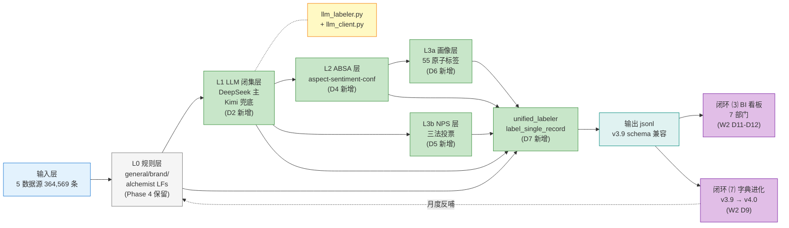
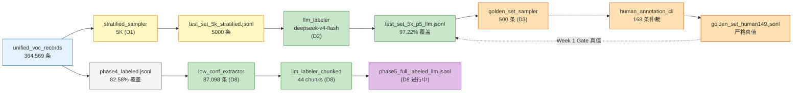
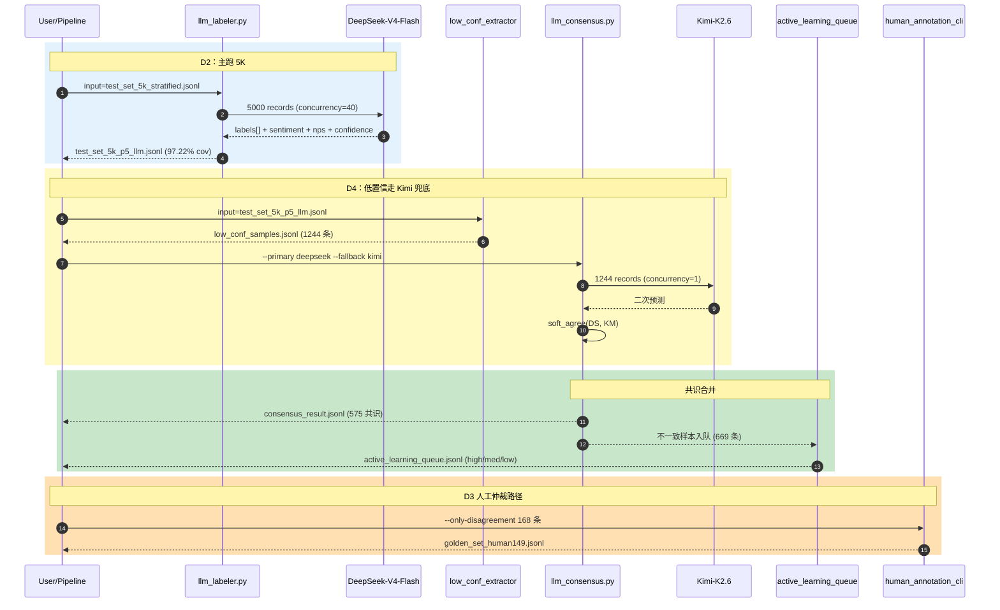
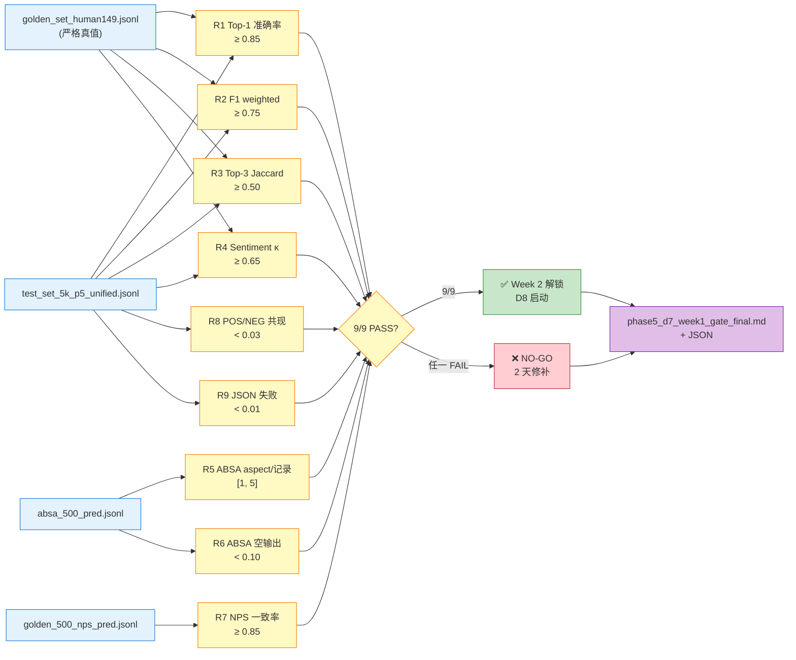
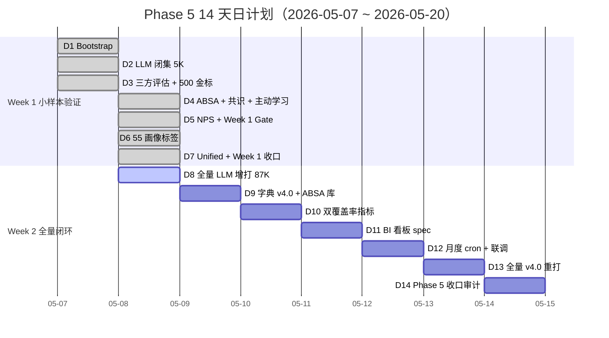
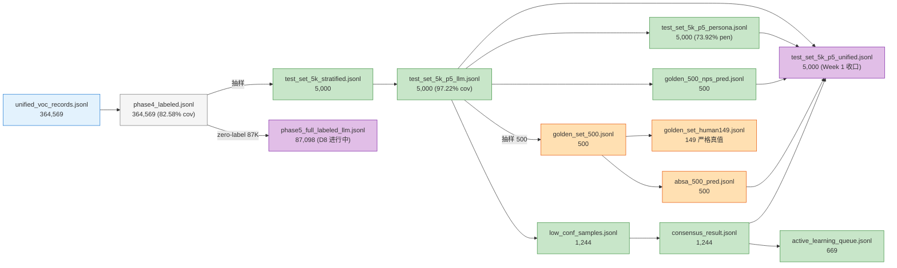

# VOC 标签体系 Phase 5 架构图集

> **配套阅读**：主文档 [phase5-architecture-and-workflow-retrospective.md](file:///Users/pray/project/paper_to_skills/paper2skills-vault/07-NLP-VOC/research/01-设计文档/00-Phase5-汇报与复盘/phase5-architecture-and-workflow-retrospective.md)
> **绘图规范**：遵循 lute_knowledge L1 基础规范 —— 横向 `flowchart LR`、`classDef` 着色（不用 inline `style`）、单图 ≤ 20 节点、时序图加 `autonumber` + `rect` 分区。本机若无 `~/lute_knowledge/`，请联系团队拉取规范副本。

## 目录

| # | 图名 | 类型 | 节点数 |
|---|---|---|---:|
| 1 | 系统分层总览（L0-L3 + 闭环 ⑶/⑺） | flowchart LR | 14 |
| 2 | 数据流：364K 全量端到端管道 | flowchart LR | 13 |
| 3 | 双 LLM 共识时序（D3-D4） | sequenceDiagram | — |
| 4 | LLM 闭集打标内部细节 | flowchart LR | 12 |
| 5 | 9 项红线 Quality Gate 判定流 | flowchart LR | 16 |
| 6 | 字典进化闭环（v3.9 → v4.0） | flowchart LR | 12 |
| 7 | D8 全量增打工程架构（chunked） | flowchart LR | 14 |
| 8 | Phase 5 14 天时间线 | gantt | — |
| 9 | 数据资产依赖图（jsonl 主键链） | flowchart LR | 15 |
| 10 | 决策流：金标双口径评估 | flowchart LR | 13 |

---

## 图 1：系统分层总览（L0-L3 + 闭环 ⑶/⑺）

**说明**：
- 灰色节点 = Phase 4 保留（0 成本打底）
- 绿色节点 = Phase 5 新增（D2/D4/D5/D6/D7 各阶段引入）
- 黄色节点 = LLM 引擎实现细节
- 紫色节点 = 闭环（W2 启用）
- 字典进化通过虚线反哺 L0，形成 v4.0 → v4.1 → v4.2 自迭代

---

## 图 2：数据流——364K 全量端到端管道

**说明**：
- 蓝色 = 原始数据
- 灰色 = Phase 4 产出
- 绿色 = Phase 5 主流程
- 橙色 = 金标体系（D3 抽样 → 人工仲裁 → 严格真值）
- 紫色 = 最终交付（D8 进行中）

---

## 图 3：双 LLM 共识时序（D3-D4）

---

## 图 4：LLM 闭集打标内部细节

```mermaid
flowchart LR
    classDef input fill:#e3f2fd,stroke:#1976d2
    classDef cache fill:#fff9c4,stroke:#f57c00
    classDef llm fill:#c8e6c9,stroke:#388e3c
    classDef validate fill:#ffe0b2,stroke:#e65100
    classDef out fill:#e1bee7,stroke:#7b1fa2
    classDef fail fill:#ffcdd2,stroke:#c62828

    Rec["单条 review<br/>(text + rating + meta)"]:::input

    Sys["build_compact_prompt<br/>(602 tag_ids,<br/>~7K tokens, lru_cache)"]:::cache

    Msg["messages = [system, user]<br/>response_format=json_object<br/>max_tokens=1200<br/>temperature=0.2"]:::cache

    Sem["asyncio.Semaphore(40)<br/>concurrency control"]:::llm

    DS["AsyncOpenAI.chat.completions.create<br/>vendor=deepseek<br/>base_url 切换"]:::llm

    Retry["指数退避<br/>0.5→1→2→4→8s × 5"]:::llm

    Parse["_parse_json_lenient<br/>(markdown ```json wrap 容错)"]:::validate

    Pyd["Pydantic LLMLabelOutput<br/>tag_id ∈ 602 闭集"]:::validate

    OK["LabelingResult<br/>success=True<br/>+ tokens_in/cache_hit/lat"]:::out

    Fail["LabelingResult<br/>success=False<br/>+ error type"]:::fail

    Retry2["max_retries_invalid=1<br/>(JSON / schema 失败重试)"]:::validate

    Rec --> Sys --> Msg --> Sem --> DS
    DS -- 429/timeout/5xx --> Retry --> DS
    DS -- 200 --> Parse
    Parse -- success --> Pyd
    Parse -- fail --> Retry2 --> Msg
    Pyd -- ok --> OK
    Pyd -- invalid --> Retry2
    Retry -- 5 次仍失败 --> Fail
    Retry2 -- 1 次仍失败 --> Fail
```

**说明**：
- system prompt 走 lru_cache + DeepSeek prompt cache，二级缓存让 cache_hit 达 98%
- 双重重试：网络层 5 次指数退避；语义层 JSON/schema 失败 1 次重试
- Pydantic 后置校验保证 0 个非法 tag_id

---

## 图 5：9 项红线 Quality Gate 判定流

**Phase 5 D7 实测**：9/9 PASS（口径 B 严格真值），Week 2 解锁。

---

## 图 6：字典进化闭环（v3.9 → v4.0）

```mermaid
flowchart LR
    classDef dict fill:#e1bee7,stroke:#7b1fa2
    classDef detect fill:#fff9c4,stroke:#f57c00
    classDef gen fill:#c8e6c9,stroke:#388e3c
    classDef filter fill:#ffe0b2,stroke:#e65100
    classDef out fill:#e0f2f1,stroke:#00897b

    V39["v3.9 字典<br/>602 唯一标签"]:::dict

    Full["phase5_full_labeled_llm.jsonl<br/>(D8 全量 87K)"]:::out

    Sample["5% 开集采样<br/>~4K 条 (D9)"]:::detect

    Gap["gap_detector.py<br/>零标签关键词挖掘"]:::detect

    Alch["alchemist_label_generator.py<br/>弱监督候选标签"]:::gen

    F1["频率 ≥ 10"]:::filter
    F2["Jaccard < 0.3<br/>(去重)"]:::filter
    F3["LLM 业务相关性<br/>≥ 3/5"]:::filter

    Cand["候选 [20, 40] 个"]:::gen

    V40["v4.0 字典<br/>+ 10_Aspect库 Sheet"]:::dict

    Validator["dictionary_validator.py<br/>--xlsx --require-sheets"]:::filter

    Report["v40_dry_run.md<br/>审核 trace"]:::out

    V39 --> Full --> Sample --> Gap --> Alch
    Alch --> F1 --> F2 --> F3 --> Cand
    Cand --> V40
    V40 --> Validator --> Report
    V40 -.->|D13 全量重打| Full
```

**说明**：
- 字典进化是 Phase 5 W2 的核心闭环，D9 启用
- 三层过滤：频率 / 语义去重 / LLM 业务评分
- v4.0 引入 ABSA aspect 库（10_Aspect库 Sheet）
- 验证器扩展支持参数化（D9 §T9.4.5）

---

## 图 7：D8 全量增打工程架构（chunked）

```mermaid
flowchart LR
    classDef input fill:#e3f2fd,stroke:#1976d2
    classDef chunk fill:#fff9c4,stroke:#f57c00
    classDef worker fill:#c8e6c9,stroke:#388e3c
    classDef monitor fill:#e1bee7,stroke:#7b1fa2
    classDef out fill:#e0f2f1,stroke:#00897b
    classDef fail fill:#ffcdd2,stroke:#c62828

    Input["phase4_zero_and_low_conf.jsonl<br/>87,098 条"]:::input

    Resume["existing_review_ids<br/>(断点续跑)"]:::chunk

    Chunker["切 44 chunk<br/>每 chunk ≤ 2000"]:::chunk

    C1["Chunk 1"]:::worker
    Cn["Chunk N..."]:::worker
    C44["Chunk 44"]:::worker

    Batch["run_batch<br/>concurrency=40<br/>asyncio.as_completed"]:::worker

    DS["DeepSeek API"]:::worker

    Tmp["chunk{N}.jsonl"]:::out

    Append["append → 主输出"]:::out

    Out["phase5_full_labeled_llm.jsonl<br/>(streaming)"]:::out

    Mon["llm_labeling_monitor.py<br/>--once 每 60s 轮询"]:::monitor

    Verdict{"3 红线<br/>succ/conf/cache"}:::monitor

    Alert["FAIL<br/>(D8 实测 chunk 7-8<br/>connection error 自愈)"]:::fail

    Input --> Resume --> Chunker
    Chunker --> C1 & Cn & C44
    C1 --> Batch
    Cn --> Batch
    C44 --> Batch
    Batch --> DS --> Tmp --> Append --> Out
    Out --> Mon --> Verdict
    Verdict -- 3/3 PASS --> Out
    Verdict -- 任一 FAIL --> Alert
```

**关键工程决策**：
- 直接 87K 跑 `as_completed` 卡死 10+ 分钟（asyncio O(N²) 队列开销）→ chunked 切 2000/批
- monitor 用 bash poll loop 而非 follow-mode，避免 FD 失效
- D8 实测 chunks 7-8 出现 32min connection error 窗口，已自愈，整体 success ≥ 99.27%

---

## 图 8：Phase 5 14 天时间线

**节奏复盘**：W1 D1-D7 实际在 D1（5-07）+ D4-D7（5-08 90 分钟连推）两天压缩完成。Week 2 D8 全量增打按 ETA 5-8h 完成后启动 D9。

---

## 图 9：数据资产依赖图（jsonl 主键链）

**说明**：所有 jsonl 以 `review_id` 为主键 join；unified 是 Week 1 单条全字段视图，Full 是 Week 2 增量。

---

## 图 10：金标双口径评估决策流

```mermaid
flowchart LR
    classDef input fill:#e3f2fd,stroke:#1976d2
    classDef path fill:#fff9c4,stroke:#f57c00
    classDef result fill:#c8e6c9,stroke:#388e3c
    classDef issue fill:#ffcdd2,stroke:#c62828
    classDef decide fill:#e1bee7,stroke:#7b1fa2

    G500["golden_set_500.jsonl<br/>500 条原始抽样"]:::input

    DS["DeepSeek 主预测"]:::path
    KM["Kimi 二意见"]:::path

    Prefill["consensus_prefill.py<br/>--mode soft"]:::path

    Auto["consensus_llm 自动共识<br/>332 条"]:::path
    Manual["待人工 168 条"]:::path

    Human["human_annotation_cli<br/>修订 short-code bug"]:::path
    GH["golden_set_human149.jsonl<br/>149 严格真值"]:::input

    OptA["口径 A 481 条全集<br/>Top-1 strict 75.5%"]:::issue

    OptB["口径 B 149 人工子集<br/>Top-1 strict 100%"]:::result

    Trace["追溯：consensus_prefill<br/>drop-tag artifact"]:::issue

    Final["Week 1 Gate 9/9 PASS<br/>(口径 B)"]:::result

    Backlog["D9 backlog<br/>修复 prefill"]:::decide

    G500 --> DS & KM
    DS --> Prefill
    KM --> Prefill
    Prefill --> Auto & Manual
    Manual --> Human --> GH
    Auto --> OptA
    GH --> OptB
    OptA -- 75.5% < 85% --> Trace
    Trace --> OptB
    OptB --> Final
    Trace --> Backlog
```

**关键决策**：D5 §3 初版判定 8/9 条件准入，D5 §8 追溯发现 R1 失败是 prefill drop-tag artifact，**改用口径 B 严格人工真值，Week 1 Gate 修订为 9/9 GO**。

---

## 附：颜色语义约定

| 颜色 | RGB | 语义 |
|---|---|---|
| 蓝色 `#e3f2fd` | 入口 / 输入 | 原始数据、入口节点 |
| 灰色 `#f5f5f5` | Phase 4 保留 | 不变更的现有组件 |
| 绿色 `#c8e6c9` | 成功 / Phase 5 新增 | 新建模块、PASS 状态 |
| 黄色 `#fff9c4` | 处理 / 缓存 | LLM 调用、prompt cache |
| 橙色 `#ffe0b2` | 验证 / 金标 | 校验、人工金标 |
| 紫色 `#e1bee7` | 决策 / 闭环 | 关键决策、BI/字典进化 |
| 红色 `#ffcdd2` | 失败 / 问题 | FAIL、异常路径 |
| 青色 `#e0f2f1` | 数据存储 | jsonl 输出 |

---

> **本图集与 [phase5-architecture-and-workflow-retrospective.md](file:///Users/pray/project/paper_to_skills/paper2skills-vault/07-NLP-VOC/research/01-设计文档/00-Phase5-汇报与复盘/phase5-architecture-and-workflow-retrospective.md) 配套使用。建议先读主总览的执行摘要，再按图 1 → 7 的顺序看架构演进。**
