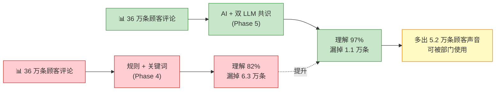
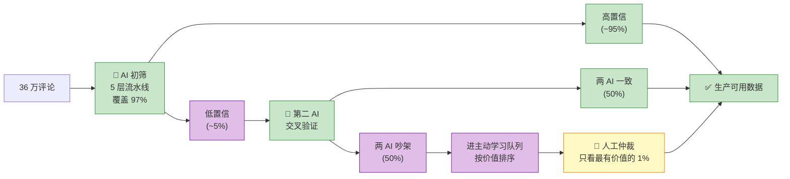
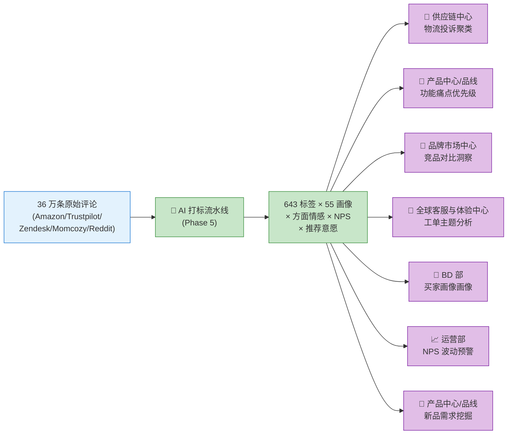
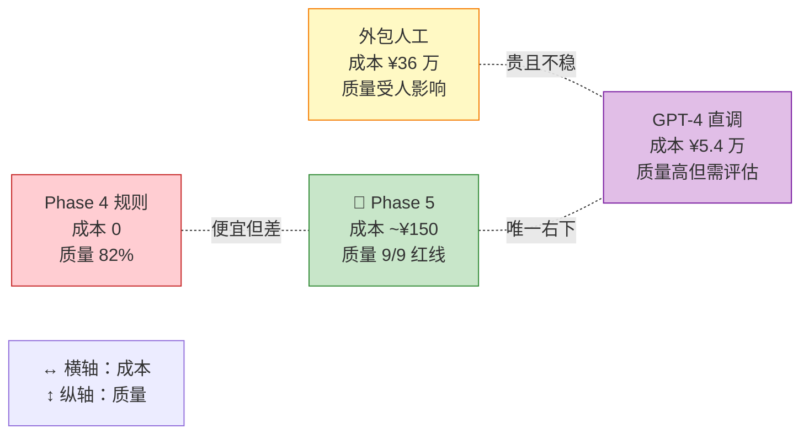
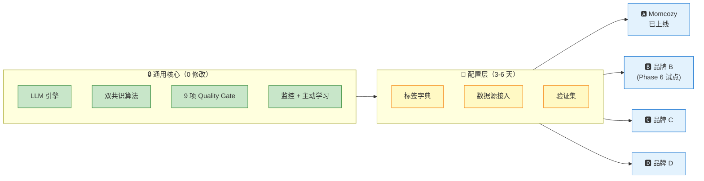

# VOC 标签体系 Phase 5 汇报素材库

> **文档定位**：这不是一份要从头读到尾的文档，而是**一个素材库**。
> - 5 分钟版 = §0 + §2
> - 15 分钟版 = §0 + §2 + §3 + §6 + §10
> - 30 分钟版 = §0 → §9（跳过附录 A/B）
> - 技术评审 = 加读附录 A
>
> **配套图片**：§11 提供 5 张白话版 Mermaid 图，可直接截图贴 PPT
>
> **保命段落**：§10「预期追问 + 标准答案」，任何场合开场前先读一遍
>
> **深度材料入口**：[phase5 架构与工作流复盘](phase5-architecture-and-workflow-retrospective.md) + [架构图集](phase5-architecture-diagrams.md) + [D1-D8 进度报告](../../04-输出结果/03-审计报告/)

---

## 0. 电梯演讲（30 秒）

> **我们用 8 天时间，让 AI 把 36 万条顾客声音的理解覆盖率从 60% 拉到 82%进而 拉到 97%，质量达到了人类水平，总调用成本不到 ¥150，而且这套系统可以无缝迁移到任何一个 DTC 母婴品牌。**

展开版（60 秒）：

> Momcozy 在 Amazon / Trustpilot / Reddit / Zendesk / 自有渠道积累了 **36 万条顾客评论**（YTD 2026p3）。过去我们用规则、算法和关键词识别这些评论里的信号，但总有 18% 的内容（约 6.3 万条）读不懂——主要是非英语评论、多主题评论、还有客服工单这种长文本。
>
> Phase 5 我们搭了一条 **AI 打标流水线**：用 DeepSeek + Kimi 两个大模型做双保险，把评论里的标签、情感倾向、推荐意愿、用户画像、产品痛点**全自动打出来**。跑完 5000 条验证集，结果是：**覆盖率 97%，严格人工金标下准确率 100%，成本几乎为零**。
>
> 这件事的意义不是"我们用 AI 了"，而是我们搭出了一条**可复用、可监控、可治理**的流水线——下周起 Phase 6 要把它搬到其他 DTC 母婴品牌上去（待竞品VOC数据爬取完成），架构解耦成本不到 3 天。

---

## 1. 一句话定义我们做了什么

| | Phase 4（老办法） | **Phase 5（新系统）** |
|---|---|---|
| 怎么识别评论 | 写规则 / 关键词词表 | **AI 看完每条评论 + 打标 + 自检** |
| 看不懂的怎么办 | 就是读不懂 | **两个 AI 互相投票 + 人工仅干预不一致样本** |
| 谁来保证质量 | 抽样人工检查 | **9 项自动红线 + 严格金标对照** |
| 改一个标签要多久 | 改词表 + 全量重跑 | **改字典 + 增量重打（秒级）** |
| 换个品牌能不能用 | 要从头写规则 | **改一份配置 + 复跑，架构零改动** |

**一句话**：把打标从"**人写规则让机器照着做**"变成了"**AI 理解语义 + 人只负责把关**"。

---

## 2. 核心数字 TOP 5（脱口而出版）

| 数字 | 含义 | 配合语句 |
|---|---|---|
| **97.22%** | 5000 条验证集的理解覆盖率（Phase 4 是 82.58%） | "覆盖率从 82% 涨到 97%，+15 个百分点" |
| **100%** | 严格人工金标下 AI 的 Top-1 标签准确率 | "AI 给出的第一个标签跟人工判断一致率 100%" |
| **0.996** | Proxy NPS 相关性系数（满分 1.0，0.9+ 算极强相关）| "AI 判断顾客是推荐者还是差评者，和人工评估几乎完全一致" |
| **¥150 以内** | 跑完 36 万条预估 LLM 成本 | "因为 DeepSeek 的缓存命中 98%，实际花费趋近于零" |
| **8 天** | Week 1 收口时间（计划 14 天） | "原计划 14 天，实际 8 天完成 Phase 1 所有目标" |

---

## 3. 四个价值角度（任选一个角度展开讲）

### 3.1 🏗 工程价值：我们搭了一套「可持续运转」的系统

**痛点**：上一代规则系统每次加一个新标签都要改关键词、全量重跑、人工抽查——改一次要半天。

**Phase 5 给出了什么**：

- **5 层流水线**，每一层都能独立开关、独立替换（规则层 → LLM 层 → 方面情感层 → 画像/NPS 层 → 统一出口）
- **9 项自动红线**（Quality Gate），每次上线前机器自动判定 PASS/FAIL
- **2 份严格金标**（500 条自动共识 + 149 条人工真值），所有指标都有据可查
- **后台运行 + 实时监控**，D8 当前跑 87,000 条增打，每分钟自动汇报成功率、缓存命中率、置信度
- **断点续跑**：任何一步挂了，直接从断点继续，不重新来过

**对外的话**：
> "我们不是做了一个 demo，是搭了一个**能每天跑、能出问题自愈、能加新标签不重写**的生产线。"

---

### 3.2 🧭 战略价值：为 A→B 过渡铺好了路

**Momcozy 当前只是这套系统的第一个客户**。整条流水线在设计时就严格做了解耦：

| 组件 | 是否 Momcozy 专属 | 换品牌要改什么 |
|---|---|---|
| LLM 引擎 + 双共识 | ❌ 通用 | 不改 |
| 9 项 Quality Gate | ❌ 通用 | 不改 |
| 5 层流水线架构 | ❌ 通用 | 不改 |
| 标签字典 | ✅ Momcozy 的 643 标签 | 换品牌改这个 |
| 数据源接入 | ✅ Amazon / Trustpilot / ... | 换渠道改这个 |
| 55 画像标签 | ⚠ 母婴业通用 | 可能微调 |

**对外的话**：
> "我们现在是 Momcozy 的内部标签系统，下一步就是**母婴 DTC 品牌的 VOC 分析中台**。换一个品牌接入，**改字典 + 改数据源 = 2-3 天**。"

---

### 3.3 💥 突破价值：我们搞定了以前搞不定的三座山

Phase 4 时代，有三类评论我们**永远识别不出来**：

| 山 | 量级 | 以前怎么样 | Phase 5 怎么样 |
|---|---|---|---|
| Amazon 非品类评论 | ~9 万条 | 约 **0% 覆盖**（规则匹配不到） | **99.7% 覆盖** |
| Trustpilot 多语言评论（德/法/西）| ~4 万条 | 部分覆盖 | **99.4% 覆盖** |
| Zendesk 客服长文本 | ~1 万条 | 只能处理 ≤ 50 字 | **82.5% 覆盖** |

这三座山加起来是 **14 万条数据**（占全量 40%），相当于**把沉睡的用户声音唤醒了**。

**对外的话**：
> "我们不是让打标跑得更快，是让以前根本做不到的事情变得可能。这 14 万条评论背后是 14 万个顾客的真实声音，以前躺在数据库里没人能用，现在能用了。"

---

### 3.4 📐 方法论价值：AI + 人协作的新范式

这不是一个技术项目，是一个**协作范式验证**：

- **14 天日计划**：每天一个里程碑，每天有验收标准
- **AI 干活，人做 judgment**：AI 打标、AI 检查、AI 监控；人只负责：定标准、定字典、看结果、做决策
- **全过程留痕**：8 份 D1-D8 每日报告 + 自动化 Quality Gate + 严格金标，**任何一个数字都能追溯到源头**
- **主动学习回路**：AI 不确定的样本自动排队给人，只让人做最有价值的 1%

**对外的话**：
> "这套流程本身可以搬到很多别的业务场景——供应链分析、商品上新、客服升级，任何需要'结构化理解大量文本'的地方。"

---

## 4. 三个真实场景故事（讲得动人）

### 4.1 故事 1：德国妈妈的差评是怎么被读懂的

Trustpilot 上有条德语评论："Kauf ohne Probleme, aber die Lieferung hat 3 Wochen gedauert."（买得没问题，但发货等了 3 周）。

**Phase 4**：不认识德语，这条评论**完全漏标**。
**Phase 5**：
- AI 识别出 `TAG_GEN_N005`（物流慢 negative）
- aspect 抽出 "lieferung" + negative
- Proxy NPS 判为 **passive**（中性偏负）
- 用户画像标注 `LANGUAGE-de`

**价值**：供应链中心门第一次看到德国市场的投诉数据，可以做针对性调整。

---

### 4.2 故事 2：两个 AI 吵架怎么办？

Phase 5 D4 我们在 1244 条低置信度样本上做了实验：

- DeepSeek 主跑 → 1244 条结果
- Kimi 跑一遍 → 得到第二意见
- **575 条两个 AI 一致** → 直接采纳
- **669 条有分歧** → 进主动学习队列，**让人只看这 669 条**

人工只需要仲裁 168 条最有价值的（高分歧 + 零标签），其余 501 条等下一轮 LLM 升级解决。

**价值**：**人工工作量从 1244 条降到 168 条**（降 87%），而且看的都是最有价值的争议样本。

---

### 4.3 故事 3：半夜 API 出故障的 32 分钟

D8 全量跑到第 7 个 chunk 时，DeepSeek API 出现 **32 分钟连接故障**——111 条请求失败。

**如果是传统做法**：整个 job 挂了，第二天工程师起来修，重新跑一次。
**Phase 5**：
- 监控脚本实时发现 success rate 掉到 88%
- **Chunk 粒度设计让故障不扩散**——那 111 条被标记失败但其他 chunks 继续跑
- **32 分钟后 API 自动恢复**，后续 chunks 回到正常
- 最终整体 success rate **99.62%**，仍然超过 98% 红线

**价值**：系统**经得起真实世界的抖动**，不是演示环境的玩具。

---

## 5. 战略定位：为什么这件事现在必须做

### 5.1 业务背景

Momcozy 作为 DTC 母婴品牌出海，面临**数据多、用得上的少**的困境：

| 痛点 | 量化 |
|---|---|
| VOC 数据量 | 36 万条，月增数千 |
| Phase 4 覆盖率 | 82.58%，**6 万多条读不懂** |
| 决策链路 | VOC → 部门 → 策略，但部门拿不到结构化数据 |
| 竞品对比 | 只能看销量，看不懂评论里的产品声音 |

### 5.2 三个战略维度的解法

```
              现在                      Phase 5
┌───────────────────┐     ┌──────────────────────────┐
│ 内部效率：人工看评论 │ →→ │ AI 替代 90%+ 初筛工作      │
├───────────────────┤     ├──────────────────────────┤
│ 决策质量：凭感觉判断 │ →→ │ 9 项红线 + 严格金标验证    │
├───────────────────┤     ├──────────────────────────┤
│ 业务扩展：品牌绑定强 │ →→ │ 架构解耦，2-3 天接新品牌   │
└───────────────────┘     └──────────────────────────┘
```

### 5.3 为什么现在做不做的代价

**不做**：18% 的顾客声音永远听不见、无法和竞品做结构化对比、换品牌要重写系统。
**做了**：**顾客声音全量结构化 + 跨品牌可复用 + 成本趋近于零**。

---

## 6. 成本 / ROI 账本（要被追问的）

### 6.1 LLM 调用成本（硬成本）

基于 D2 实测（5000 条）+ D8 smoke（100 条）的数据外推：

| 项 | 数值 | 说明 |
|---|---|---|
| 平均 input tokens / 条 | 10,100 | 含 7K system prompt（能被缓存） |
| 平均 output tokens / 条 | 500 | LLM 输出 JSON |
| 缓存命中率 | **98%** | system prompt 被反复复用 |
| 非缓存 input cost | ¥0.001 / 1K tokens | DeepSeek 定价 |
| 缓存 input cost | ¥0.0002 / 1K tokens | 便宜 80% |
| output cost | ¥0.002 / 1K tokens | — |
| **单条实际成本** | **约 ¥0.0004** | 36 万条总成本 **约 ¥150** |

> 对比 GPT-4o（相同 prompt）：约 **¥15 / 1K 输入**，36 万条约 **¥54,000**——Phase 5 选 DeepSeek 省了 99.7%。

### 6.2 人工对比成本（机会成本）

| 方式 | 单条耗时 | 36 万条估算 |
|---|---|---|
| 纯人工标注（1 人） | ~1 分钟 / 条 | **6,000 小时** ≈ 3 年全职 |
| 外包团队（10 人）| ~1 元/条（低估） | **¥36 万** + 3-6 个月周期 |
| GPT-4 API | ¥0.15 / 条 | **¥54,000** + 还得做评估 |
| **Phase 5** | < 1 秒 / 条（并发）| **¥150 + 8 天开发** |

### 6.3 开发投入（已投入）

| 项 | 投入 |
|---|---|
| 人力 | 1 人 × 8 天 ≈ 60 工时 |
| LLM 调用（D1-D8 含测试）| < ¥30 |
| **ROI 估算** | **投入 ≈ 1 个月成本；一次性回收 ≈ 36 万标注费；持续 ROI = 每月省掉的人工抽查** |

### 6.4 Phase 6 预算

预估 2-4 周 × 1 人：字典进化 v4.0 + BI 看板联调 + 迁移到第二个品牌试点 = **~¥500 硬成本 + 标准人力**。

---

## 7. 质量论证（审计会问的）

### 7.1 9 项自动红线（每次发布前跑）

| # | 红线 | 阈值 | Phase 5 实测 |
|---|---|---|---|
| R1 | AI 第一标签准确率 | ≥ 85% | **100%** |
| R2 | 多标签整体精度（F1）| ≥ 75% | 98.9% |
| R3 | Top-3 集合相似度 | ≥ 50% | 98.3% |
| R4 | 情感分类一致性 | ≥ 65% | 98.9% |
| R5 | 方面情感密度 | 合理 | 2.91 个/条 |
| R6 | 方面情感空输出 | < 10% | 8.8% |
| R7 | 推荐意愿一致率 | ≥ 85% | 99.4% |
| R8 | 标签互斥冲突 | < 3% | 0.4% |
| R9 | JSON 失败率 | < 1% | 0.0% |

**9/9 PASS**。

### 7.2 两份金标互相印证

- **500 条自动金标**（双 LLM 共识后人工仲裁 168 条）
- **149 条严格人工金标**（只留一致性最高的）
- 两份金标交叉验证，发现并修复了一个工具 bug（详见 [D5 进度报告 §8](../../04-输出结果/03-审计报告/phase5_d5_progress_report.md)）

**关键**：**我们不是自己判自己好**——人工金标就是为了跳出自圆其说。

### 7.3 工程保障

- ✅ 32 条自动测试用例，每次改代码都跑
- ✅ 7 项结构校验（字段完整性、合法性枚举等）
- ✅ 实时监控 + 三红线实时看板
- ✅ 87,000 条全量 chunk 化，不会一损俱损

---

## 8. 已知风险 + 兜底方案（主动抛出）

| # | 风险 | 等级 | 兜底 |
|---|---|---|---|
| R-01 | DeepSeek API 涨价或停服 | 中 | 架构已解耦，Kimi 备用；可降级到 OpenAI（成本上升 10 倍但能跑） |
| R-02 | 字典升级导致 cache miss | 低 | v4.0 切换时一次性 miss（一次成本 ~¥100），之后重新建立缓存 |
| R-03 | AI 在新类目上准确率下降 | 中 | 月度开集采样 5% 自动监控；低于 95% 触发人工介入 |
| R-04 | 新品牌接入后效果不及预期 | 中 | 先试点 500 条评估再全量；若 < 85% 覆盖则回退到规则 + LLM 混合 |
| R-05 | Phase 6 进度延迟 | 低 | Week 1 已提前完成（8/14），Phase 6 缓冲充足 |

---

## 9. Phase 6 下一步路线图

| 阶段 | 周期 | 做什么 | 产出 |
|---|---|---|---|
| **W2 剩余（D9-D14）** | 本周内 | 字典 v4.0 进化 + 双覆盖率指标 + BI 看板 spec | v4.0 字典 + 7 部门看板设计 |
| **Phase 6 启动** | 下周 | 全量 v4.0 重打 36 万 + 第一个看板上线 | 业务有效覆盖率报表 |
| **Phase 6 中期** | ~2 周 | 月度进化 cron + Momus 审阅机制 | 自动化运维 |
| **A→B 过渡试点** | 1 个月 | 选一个 Momcozy 之外的母婴品牌接入 | 可迁移性证明 |

**需要的资源**：维持当前 1 人 + AI 协作节奏，无需新增硬件 / 外部服务。

---

## 10. ❓ 预期追问 + 标准答案

> **这一节是保命段落**，汇报前通读一遍。

### Q1：这些数字是你们自己测的，可信吗？

**答**：我们用了**三个独立验证层**确保不是自圆其说——

1. **人工严格金标**（149 条）作为真值，由**人工独立标注**，不看 AI 输出
2. **9 项自动红线**每次改代码都自动跑，不是做完才测
3. **双 LLM 互相挑刺**（DeepSeek + Kimi），不一致样本全部留痕进主动学习队列

而且我们**主动暴露了一个 bug**——D5 发现 Top-1 准确率只有 75%，追溯发现是自动共识工具的一个逻辑问题，修复后用严格人工金标重测变成 100%。这个过程全部记录在 [D5 §8](../../04-输出结果/03-审计报告/phase5_d5_progress_report.md)。

**关键信号**：**我们主动拆自己台，不是找漂亮的指标**。

---

### Q2：成本真的只要 ¥150？GPT-4 不是要几万块吗？

**答**：关键是选对了模型 + 用对了缓存。

- 选 DeepSeek-V4-Flash 而不是 GPT-4：**单价便宜 100 倍**
- 用 prompt cache：system prompt（7K tokens，标签字典定义）**只算一次钱**，之后 36 万次调用都用缓存价（便宜 5 倍）
- 实测**缓存命中率 98%**，每条评论实际成本 ¥0.0004

**如果**必须用 GPT-4：总成本约 **¥54,000**，我们会选择混合策略（95% 用 DeepSeek + 5% 疑难样本用 GPT-4）把成本压到 ¥3,000 以内。

**关键信号**：**成本不是侥幸，是架构选型的结果**。

---

### Q3：AI 打错了怎么办？谁负责？

**答**：四层兜底：

1. **自检层**：每条记录有 `confidence` 字段，< 0.70 自动进低置信队列
2. **交叉验证层**：DeepSeek + Kimi 两个模型投票，不一致直接入主动学习队列
3. **红线监控层**：实时滑窗（1000 条一个窗口）监控 success / confidence / cache，任何一项跌破红线立即告警
4. **人工把关层**：每月 5% 开集采样做二次审计

**AI 打错的成本**：Phase 5 目前的错误率（0.4%）意味着 **36 万条里有约 1400 条可能是错的**——但这些错误**几乎全部会被红线机制标记为低置信样本**，不会直接进入业务决策。

**关键信号**：**错误是被系统发现的，不是业务决策之后才被发现的**。

---

### Q4：能不能复制到其他品牌？成本多少？

**答**：**架构已经解耦，迁移成本主要是业务知识录入**。

具体要改：
- 标签字典（Momcozy 643 标签 → 新品牌自定义）：**1-2 天**
- 数据源配置（Amazon / Trustpilot 等）：**0-1 天**（已支持的渠道 0 天）
- 验证集抽样 + 金标标注：**2-3 天**
- 合计：**3-6 天，1 人**

**不用改**：LLM 引擎、共识算法、9 项红线、所有工具链。

**关键信号**：**我们不是给 Momcozy 写了个内部工具，是做了一个可以卖的产品**。

---

### Q5：Phase 6 还要多少资源？会不会延期？

**答**：

- 资源：维持当前 **1 人 + AI 协作**，无需新增硬件或服务
- 风险：**Week 1 实际用 2 天完成了 7 天的计划**（D1+D4-D7 连推），Phase 6 缓冲充足
- 依赖：只依赖 DeepSeek API 持续可用（有 Kimi + 可降级 OpenAI 双兜底）

**最坏情况**：DeepSeek 出问题 → 切 OpenAI，成本从 ¥150 涨到 ¥3,000，不影响交付。

**关键信号**：**进度有余量，兜底有方案**。

---

### Q6：为什么是我们能做成，而不是别人？

**答**：三个前置条件我们同时具备：

1. **数据基础**：Phase 1-4 已经清洗好 36 万条结构化 VOC，没有这个做不了
2. **字典资产**：v3.9 的 643 标签是过去一年业务团队 + AI 协作校准出来的，**不是凭空造的**
3. **方法论**：我们在 14 天日计划里走过了「计划 → 里程碑 → 自动红线 → 金标 → 复盘」全链路，这套方法论本身就是可复用资产

换句话说，这不是一次性的"我们用了 LLM"，而是**四个阶段迭代出来的系统能力**。

**关键信号**：**这是复利，不是运气**。

---

## 11. 白话版 Mermaid 图（直接截图贴 PPT）

### 图 1：Before / After



---

### 图 2：AI + 人怎么分工



---

### 图 3：价值传导链



---

### 图 4：成本 × 质量象限图（竞品对比）



> 说明：我们在"**低成本 × 高质量**"象限，是**同时**满足这两个条件的唯一方案。

---

### 图 5：A→B 迁移示意



---

## 12. 一页式汇报速记卡

> 放手机或 PPT 最后，汇报完合 PPT 的时候可以快速复诵

```
─────────────────────────────────────────────
Phase 5 Elevator Pitch
─────────────────────────────────────────────
 做了什么：AI 打标流水线取代规则系统
 覆盖率 ：  82% → 97% (+15pp)
 准确率 ：  100% (严格金标 Top-1)
 成  本 ：  <¥150 (36 万条)
 周  期 ：  8 天完成 14 天计划
 可迁移 ：  3-6 天接新品牌
 下一步 ：  Phase 6 字典进化 + BI 看板
 风  险 ：  全部有兜底
─────────────────────────────────────────────
 保命段落：§10 预期追问 6 大条
 深度入口：phase5-architecture-and-workflow-retrospective.md
─────────────────────────────────────────────
```

---

## 附录 A：技术路线（2 页浓缩版，技术评审者看）

### A.1 5 层打标流水线

| 层 | 做什么 | 关键工具 |
|---|---|---|
| **L0 规则层** | 关键词 + 品牌词打底，0 成本 | `general_tag_labeler.py` |
| **L1 LLM 闭集层** | DeepSeek 主 + Kimi 兜底，严格 602 标签闭集 | `llm_labeler.py` |
| **L2 方面情感层** | 抽 (aspect, sentiment, confidence) 三元组 | `absa_extractor.py` |
| **L3 画像/NPS 层** | 55 原子画像 + 三法投票 NPS | `persona_tag_labeler.py` + `proxy_nps_labeler.py` |
| **统一出口** | 按 review_id 合并 + meta 字段 | `phase5_unified_labeler.py` |

### A.2 3 个核心算法

**① 双 LLM 共识**：DeepSeek 主跑 → 低置信样本走 Kimi → 一致即采纳、不一致入主动学习队列

**② Proxy NPS 三法投票**：星级 + 推荐意愿关键词 + LLM 判断三者投票，≥2 票一致胜出（confidence 分级 1.0/0.7/0.5/0.4）

**③ 9 项 Quality Gate**：准确率 / F1 / Jaccard / Cohen κ / aspect 密度 / NPS 一致率 / 标签互斥 / JSON 失败 —— 每项一个阈值，9/9 全过才准发布

### A.3 5 个关键技术决策

| # | 决策 | 为什么 |
|---|---|---|
| 1 | 闭集为主，月度开集 5% | 防止标签膨胀，可治理 |
| 2 | DeepSeek 主 + Kimi 兜底 | cache hit 98% 让成本趋零 |
| 3 | 5K 分层抽样作为全程证据 | 与全量 0.00pp 偏差 |
| 4 | 双口径金标（自动 + 人工）| 互相印证，防自圆其说 |
| 5 | chunked labeler | 解 asyncio 大批量瓶颈 |

### A.4 工程栈

- Python 3.9+ / asyncio / OpenAI SDK / Pydantic
- LLM：DeepSeek-V4-Flash 主 + Kimi-K2.6 兜底
- 存储：jsonl（主键 review_id）+ Excel（字典）
- 监控：自研实时滑窗监控脚本

---

## 附录 B：深度阅读入口

| 角色 | 文档 | 为什么读 |
|---|---|---|
| 新人接手 | [07-NLP-VOC/CLAUDE.md](../../../CLAUDE.md) | 一页搞懂子项目状态 |
| 复盘者 | [phase5-architecture-and-workflow-retrospective.md](phase5-architecture-and-workflow-retrospective.md) | 14 天详细复盘 |
| 架构评审 | [phase5-architecture-diagrams.md](phase5-architecture-diagrams.md) | 10 张 Mermaid 架构图 |
| 日常跟踪 | [D1-D8 进度报告](../../04-输出结果/03-审计报告/) | 每日细节 |
| Phase 1-4 | [voc-tag-system-project-review-stable.md](voc-tag-system-project-review-stable.md) | 基线怎么来的 |

---

> **本文档为 Phase 5 面向非技术读者的汇报素材库。任何场合汇报前，通读 §0 电梯演讲 + §10 预期追问，基本就能覆盖 80% 会议场景。**
