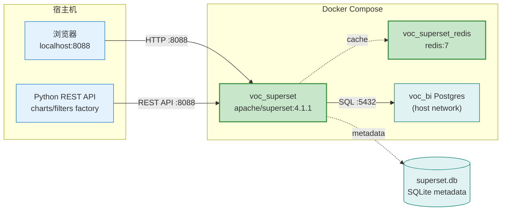
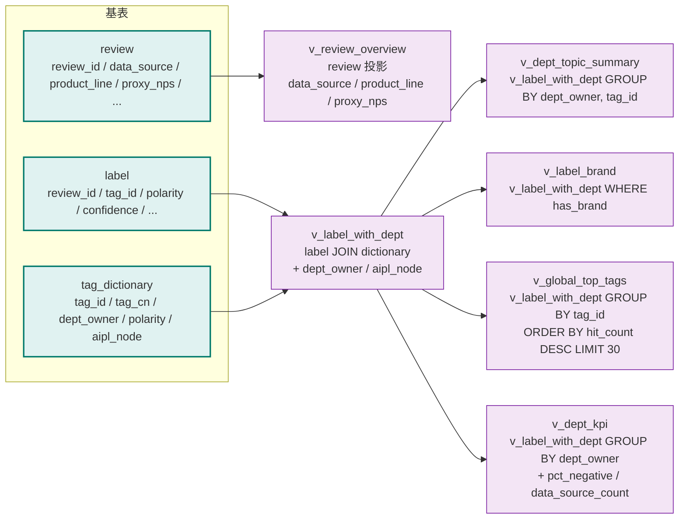
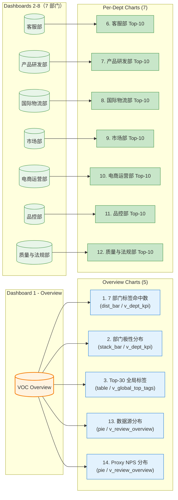
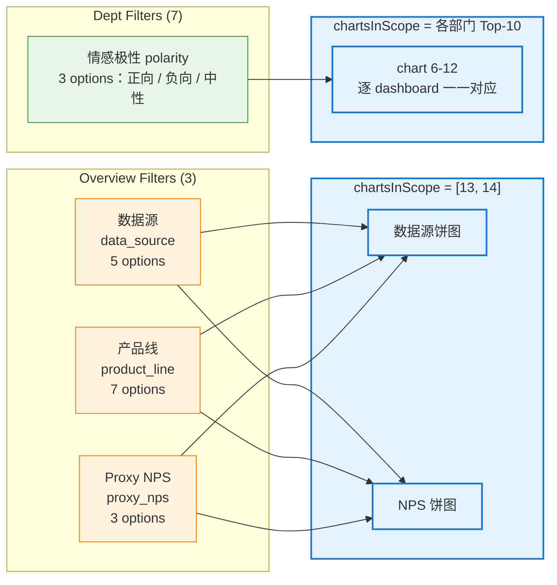
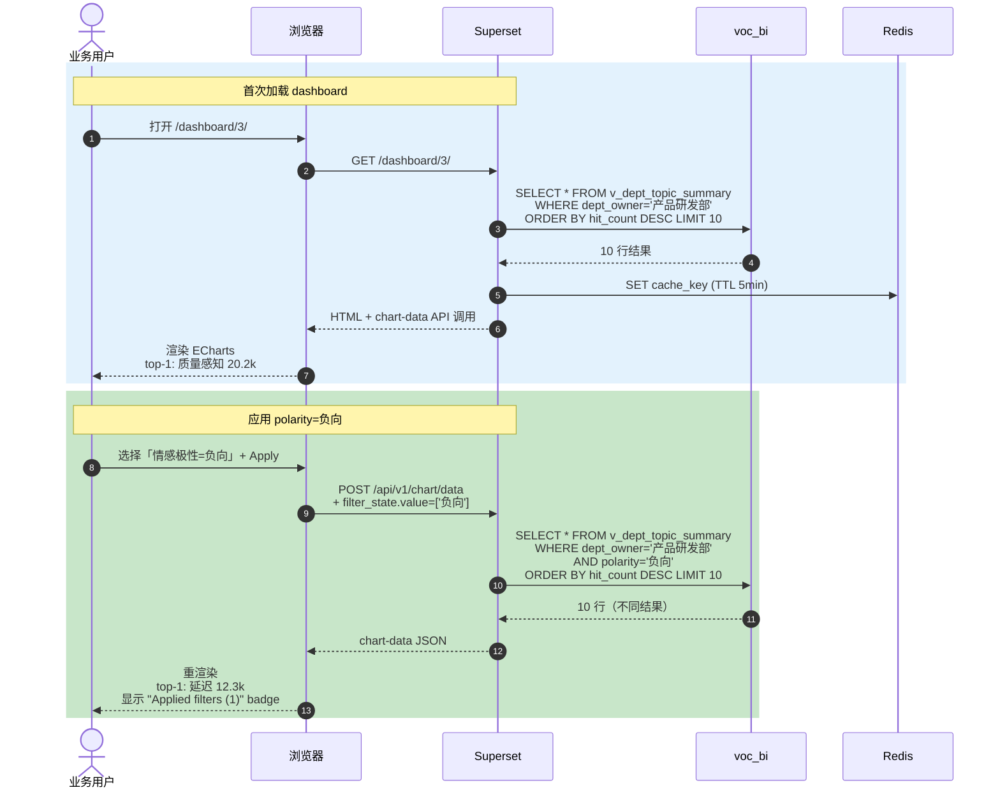
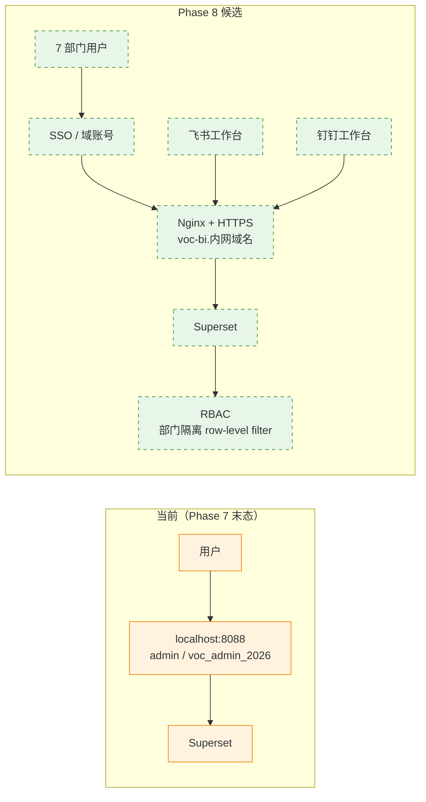
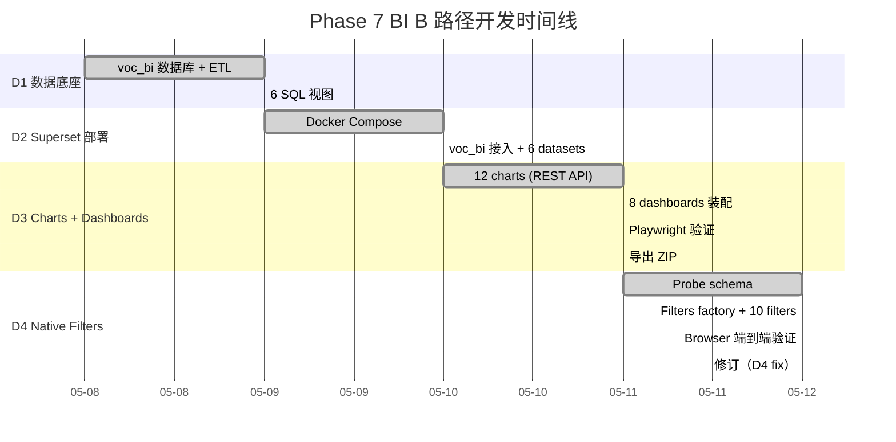
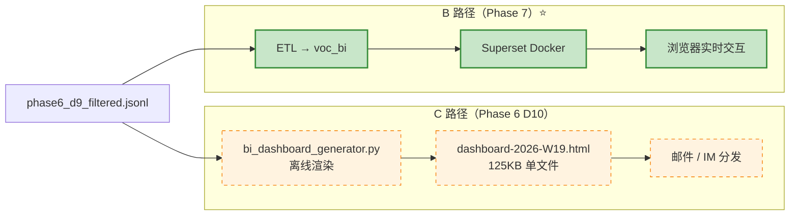

# Phase 7 BI 架构图集（Mermaid 版）

> 配套白话汇报：[phase6-7-executive-brief.md](phase6-7-executive-brief.md)
> 配套高保真 HTML 版：[phase7-architecture-diagrams.html](phase7-architecture-diagrams.html)（Blueprinter 风格）
> 关联文档：[Superset_BI_SOP.md](../07-操作指南/Superset_BI_SOP.md) / [ETL_pipeline_SOP.md](../07-操作指南/ETL_pipeline_SOP.md)

## 图 1 — 系统分层（Phase 5 → Phase 6 → Phase 7）

> **看点**：Phase 7 在 Phase 5/6 之上加了 BI 层，但不动下层。

```mermaid
flowchart LR
    subgraph L1["Phase 5：AI 打标管道"]
        P5_RAW["原始 jsonl<br/>364K reviews"]
        P5_L0["L0 规则层<br/>关键词 + 品牌"]
        P5_L1["L1 LLM 闭集<br/>DeepSeek + Kimi"]
        P5_L2["L2 ABSA"]
        P5_L3["L3 画像 + NPS"]
        P5_OUT["phase5_intermediate_merged.jsonl"]
    end

    subgraph L2["Phase 6：质量提升"]
        P6_F["Method C 后处理过滤<br/>label_filter_kimi.py"]
        P6_OUT["phase6_d9_filtered.jsonl<br/>precision 0.896"]
    end

    subgraph L3["Phase 7：BI B 路径"]
        P7_ETL["ETL<br/>etl_to_postgres.py"]
        P7_DB[("voc_bi<br/>Postgres + 6 视图")]
        P7_SS["Superset 4.1.1<br/>Docker"]
        P7_DASH["8 dashboards<br/>12 charts<br/>10 filters"]
    end

    P5_RAW --> P5_L0 --> P5_L1 --> P5_L2 --> P5_L3 --> P5_OUT
    P5_OUT --> P6_F --> P6_OUT
    P6_OUT --> P7_ETL --> P7_DB --> P7_SS --> P7_DASH

    classDef phase5 fill:#e3f2fd,stroke:#1976d2,stroke-width:1px;
    classDef phase6 fill:#fff3e0,stroke:#f57c00,stroke-width:1px;
    classDef phase7 fill:#c8e6c9,stroke:#388e3c,stroke-width:2px;
    classDef store fill:#e0f2f1,stroke:#00796b,stroke-width:1px;

    class P5_RAW,P5_L0,P5_L1,P5_L2,P5_L3 phase5;
    class P5_OUT,P6_F,P6_OUT store;
    class P7_ETL,P7_SS,P7_DASH phase7;
    class P7_DB store;
```



## 图 2 — ETL 数据流（D1：37s 导入 364K）

```mermaid
flowchart LR
    SRC["phase6_d9_filtered.jsonl<br/>560M / 364,569 reviews"]
    DICT["tag_dictionary_v4.1.xlsx<br/>v4.1 字典"]

    subgraph ETL["etl_to_postgres.py（37 秒）"]
        PARSE["1. 解析 jsonl<br/>逐行 + Pydantic 校验"]
        FLATTEN["2. 扁平化 labels<br/>1 review × N labels → row"]
        ENRICH["3. 字典 enrich<br/>tag_id → tag_cn / tag_en / dept_owner / polarity"]
        BULK["4. Postgres COPY<br/>review + label 双表"]
    end

    subgraph DB[("voc_bi Postgres")]
        T_REVIEW["review<br/>364,569 行"]
        T_LABEL["label<br/>1,103,287 行"]
        V1["v_review_overview"]
        V2["v_label_with_dept"]
        V3["v_dept_topic_summary"]
        V4["v_label_brand"]
        V5["v_global_top_tags"]
        V6["v_dept_kpi"]
    end

    SRC --> PARSE
    DICT --> ENRICH
    PARSE --> FLATTEN --> ENRICH --> BULK
    BULK --> T_REVIEW
    BULK --> T_LABEL
    T_REVIEW -.SQL CREATE VIEW.-> V1
    T_LABEL -.JOIN.-> V2
    V2 -.GROUP BY.-> V3
    V2 -.GROUP BY.-> V4
    V2 -.GROUP BY.-> V5
    V2 -.GROUP BY.-> V6

    classDef src fill:#e3f2fd,stroke:#1976d2;
    classDef etl fill:#fff3e0,stroke:#f57c00;
    classDef table fill:#e0f2f1,stroke:#00796b,stroke-width:2px;
    classDef view fill:#f3e5f5,stroke:#7b1fa2;

    class SRC,DICT src;
    class PARSE,FLATTEN,ENRICH,BULK etl;
    class T_REVIEW,T_LABEL table;
    class V1,V2,V3,V4,V5,V6 view;
```

## 图 3 — Superset 容器栈（D2 部署）



## 图 4 — 6 SQL 视图依赖关系



## 图 5 — 12 charts × 8 dashboards 映射



## 图 6 — 10 native filters 作用域



## 图 7 — 用户交互时序（部门 polarity 过滤）



## 图 8 — 看板访问控制（当前 + Phase 8 候选）



## 图 9 — Phase 7 时间线（D1-D4 ~7h）



## 图 10 — C 路径 vs B 路径对比



| 维度 | C 路径（HTML） | B 路径（Superset） |
|---|---|---|
| 上线时间 | Phase 6 D10 | Phase 7 D1-D4 |
| 交付方式 | 单文件 HTML | 实时 web app |
| 交互 | 静态 | filter / drill-down |
| 分发 | 邮件 / IM 附件 | URL |
| 维护 | 手动重生 | REST API 自动化 |
| 适用场景 | 周报快照 / 离线档案 | 日常决策 / 探索 |

**两条路径互补**——C 路径作快照存档，B 路径作日常工具。

---

## 引用脚本与产物

| 图涉及 | 脚本 / 文件 |
|---|---|
| 图 2 ETL | [etl_to_postgres.py](../../02-脚本工具/01-标签进化/etl_to_postgres.py) |
| 图 3 Docker | [docker-compose.yml](../../02-脚本工具/01-标签进化/docker/docker-compose.yml) |
| 图 4 SQL 视图 | [voc_bi_views.sql](../../02-脚本工具/01-标签进化/sql/voc_bi_views.sql) |
| 图 5 Charts | [superset_charts_factory.py](../../02-脚本工具/01-标签进化/docker/superset_charts_factory.py) |
| 图 6 Filters | [superset_filters_factory.py](../../02-脚本工具/01-标签进化/docker/superset_filters_factory.py) |
| 图 7 时序 | Playwright 实测：[phase7_d4_progress_report.md §四](../../04-输出结果/03-审计报告/phase7_d4_progress_report.md) |
| 图 10 C 路径 | [bi_dashboard_generator.py](../../02-脚本工具/01-标签进化/bi_dashboard_generator.py) → [phase6_html_dashboard/](../../00-归档资料/phase6_html_dashboard/) |
