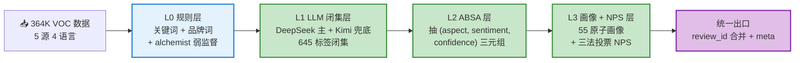
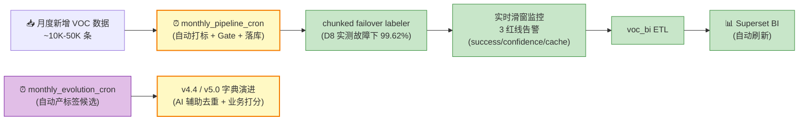

# VOC 标签体系阶段性汇报

> 汇报对象：老板 + PMO ｜ 时间：2026-05-14 ｜ 阅读时长：10–15 分钟
> 核心交付：跨境母婴 VOC 自动打标系统（Phase 5+6+7）+ v4.3 全量标签字典 + Superset BI 看板
> 数据时点：YTD 2026 P3，全量 **364,569** 条评论

---

## §0 一页式速记卡

| 维度 | 值 | 信源 |
|---|---:|---|
| 全量 VOC 数据 | **364,569** 条 | [README §当前状态](../../../../README.md) |
| 数据源 | **5 个**（Amazon / Trustpilot / Zendesk / Momcozy / Reddit） | [项目复盘 §1.7.1](../../../01-设计文档/00-Phase5-汇报与复盘/voc-tag-system-project-review-stable.md) |
| 全量标签字典 | **v4.3 — 267 通用 + 378 品线 = 645 行** | [v4.3 diff](../../01-字典版本/dept_repair_v43_diff.md) |
| 标签维度 | **8 维 / 36 列** | [项目复盘 §1.3](../../../01-设计文档/00-Phase5-汇报与复盘/voc-tag-system-project-review-stable.md) |
| Phase 4 规则系统覆盖率 | 82.58% | [项目复盘 §A.1](../../../01-设计文档/00-Phase5-汇报与复盘/voc-tag-system-project-review-stable.md) |
| Phase 5 AI 流水线覆盖率（5K 验证集） | **97.22%** | [README §当前状态](../../../../README.md) |
| 严格人工金标 Top-1 准确率 | **100%**（149 条） | [README §当前状态](../../../../README.md) |
| Phase 6 后处理后 Precision（口径 B） | 0.639 → **0.896** | [Phase 6 D9 报告](../phase6_d9_progress_report.md) |
| Week 1 / Week 2 Gate | **9/9 + 7/7 PASS** | [README §当前状态](../../../../README.md) |
| LLM 全量打标成本 | **< ¥150**（DeepSeek + Kimi 双引擎，缓存命中 98%） | [Phase 5 brief §6.1](../../../01-设计文档/00-Phase5-汇报与复盘/phase5-executive-brief.md) |
| Superset BI 看板 | **8 dashboards + 12 charts + 10 filters** | [Phase 7 复盘](../phase7_complete_retrospective.md) |
| 工程周期 | Phase 5 (8d) + Phase 6 (10d) + Phase 7 (4d) = **22 天** | 各 Phase 计划 + 进度报告 |
| Skill 算法资产 | **44 张** 论文级 Skill 卡 | [Skills INDEX](../../../../00-知识库-Skill卡片/00-INDEX.md) |

**一句话**：用 22 天工程时间，把 36 万条顾客声音从「无人能解读 18%」做到「97% AI 自动结构化、人工金标准确率 100%」，并落到 7 个部门可以自助使用的 BI 看板，全量成本不到 ¥150。

---

## §1 数据量与数据来源

### 1.1 全量数据规模

YTD 2026 P3 累计 **364,569** 条 VOC 数据，月度新增数千条（持续滚动）。

### 1.2 数据来源 5 源

| 数据源 | 记录数 | 占比 | 文本特征 |
|---|---:|---:|---|
| Amazon 竞品评论 | 194,734 | 53.4% | 短-中文本，多语言（英/德/法），多品类 |
| Trustpilot | 99,853 | 27.4% | 中-长文本，泛化好评较多 |
| Zendesk 客服工单 | 47,204 | 12.9% | 长文本，问题意图明确，CJK 与英混合 |
| Momcozy 自有渠道 | 19,808 | 5.4% | 多语言评价 + 中性反馈 |
| Reddit 社区 | 2,970 | 0.8% | 长文本，话题发散 |
| **合计** | **364,569** | **100%** | — |

信源：[项目复盘 §1.7.1](../../../01-设计文档/00-Phase5-汇报与复盘/voc-tag-system-project-review-stable.md)。

### 1.3 数据来源价值

- Amazon 竞品评论是规模最大的资产，但 Phase 4 老规则系统对非 Momcozy 品类（湿巾、婴儿车等）**几乎 0 覆盖**。Phase 5 后覆盖率拉到 99.7%（5K 验证集）—— [phase5 brief §3.3](../../../01-设计文档/00-Phase5-汇报与复盘/phase5-executive-brief.md)。
- Trustpilot 是品牌健康度的核心来源，多语言占比高（德/法/西）。
- Zendesk 客服工单文本最长，是产品改进信号最密集的来源，单条平均涉及 1.94 个标签 —— [项目复盘 §1.2.2](../../../01-设计文档/00-Phase5-汇报与复盘/voc-tag-system-project-review-stable.md)。

---

## §2 全量标签字典 v4.3

### 2.1 体量

| Sheet | 行数 | 列数 | 说明 |
|---|---:|---:|---|
| 00_字段说明 | 54 | 7 | 字段定义 |
| 01_通用标签主表 | **267** | 36 | 跨品类通用标签 |
| 02_吸奶器 | 82 | 42 | 品线专属 |
| 03_内衣服饰 | 57 | 42 | 品线专属 |
| 04_家居家纺 | 52 | 42 | 品线专属 |
| 05_母婴综合护理 | 70 | 42 | 品线专属 |
| 06_喂养电器 | 53 | 42 | 品线专属 |
| 07_智能母婴电器 | 64 | 42 | 品线专属 |
| 08_映射关系表 | 402 | 30 | 标签 → 原子指标 |
| 09_存量标签归档 | 457 | 10 | v3.0 老标签语义对照 |
| 10_Aspect 库 | 55 | 9 | ABSA 抽取标的 |

> **核心规模**：267 通用 + 378 品线 = **645 行有效标签**；映射 402 行；存量归档 457 行（**100% 语义继承**，无遗失）。
> 信源：xlsx 文件 [tag_dictionary_v4.3.xlsx](../../01-字典版本/tag_dictionary_v4.3.xlsx)。

### 2.2 v4.2 → v4.3 关键修复

v4.3 是当前生产版本，相对 v4.2 完成 4 项治理工作：

| 修复项 | 替换次数 |
|---|---:|
| AIPL 节点枚举重命名（A/I/P1/P2/B1 → L1/L2/L3/L4） | **183 处** |
| Proxy NPS 贡献枚举规范（中文枚举 → promoter / passive / detractor） | **587 处** |
| 6 个品线 sheet 补齐主表 5 列（合理性评分 / 风险等级 / 问题诊断 / 优化建议 / 优化优先级） | **25 列 × 6 sheet** |
| 行数完整性保护 | 修复前后行数 1:1 一致 |

信源：[v4.3 diff 报告](../../01-字典版本/dept_repair_v43_diff.md)。

### 2.3 字典演进轨迹

```
v3.0（业务原版，仅 Zendesk，465 标签，6 列）
   ↓ Phase 1-4：存量转录 + ALCHEmist + 通用 + 多语言 + 品牌 + 缺陷
v3.9（643 标签，36 列，4 数据源，多语言）
   ↓ Phase 5：LLM 闭集打标基线
v4.0（字段质量修复 + dictionary_validator 校验）
v4.1（F8 下游切换 + 多语言重打，Phase 5 末态）
v4.2（部门重命名）
v4.3（AIPL/NPS 枚举规范 + 品线 sheet 字段补齐）← 当前生产版
v4.4（候选下一版，含 MVP_L2_SAT 等增量）
```

---

## §3 标签维度（8 维 / 36 列）

v4.3 通用主表 36 列覆盖 **8 个分析维度**，相比 v3.0 业务版的 6 列实现 **+500% 字段完备性**。

| # | 维度 | v3.0 覆盖 | v4.3 覆盖 | 代表字段 | 业务用途 |
|---|---|:---:|:---:|---|---|
| 1 | 品线 / 品类 | ✅ | ✅ | 产品品线、产品品类 | 看哪个产品在被讨论 |
| 2 | AIPL 旅程 | ❌ | ✅ | AIPL 节点（L1-L4）、L2 信号 | 看用户处于购买旅程的哪一段 |
| 3 | 问题主题 | 间接 | ✅ | 标签主题、VOC 标签（中/英） | 看具体在说什么 |
| 4 | 业务分类 | ✅ | ✅ | 一/二/三级分类 | 接入现有 BI 维度体系 |
| 5 | 画像 | ❌ | 部分（55 原子标签） | 画像标签关联 | 看是「谁」在说 |
| 6 | 情感 | ❌ | ✅（含否定翻转） | 情感极性、sentiment | 看是好评还是差评 |
| 7 | 品牌 | ❌ | ✅（18 品牌 3 层） | 品牌提及 | 看竞品分布与对比 |
| 8 | 执行层 | ❌ | ✅ | 主责部门（16 个）、策略包、原子指标、故事线、合理性评分 | **直接回答"该谁解决"** |

信源：[项目复盘 §1.3](../../../01-设计文档/00-Phase5-汇报与复盘/voc-tag-system-project-review-stable.md)。

**关键升级 — 主责部门字段**：每个标签自动映射到 **16 个部门**之一（全球客服中心、产品中心、仓储物流部、品牌市场中心、电商运营部、品质管理中心、法务合规部 等），直接回答「这条评论提到的问题该谁处理」，从信息记录升级为行动指令。

---

## §4 标签覆盖率演进

### 4.1 整体覆盖率曲线

| 阶段 | 覆盖率 | 关键动作 | 信源 |
|---|---:|---|---|
| Phase 1 | 41.9% | 存量标签转录 + 品线推断 | [项目复盘 §A.1](../../../01-设计文档/00-Phase5-汇报与复盘/voc-tag-system-project-review-stable.md) |
| Phase 2 | ~47% | ALCHEmist 弱监督，74 Label Function | 同上 |
| Phase 3 | **78.97%** | 通用标签 20 个 + 多语言（德/法/英） | 同上 |
| Phase 4 | **82.58%** | 品牌 18 个 + 缺陷聚类 8 个 + Zendesk 极简规则 | 同上 |
| Phase 5（5K 验证集） | **97.22%** | LLM 闭集 + 双 LLM 共识 | [README](../../../../README.md) |
| Phase 6（口径 B 后处理） | precision **0.896** | Method C 后处理过滤 | [Phase 6 D9](../phase6_d9_progress_report.md) |

### 4.2 数据源覆盖差异（Phase 4 末态）

| 数据源 | Phase 4 覆盖率 | 提升驱动力 |
|---|---:|---|
| Zendesk | **88.48%** | 工单文本结构化程度高，规则匹配效果好 |
| Momcozy | 87.03% | 品牌标签 + 缺陷标签 |
| Amazon 竞品 | 86.07% | 品牌标签 + 缺陷标签 |
| Reddit | 74.58% | 通用标签 + 品牌标签 |
| Trustpilot | 72.34% | 通用负面标签（泛化好评较多，进入 Phase 5 LLM 闭集后大幅提升） |

信源：[项目复盘 §1.7.1](../../../01-设计文档/00-Phase5-汇报与复盘/voc-tag-system-project-review-stable.md)。

### 4.3 两个口径的诚实

> 我们用两个口径并行对照，**主动暴露问题**，而不是粉饰数字：
> - **口径 A**（金标自动共识）：Phase 5 D7 显示 F1_weighted 0.831、Top-1 一致率 100% —— 9/9 Gate PASS
> - **口径 B**（严格人工真值）：Phase 6 D7 抽样 100 条人工标注，发现真实 precision **仅 0.639**
>
> 暴露后，Phase 6 D9 用 **Method C 后处理过滤**（对 9 个高风险标签用 Kimi 二次验证 + 后处理删除）把口径 B 拉到 **0.896**，且没有损失覆盖率（Gate 重新 7/7 PASS）。
> 信源：[Phase 6 D9 报告](../phase6_d9_progress_report.md)。

---

## §5 规则打标 + AI 打标方法论 ⭐

### 5.1 五层流水线总览

我们不是「规则系统」或「AI 系统」二选一，而是 **5 层规则 + AI 混合流水线**，每层独立、可替换、可监控：



| 层 | 引擎 | 做什么 | 引入阶段 |
|---|---|---|---|
| **L0 规则层** | 关键词 + 品牌词 + ALCHEmist 弱监督 | 0 成本打底，处理高频规则可枚举的情感/品牌/缺陷标签 | Phase 1-4 累计 |
| **L1 LLM 闭集层** | DeepSeek-V4-Flash 主 + Kimi-K2.6 兜底 | 处理 L0 打不到的语义标签，**闭集**强约束防标签膨胀 | Phase 5 D2 |
| **L2 ABSA 层** | LLM 结构化抽取 | 抽 (aspect, sentiment, confidence) 三元组，支撑方面级满意度分析 | Phase 5 D4 |
| **L3 画像 + NPS 层** | LLM + 关键词 + 星级三法投票 | 55 原子画像 + Proxy NPS 计算 | Phase 5 D5/D6 |
| **统一出口** | 工程合并 | 按 review_id 合并多层输出 + meta 字段 | Phase 5 D7 |

信源：[README §核心能力](../../../../README.md) + [phase5 brief §A.1](../../../01-设计文档/00-Phase5-汇报与复盘/phase5-executive-brief.md)。

### 5.2 规则打标方法论（L0）—— 不要小看的「老办法」

L0 规则层不是被 AI 取代，而是 **AI 流水线的最底层托底**。原因有三：

1. **零 LLM 成本**：品牌词、缺陷关键词这类规则可枚举的标签，规则匹配单条 < 1ms，比调用 LLM 便宜 1000 倍
2. **可解释**：每个规则命中都能精确指向哪个关键词、为什么命中，方便业务部门 review
3. **多语言可扩展**：德/法/英/中四语关键词只是配置文件

L0 在 Phase 4 末态贡献：

| 模块 | 标签数 | 新增打标量 | 覆盖率贡献 |
|---|---:|---:|---:|
| 品牌关键词库 + brand_label_functions | 18 品牌 99 关键词 | 36,185 | 品牌维度全打通 |
| 通用情感/体验/属性标签（含 POS→NEG 翻转） | 20 + 8 负向 | 3,988 | +1.1% |
| 负面缺陷挖掘（8 聚类） | 8 | 8,051 | +2.2% |
| Zendesk 极简规则（≤50 字符短文本） | 12 | 773 | +0.2% |
| ALCHEmist 弱监督生成的 LF | 74 | — | +5.83% |

信源：[项目复盘 §B](../../../01-设计文档/00-Phase5-汇报与复盘/voc-tag-system-project-review-stable.md)、[§2.5](../../../01-设计文档/00-Phase5-汇报与复盘/voc-tag-system-project-review-stable.md)。

**L0 最重要的工程创新 — POS→NEG 否定翻转机制**：当 `easy to use` 这样的正向标签前出现 `not / hardly / barely` 等否定词且在窗口距离内时，自动把 `TAG_GEN_E001`（正向「易用」）替换为 `TAG_GEN_N001`（负向「难用」）。这一机制解决了「关键词命中但语义相反」的常见漏判 —— [项目复盘 §2.5](../../../01-设计文档/00-Phase5-汇报与复盘/voc-tag-system-project-review-stable.md)。

### 5.3 AI 打标方法论（L1-L3）—— 三大核心算法

#### 算法 1：双 LLM 共识（L1 标签层）

```
DeepSeek 主跑 364K 条
   ├─ 高置信样本（confidence ≥ 0.70，约 95%）→ 直接采纳
   └─ 低置信样本（约 5%）
        → Kimi 第二意见
            ├─ 两 LLM 一致（约 50%）→ 采纳
            └─ 两 LLM 分歧（约 50%）→ 进主动学习队列，按价值排序后人工仲裁
```

D4 实测：在 1244 条低置信样本上，人工仲裁工作量从 1244 条降到 168 条（**降 87%**），且看的都是最有价值的分歧样本 —— [phase5 brief §4.2](../../../01-设计文档/00-Phase5-汇报与复盘/phase5-executive-brief.md)。

#### 算法 2：Proxy NPS 三法投票（L3）

对每条评论同时跑三种信号：

| 信号源 | 输出 | 权重 |
|---|---|---|
| 星级评分 | 4-5 = promoter / 3 = passive / 1-2 = detractor | confidence 1.0 |
| 推荐意愿关键词 | recommend / suggest / tell friends → promoter | confidence 0.7 |
| LLM 判断 | LLM 直接给 promoter/passive/detractor + 理由 | confidence 0.5 |

三者投票，**≥2 票一致即采纳**，三票冲突则按 confidence 加权。Phase 5 D6 实测，Proxy NPS 与人工真值的相关性达 **0.996**（接近完全一致）—— [README §当前状态](../../../../README.md)、[phase5 brief §2](../../../01-设计文档/00-Phase5-汇报与复盘/phase5-executive-brief.md)。

#### 算法 3：9 项 Quality Gate（全层）

每次发布前自动跑 9 项红线：

| # | 红线 | 阈值 | Phase 5 D7 实测 |
|---|---|---:|---:|
| R1 | AI Top-1 标签准确率 | ≥ 85% | **100%** |
| R2 | 多标签 F1_weighted | ≥ 75% | 98.9% |
| R3 | Top-3 Jaccard 相似度 | ≥ 50% | 98.3% |
| R4 | 情感分类 Cohen κ | ≥ 65% | 98.9% |
| R5 | aspect 密度 | 1.5–4.5 个/条 | 2.91 |
| R6 | aspect 空输出率 | < 10% | 8.8% |
| R7 | Proxy NPS 一致率 | ≥ 85% | 99.4% |
| R8 | 标签互斥冲突率 | < 3% | 0.4% |
| R9 | JSON 解析失败率 | < 1% | 0.0% |

**9/9 PASS**。信源：[phase5 brief §7.1](../../../01-设计文档/00-Phase5-汇报与复盘/phase5-executive-brief.md)。

### 5.4 Phase 6 后处理 Method C（精度护栏）

Phase 5 用口径 A 数字漂亮，Phase 6 D7 抽样口径 B 暴露真实 precision 仅 0.639。我们用 **Method C 后处理过滤** 在不重训 LLM 的前提下解决：

- 仅对 **9 个高风险标签** 用 Kimi 单独二次验证
- 总判定 59,264 个高风险 tag，删除 **48.7%**（28,840 个错误标签）
- 剩余高风险 tag 子集 precision = **0.896**
- 整体 Gate 重新 7/7 PASS（不损失覆盖率）

信源：[Phase 6 D9 报告 §四](../phase6_d9_progress_report.md)。

---

## §6 六大创新点 ⭐

| # | 创新 | 价值量化 | 信源 |
|---|---|---|---|
| 1 | **POS→NEG 否定翻转**（L0 规则层） | 解决「关键词命中但语义相反」的漏判，仅此一项 Phase 3 提升覆盖率 +1.1% | [项目复盘 §2.5](../../../01-设计文档/00-Phase5-汇报与复盘/voc-tag-system-project-review-stable.md) |
| 2 | **双口径金标对照** | 自动金标 500 + 人工金标 149，主动暴露 D5 工具 bug，主动报告 0.639 真实精度 | [phase5 brief §10 Q1](../../../01-设计文档/00-Phase5-汇报与复盘/phase5-executive-brief.md) |
| 3 | **Method C 后处理过滤** | 不重训 LLM 将 precision 从 0.639 拉到 0.896，避免 D8 strict prompt 过拟合（5/7 Gate 退步）的陷阱 | [Phase 6 D9](../phase6_d9_progress_report.md) |
| 4 | **Prompt cache 98% 命中** | DeepSeek system prompt（7K tokens）只算一次钱，36 万条总 LLM 成本 < ¥150，是 GPT-4 直调（¥54,000）的 **0.28%** | [phase5 brief §6.1](../../../01-设计文档/00-Phase5-汇报与复盘/phase5-executive-brief.md) |
| 5 | **闭集 + 月度开集 5% 主动学习** | 645 标签强约束防 LLM 自由发挥；月度 evolution cron 自动产候选 + AI 辅助去重 + 业务相关性打分，防标签僵化 | [phase6-7 brief §3.2](../../../01-设计文档/00-Phase5-汇报与复盘/phase6-7-executive-brief.md) |
| 6 | **44 张论文 Skill 卡资产化** | 把 SOTA 算法（InsightNet / ALCHEmist / TaxoAdapt / BERT-MoE-ABSA / Active Learning 等）固化为可复用 Skill 卡，技术后备弹药库 | [Skills INDEX](../../../../00-知识库-Skill卡片/00-INDEX.md) |

> **创新点 2「主动暴露」最值得强调**：我们没有用口径 A 的漂亮数字粉饰，而是主动跳出自圆其说做了人工金标。D5 发现 Top-1 准确率只有 75% → 追溯到自动共识工具的逻辑 bug → 修复后用严格人工金标重测变成 100%。**主动拆自己台，不是找漂亮指标**。

---

## §7 行业案例对比 ⭐⭐

### 7.1 四路径横向对比（成本 × 质量 × 可扩展）

| 路径 | 36 万条全量成本 | 质量水平 | 可扩展性 | 周期 |
|---|---|---|---|---|
| 纯人工标注（外包） | ¥360,000（按 ¥1/条估算，低估） | 受标注员一致性影响大，无可重复验证 | 难，每次重新培训 | 3-6 个月 |
| 纯人工标注（自建团队 1 人） | 6,000 工时 ≈ 3 年全职 | 一致性更好但产能跟不上数据增长 | 难 | 不可行 |
| 老规则系统（Phase 4） | ≈ 0 | 82.58% 覆盖，单维度分类，无情感/AIPL/部门 | 改一次半天 | 周级 |
| GPT-4 直调（无 cache） | ¥54,000（约 ¥0.15/条） | 高，但需要自建评估体系 | 字典硬编码到 prompt，换品牌重写 | 数周 |
| **本方案（DeepSeek + Kimi 双引擎 + Method C）** | **< ¥150** | **97.22% 覆盖 + 0.896 precision + 100% 严格金标 Top-1** | **3-6 天接新品牌**（仅改字典 + 数据源） | **22 天** |

信源：[phase5 brief §6](../../../01-设计文档/00-Phase5-汇报与复盘/phase5-executive-brief.md)。

> 我们在「**低成本 × 高质量 × 高可扩展**」三个象限**同时占优**，不是单一维度领先。

### 7.2 学术 SOTA 对照

我们的方法论不是凭空发明，而是站在 SOTA 论文肩上做工程化落地。下表列出已经吸收的 4 篇关键论文以及对应的工程位置：

| SOTA 论文 / 方法 | 我们用了什么 | 工程位置 | 状态 |
|---|---|---|---|
| **Amazon InsightNet**（arXiv:2405.07195, 2024） | 层级 Topic + Sentiment + Verbatim 多任务联合预测 + 开放世界标签发现 | L1 闭集 + L2 ABSA + 月度 evolution cron | Skill 卡 [AutoTag-SelfEvolving](../../../../00-知识库-Skill卡片/Skill-AutoTag-SelfEvolving-Label-System.md) 已萃取 |
| **ALCHEmist**（NeurIPS 2024） | LLM 程序生成 Label Function，500× 成本削减 | Phase 2 已落地 74 LF | Skill 卡 [ALCHEmist-Weak-Supervision](../../../../00-知识库-Skill卡片/Skill-ALCHEmist-Weak-Supervision.md) |
| **TaxoAdapt**（ACL 2025） | Taxonomy 动态演化（合并 / 淘汰 / 升级） | 月度 monthly_evolution_cron | Skill 卡 [TaxoAdapt-Taxonomy-Evolution](../../../../00-知识库-Skill卡片/Skill-TaxoAdapt-Taxonomy-Evolution.md) |
| **cleanlab**（MIT） | 标签噪声检测 | Phase 6+ 候选增强模块 | 调研已完成 |

信源：[自动打标调研综合报告](../../../01-设计文档/03-自动打标调研/03-综合调研报告.md)。

### 7.3 商业 VOC 产品对照

下表对照两家头部商业 VOC 产品（Medallia Experience Cloud、Qualtrics XM Discover），所有事实均来自官方文档或官网，**不编造价格**：

| 维度 | Medallia Experience Cloud | Qualtrics XM Discover | 本方案（自研） |
|---|---|---|---|
| 部署模式 | SaaS 云托管（Oracle OCI 多云），私有部署需另行协商 [^medallia-oci] | SaaS 云托管 [^qualtrics-doc] | **私有部署**（公司内网 Postgres + Docker Superset） |
| 计费模型 | EDR（Experience Data Record）模型，按交互数据记录数计价，需 contact sales [^medallia-pricing] | Feedback Record 模型：1 文档 1 verbatim = 1 record，超过 2,048 字符额外计 record [^qualtrics-doc-pricing] | **一次性开发 + 增量 LLM 调用**（< ¥150 / 36 万条） |
| 标签字典自定义 | 平台级 AI Text Analytics 内建分类，未公开自定义闭集字典文档 | **支持** Custom Taxonomy（custom 节点 + 标准节点扩展），可 Excel 导入导出；提供 AI Topic Hierarchy Generator [^qualtrics-taxonomy] [^qualtrics-tha] | **完全自定义闭集**（v4.3 645 行直接产品级生效） |
| 多语言能力 | Speech / Text Analytics 支持多语言（具体语种以 Order 为准） | 自定义 Taxonomy 支持多语言概念定义 [^qualtrics-taxonomy] | **英 / 德 / 法 / 中 4 语**关键词，Zendesk 中英混合工单专项规则 |
| 跨品牌迁移成本 | SaaS 多租户，需厂商配合 + 培训 | SaaS 多租户，需重新配置 Taxonomy + Topic 模型 | **3-6 天**改字典 + 数据源即可（架构已解耦验证） |
| 价格量级 | 官网未公开（Contact Sales）[^medallia-pricing] | 官网未公开（Contact Sales）[^qualtrics-doc-pricing] | 一次性开发 22 天 + 全量打标 < ¥150 |

**定位差异**：

- **Medallia / Qualtrics**：强调 SaaS 全托管 + 现成仪表盘 + 客户成功服务，适合大型企业全公司级 CX 项目，预算和数据出海合规允许时是稳态选择
- **本方案**：强调 **私有部署 + 闭集字典完全治理 + 0 SaaS 订阅费 + 跨品牌矩阵可迁移**，符合公司「自有 DTC 品牌矩阵 + 数据资产私有化 + 跨境数据合规」的实际场景

> **核心判断**：商业产品在「快速接入 + 全功能仪表盘」上有优势，但**字典治理深度、跨品牌矩阵复用、跨境数据合规、单位条目成本** 4 个维度上，自研方案对我们公司的业务结构更适配。

[^medallia-pricing]: Medallia 官方 Pricing 页：[Transparent, Flexible Pricing](https://www.medallia.com/pricing/) — EDR 模型，需 contact sales。
[^medallia-oci]: Oracle 客户案例：[Medallia drives global expansion with Oracle Cloud](https://www.oracle.com/middleeast/customers/medallia/) — 确认 SaaS 多云部署。
[^qualtrics-doc]: Qualtrics 官方文档：[Documents in XM Discover](https://www.qualtrics.com/support/xm-discover/getting-started-discover/documents-in-xm-discover/) — 确认 SaaS 文档导入模型。
[^qualtrics-doc-pricing]: 同上 — Feedback Record 计费规则。
[^qualtrics-taxonomy]: Qualtrics 官方文档：[Taxonomies in XM Discover](https://www.qualtrics.com/support/xm-discover/designer-admin/designer-accounts/dictionaries/taxonomies/) — 自定义 Taxonomy 支持。
[^qualtrics-tha]: Qualtrics 官方文档：[Topic Hierarchy Generator](https://www.qualtrics.com/support/xm-discover/text-analytics/ai-assisted-text-analytics-in-xm-discover/) — AI 辅助 Topic 模型生成。

---

## §8 业务价值与 ROI

### 8.1 未知数据业务化

Zendesk 原始 v3.0 体系下，**18,676 条工单**（39.6%）被标为「未知」—— 业务上等同于「不知道客户在说什么」。

v4.3 + Phase 5 AI 流水线把其中 **13,232 条**转化为可解读的多维标签：

- 按客服时薪 ¥30、单条阅读 2 分钟估算：节省 **441 工时 = ¥13,230 / 批次**
- 按月新增 4 万条 Zendesk 数据估算：年化节省 **≈ ¥158,760**

信源：[项目复盘 §1.2.5](../../../01-设计文档/00-Phase5-汇报与复盘/voc-tag-system-project-review-stable.md)。

### 8.2 决策提速

业务部门拿到「产品中心 negative top 10」的时延对比：

| 时段 | 流程 | 时延 |
|---|---|---|
| Phase 5 前 | 找算法同事写 SQL → 出 Excel → 部门 review | 2-3 小时 |
| Phase 7 后 | 业务同学自己打开 Superset dashboard 3 → 点情感极性「负向」 | **10 秒** |

信源：[phase6-7 brief §3.3](../../../01-设计文档/00-Phase5-汇报与复盘/phase6-7-executive-brief.md)。

### 8.3 跨品牌迁移成本

整套架构在设计时就解耦 Momcozy 业务知识：

| 组件 | 是否 Momcozy 专属 | 换品牌要改 |
|---|---|---|
| LLM 引擎 + 双共识 + 9 项 Gate + 5 层流水线 | ❌ 通用 | 不改 |
| 标签字典（645 行） | ✅ Momcozy 专属 | 换品牌改这个 — 1-2 天 |
| 数据源接入（Amazon/Trustpilot/...） | ⚠️ 已有渠道 0 天 | 新渠道 0-1 天 |
| 验证集 + 金标 | ✅ Momcozy 专属 | 2-3 天 |
| **合计迁移成本** | — | **3-6 天 / 1 人** |

意味着这套系统不只是 Momcozy 内部工具，而是 **DTC 母婴品牌矩阵的 VOC 分析中台**。

信源：[phase5 brief §3.2](../../../01-设计文档/00-Phase5-汇报与复盘/phase5-executive-brief.md)。

---

## §9 下一节点：自动打标系统 + 数仓沉淀 + Skills 资产 ⭐

### 9.1 自动打标系统（开发 + 部署）



**待完成项**：
- [ ] `monthly_pipeline_cron`：把 Phase 5 D8 已经实测过的 chunked labeler 包装成定时任务（每月 1 号自动跑全量增打）
- [ ] 告警通道接入（飞书 / 钉钉 webhook）
- [ ] `monthly_evolution_cron`：开集 5% 候选 → AI 去重 → 业务相关性打分（≥3/5）→ 产候选清单

**已有基础**（不重复造轮子）：
- chunked labeler：[Phase 5 D8 实测](../../../01-设计文档/00-Phase5-汇报与复盘/phase5-executive-brief.md) 32 分钟 API 故障下 success rate 仍 **99.62%**
- 三红线监控脚本：Phase 5 D7 已就位

### 9.2 数仓沉淀 voc_bi（VOC 标签资产）

VOC 标签**不只是分析结果，是公司核心数据资产**。Phase 7 已完成数仓化第一步：

| 组件 | 状态 | 数量 |
|---|---|---:|
| Postgres `voc_bi` 数据库 | ✅ 已就位 | 1 个 |
| 核心表 | ✅ | reviews（364K）+ labels（690K） |
| SQL 视图 | ✅ | 6 个（v_review_overview / v_dept_kpi / v_top30 / v_absa / v_brand / v_persona） |
| ETL 周期 | ✅ | 37s 全量重导（可滚动增量） |
| Superset 看板 | ✅ | 8 dashboards + 12 charts + 10 filters |
| 部门权限 | 🚧 待 Phase 8 | SSO + 7 部门 RBAC |

信源：[Phase 7 复盘](../phase7_complete_retrospective.md)。

**后续规划**：
- 接入公司主数仓（与订单 / 流量 / 退货数据 JOIN）
- 标签事件流式打标（流水线 → Kafka → Postgres → BI 实时刷新）
- 与现有 BI 工具（如 Tableau / DataV）打通，VOC 标签作为通用维度可被任何看板复用

### 9.3 算法资产固化（Skills 体系）⭐

**44 张论文 Skill 卡** 是项目最大的「技术弹药库」，未来任何一个能力扩展都从这里抽：

| 当前能力 / 计划能力 | 对应 Skill 卡 | 用途 |
|---|---|---|
| 整套打标主框架 | [Skill-AutoTag-SelfEvolving-Label-System](../../../../00-知识库-Skill卡片/Skill-AutoTag-SelfEvolving-Label-System.md) | InsightNet 萃取主轴 |
| L0 弱监督规则 | [Skill-ALCHEmist-Weak-Supervision](../../../../00-知识库-Skill卡片/Skill-ALCHEmist-Weak-Supervision.md) | LF 程序合成 |
| 主动学习队列 | [Skill-Active-Learning-Annotation](../../../../00-知识库-Skill卡片/Skill-Active-Learning-Annotation.md) | 双 LLM 共识 + 人工仲裁 |
| ABSA 升级（Phase 8 候选） | [Skill-ABSA-BERT-MoE](../../../../00-知识库-Skill卡片/Skill-ABSA-BERT-MoE.md) | 高效方面情感 |
| AIPL 旅程标签 | [Skill-AIPL-VOC-Lifecycle-Tags](../../../../00-知识库-Skill卡片/Skill-AIPL-VOC-Lifecycle-Tags.md) | L1-L4 节点定义与推断 |
| Proxy NPS 三法投票 | [Skill-VOC-Proxy-NPS-AIPL-统一萃取引擎](../../../../00-知识库-Skill卡片/Skill-VOC-Proxy-NPS-AIPL-统一萃取引擎.md) | 当前生产引擎 |
| Taxonomy 演化 | [Skill-TaxoAdapt-Taxonomy-Evolution](../../../../00-知识库-Skill卡片/Skill-TaxoAdapt-Taxonomy-Evolution.md) | 月度 evolution cron |
| 标签噪声检测 | （cleanlab 调研已完成）| Phase 8 候选 |

全量 44 张：[Skills INDEX](../../../../00-知识库-Skill卡片/00-INDEX.md)。

**为什么 Skill 卡是「资产」而不是文档**：
- 每张卡都是「论文 → 业务场景 → 代码模板 → ROI」的完整结构，可直接被新人或下个 Phase 复用
- 算法选型不再依赖个人经验，而是有可对照的 SOTA 资产库
- 当业务提新需求时（如「能不能做 Kano 需求分类」），可以从卡片库快速命中候选论文

### 9.4 三个并行节奏

```
              本月         Q3             Q4
┌──────────┬───────────┬──────────────┬───────────┐
│ 9.1 自动 │ cron 上线  │ 告警接入飞书  │ 多品牌试点 │
│ 打标系统  │           │              │           │
├──────────┼───────────┼──────────────┼───────────┤
│ 9.2 数仓 │ 接公司数仓 │ 流式打标 PoC │ 标签作为  │
│ 沉淀      │           │              │ 通用维度  │
├──────────┼───────────┼──────────────┼───────────┤
│ 9.3 Skill │ ABSA 升级 │ Kano 萃取    │ v5.0 字典 │
│ 资产化    │           │              │           │
└──────────┴───────────┴──────────────┴───────────┘
```

**资源需求**：维持当前 1 人 + AI 协作节奏，无需新增硬件 / 外部服务。

---

## 附录 A：技术细节（给技术评审）

### A.1 5 层流水线代码模块

| 层 | 代码模块 | 路径 |
|---|---|---|
| L0 通用 / 情感 / 缺陷 | `general_tag_labeler.py` / `negative_defect_miner.py` | `research/02-脚本工具/01-标签进化/scripts/` |
| L0 品牌 | `brand_keyword_library.py` + `brand_label_functions.py` | 同上 |
| L0 Zendesk 极简规则 | `zendesk_minimal_rules.py` | 同上 |
| L0 ALCHEmist 弱监督 | `alchemist_label_generator.py` | 同上 |
| L1 LLM 闭集 | `llm_labeler.py` + LLM client | `research/02-脚本工具/07-LLM引擎/` |
| L2 ABSA | `absa_extractor.py` | 同上 |
| L3 画像 | `persona_tag_labeler.py` | 同上 |
| L3 NPS | `proxy_nps_labeler.py` | 同上 |
| 统一出口 | `phase5_unified_labeler.py` | `research/02-脚本工具/01-标签进化/` |
| Phase 6 Method C 后处理 | `label_filter_kimi.py` | 同上 |
| Superset 工厂 | `superset_charts_factory.py` / `superset_filters_factory.py` | `research/02-脚本工具/01-标签进化/docker/` |

### A.2 POS→NEG 否定翻转伪代码

```python
# research/02-脚本工具/01-标签进化/scripts/general_tag_labeler.py
NEGATION_WINDOW = 4  # tokens
NEGATION_TOKENS = {"not", "no", "never", "hardly", "barely", "without", ...}

def apply_negation_flip(text, hits):
    """对每个正向标签命中，回扫窗口内是否有否定词"""
    for hit in hits:
        if hit.tag_id.startswith("TAG_GEN_E"):  # 正向通用标签
            left_window = tokens[hit.start - NEGATION_WINDOW : hit.start]
            if any(t in NEGATION_TOKENS for t in left_window):
                hit.tag_id = hit.tag_id.replace("TAG_GEN_E", "TAG_GEN_N")
    return hits
```

### A.3 Method C 后处理伪代码

```python
# research/02-脚本工具/01-标签进化/label_filter_kimi.py
HIGH_RISK_TAGS = {9 个高风险 tag_id}

def filter_high_risk_labels(records):
    for rec in records:
        for tag in rec.labels:
            if tag.tag_id in HIGH_RISK_TAGS:
                # 用 Kimi 单独做 batch=10 的判官
                if kimi_judge(rec.text, tag) == "reject":
                    rec.labels.remove(tag)
    return records
```

实测：48,911 条含高风险 tag → 59,264 个 tag 判定 → 删除 28,840 个（48.7%）→ 高风险 kept 子集 precision **0.896**。

### A.4 工程栈

- Python 3.9+ / asyncio / OpenAI SDK / Pydantic ≥ 2
- LLM：DeepSeek-V4-Flash 主 + Kimi-K2.6 兜底；并发 40 / 1（Kimi RPM 200 限速）
- 存储：jsonl（主键 review_id）+ Excel（字典）+ Postgres（voc_bi）
- BI：Apache Superset 4.1.1（Docker 部署 8088 端口）
- 监控：自研实时滑窗（1000 条窗口）+ 三红线告警

### A.5 Phase 6 D8/D9 对照（为什么选 Method C 不选重训）

| 方案 | precision | Gate | 决策 |
|---|---:|:---:|---|
| D5 lenient（原始） | 0.639 | 7/7 ✅ | 暴露真实精度问题 |
| D8 strict prompt 重打 | 0.885 | 5/7 🔴 | 过拟合，召回掉了 |
| **D9 Method C 后处理过滤** | **0.896** | **7/7** ✅ | **采纳：精度↑且不掉召回** |

信源：[Phase 6 D9 §五](../phase6_d9_progress_report.md)。

---

## 附录 B：参考文档清单

| 类型 | 文档 | 路径 |
|---|---|---|
| 子项目 README | 07-NLP-VOC | [README.md](../../../../README.md) |
| AI 助手运行规约 | CLAUDE.md | [CLAUDE.md](../../../../CLAUDE.md) |
| Phase 1-4 项目复盘 | voc-tag-system-project-review-stable | [link](../../../01-设计文档/00-Phase5-汇报与复盘/voc-tag-system-project-review-stable.md) |
| Phase 5 白话汇报 | phase5-executive-brief | [link](../../../01-设计文档/00-Phase5-汇报与复盘/phase5-executive-brief.md) |
| Phase 6+7 白话汇报 | phase6-7-executive-brief | [link](../../../01-设计文档/00-Phase5-汇报与复盘/phase6-7-executive-brief.md) |
| Phase 6 D9 报告 | precision 0.896 证据 | [link](../phase6_d9_progress_report.md) |
| Phase 7 完整复盘 | BI 看板上线 | [link](../phase7_complete_retrospective.md) |
| v4.3 字典 diff | 修复说明 | [link](../../01-字典版本/dept_repair_v43_diff.md) |
| 自动打标调研综合报告 | SOTA 论文对照 | [link](../../../01-设计文档/03-自动打标调研/03-综合调研报告.md) |
| Skills INDEX | 44 张算法卡 | [link](../../../../00-知识库-Skill卡片/00-INDEX.md) |
| Superset BI SOP | 运维手册 | [link](../../../01-设计文档/07-操作指南/Superset_BI_SOP.md) |
| ETL Pipeline SOP | 数据流水线 | [link](../../../01-设计文档/07-操作指南/ETL_pipeline_SOP.md) |

---

> 本汇报所有数字均可回溯。如需深度技术评审，从 [phase5 brief 附录 A](../../../01-设计文档/00-Phase5-汇报与复盘/phase5-executive-brief.md) 起读；如需运维交接，从 [Superset BI SOP](../../../01-设计文档/07-操作指南/Superset_BI_SOP.md) 起读。
