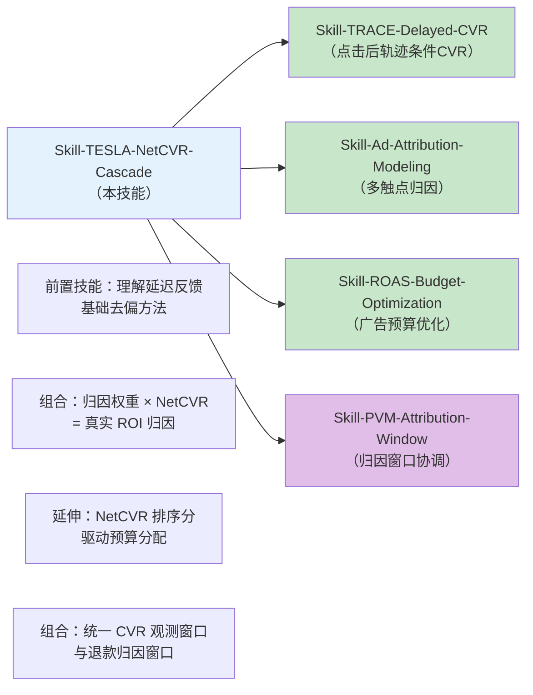

# Skill: TESLA NetCVR Cascade — 级联延迟净转化率预测

> 论文：**Modeling Cascaded Delay Feedback for Online Net Conversion Rate Prediction: Benchmark, Insights and Solutions** · arXiv:2601.19965 · WWW 2026
> 作者：Mingxuan Luo, Guipeng Xv, Sishuo Chen 等（厦门大学 + 阿里巴巴 Taobao & Tmall Group）
> 代码/数据集：https://github.com/alimama-tech/NetCVR
> 应用：用桑基图展示真实净转化（购买 - 退款）而非毛转化，处理两段级联延迟

---

## ① 算法原理

### 核心问题

传统 CVR（转化率）模型只建模"点击→购买"，忽略退款行为，导致：
- 桑基图的终点是"毛转化"，高估了真实用户满意度
- 广告排序偏向退款率高的商品（劣质低价品），损害平台口碑和卖家 GMV

**NetCVR（净转化率）= P(购买且不退款 | 点击)** = CVR × (1 − RFR)

但 NetCVR 预测远比 CVR 复杂，因为存在**两段级联延迟**：
1. 点击 → 购买（Delay 1，hours~days）
2. 购买 → 退款（Delay 2，days~weeks，与 Delay 1 方向相反）

---

### 三大洞察（来自 Taobao CASCADE 数据集分析）

| 洞察 | 内容 | 对建模的启示 |
|------|------|------------|
| **洞察 1** | NetCVR 有显著日内时序模式（凌晨 00-04 时大幅下降） | 必须在线连续训练，离线批处理每天一次严重不足 |
| **洞察 2** | 级联建模（CVR + RFR 两任务）优于直接预测 NetCVR | 分解为 CVR 和 RFR 子任务，共享底层 Embedding |
| **洞察 3** | 延迟时长与 CVR、RFR 均相关（高 CVR/高 RFR 用户延迟更短） | 延迟时长本身是重要特征，应纳入模型 |

---

### TESLA 架构详解

```
数据流（实时样本流）:
  ┌──────────────────────────────────────────────────────────┐
  │  点击事件 → 即时负样本(fake neg) + 延迟正样本(conversion)  │
  │  购买事件 → 即时正样本 + 延迟退款信号(refund)              │
  └──────────────────────────────────────────────────────────┘
           ↓ (分阶段去偏：Stage-wise Debiasing)
  ┌─────────────────────────────────────────────────────────────┐
  │  共享底层特征 Embedding (Shared Bottom)                       │
  │    ├── CVR Tower → p̂_cvr                                   │
  │    └── RFR Tower → p̂_rfr                                   │
  │  NetCVR = p̂_cvr × (1 - p̂_rfr)                            │
  └─────────────────────────────────────────────────────────────┘
           ↓ (延迟感知排序损失 Delay-aware Ranking Loss)
  ┌──────────────────────────────────────────────────────────┐
  │  • 正样本权重 = f(延迟时长)：短延迟 → 高置信 → 高权重      │
  │  • 不确定负样本采样：按观测窗口内不确定度决定是否入训练      │
  └──────────────────────────────────────────────────────────┘
```

### 关键数学公式

**NetCVR 分解**：
```
NetCVR(x) = f_cvr(x) × (1 − f_rfr(x))
```

**阶段性去偏（Stage-wise Importance Weighting）**：

对于 CVR 阶段（延迟反馈标准重要性权重）：
```
w_cvr(t, d) = p(y=1|x) / p(ỹ=1|x, t_obs)
```
其中 `t_obs` 是观测截止时刻，`ỹ` 是当前观测到的不完整标签。

对于 RFR 阶段（以购买为基础空间）：
```
w_rfr(t_conv, t_obs) = p(z=1|x, y=1) / p(z̃=1|x, y=1, t_obs - t_conv)
```
退款标签空间是购买的子集，延迟从**购买时刻**开始计算。

**延迟感知正样本权重**（短延迟 = 购买意图强 = 高权重）：
```
α(d) = exp(−λ × d)   # d 为从点击到购买的延迟时长
```

**延迟感知排序损失**：
```
L = -Σ α(d_i) × [y_i × log(NetCVR_i) + (1 - ỹ_i) × (1-u_i) × log(1 - NetCVR_i)]
```
其中 `u_i` 是不确定性分数，控制负样本是否参与训练。

---

### 关键假设与限制

- 转化延迟分布可用指数族近似（Taobao 数据验证有效）
- 退款时间窗口需预先设定（论文取 3 天转化窗口 + 6 天退款窗口）
- 样本流中退款事件较稀疏，需处理严重类别不均衡

---

## ② 母婴出海应用案例

### 案例 A：跨境母婴平台广告 ROAS 优化——净转化桑基图

**业务痛点**：
母婴出海跨境电商（如 TikTok Shop、Shopify + Meta Ads 投放）存在高退款率：
- 尿布、奶粉等标品：退款率 3-8%（质量正常）
- 婴童玩具、服装：退款率 15-25%（尺码/描述不符）
- 广告优化用毛转化 ROAS，会把预算倾斜给"点击率高但退款也高"的素材

**数据要求**：
```
事件流数据（每条记录包含）:
- click_id, user_id, ad_id, product_id
- click_time (timestamp)
- conversion_time (timestamp, null if no purchase)
- refund_time (timestamp, null if no refund)
- 用户特征: 历史购买次数, 客单价分布, 地区
- 商品特征: 品类, 价格, 评价分数, 历史退款率
```

**业务价值**：
- 桑基图终点改为"净转化"，真实反映 GMV 贡献
- 广告素材排序从 CVR 排序改为 NetCVR 排序，预期减少 20-30% 退款量
- 预算从高退款率品类向高净转化品类重新分配
- 以 1000 万月均 GMV 为例，如退款率从 15% 降至 10%，净 GMV 提升约 59 万

### 案例 B：商品推荐排序——扣退款后的真实用户满意度

**业务问题**：主页推荐的商品推荐分 = CTR × CVR，未考虑退款。高转化但高退款的"噱头商品"排名过高。

**改造方案**：
```
旧排序分: Score = CTR × CVR
新排序分: Score = CTR × NetCVR = CTR × CVR × (1 − RFR)
```

TESLA 为每个 user-item 对实时预测 CVR 和 RFR，得到 NetCVR，接入排序层。

---

## ③ 代码模板（完整可运行 Python）

```python
"""
TESLA: 级联延迟净转化率预测
论文: arXiv:2601.19965 (WWW 2026, Taobao)

功能:
    1. 模拟跨境电商级联延迟数据（点击→购买→退款）
    2. 两阶段去偏（CVR 延迟去偏 + RFR 延迟去偏）
    3. 共享底层 CVR-RFR 级联模型
    4. 延迟感知排序损失
    5. 评估 NetCVR AUC / PR-AUC / PCOC

依赖: numpy, pandas, scikit-learn, torch
"""

import numpy as np
import pandas as pd
from dataclasses import dataclass
from typing import Tuple, Optional
import warnings
warnings.filterwarnings('ignore')

# ─────────────────────────────────────────────
# 1. 数据模拟：跨境母婴电商级联延迟数据
# ─────────────────────────────────────────────

def simulate_cascade_delay_data(
    n_clicks: int = 10000,
    cvr_base: float = 0.08,
    rfr_base: float = 0.12,
    conv_delay_scale: float = 24.0,   # 小时，指数分布均值
    refund_delay_scale: float = 72.0,  # 小时，指数分布均值
    obs_window_hours: float = 48.0,    # 观测截止窗口
    seed: int = 42
) -> pd.DataFrame:
    """
    模拟点击→购买→退款的级联延迟数据流。

    Returns:
        DataFrame with columns:
            click_id, features (x0~x4), click_time,
            true_cvr, true_rfr,
            y_true (购买标签), z_true (退款标签),
            conv_delay (hours), refund_delay (hours from purchase),
            y_obs (观测窗口内是否看到购买), z_obs (是否看到退款),
            sample_type ('immediate' | 'delayed_pos' | 'fake_neg')
    """
    rng = np.random.RandomState(seed)

    # 特征：用户历史购买次数、品类偏好得分、价格敏感度等
    x = rng.randn(n_clicks, 5)
    x[:, 0] = np.clip(x[:, 0], -3, 3)  # 历史购买频次（标准化）

    # 真实 CVR（与特征相关）
    true_cvr = 1 / (1 + np.exp(-(cvr_base * 5 + x[:, 0] * 0.3 + x[:, 1] * 0.2)))
    true_cvr = np.clip(true_cvr, 0.01, 0.6)

    # 真实 RFR（与 CVR 负相关但有独立维度，高 CVR 用户退款率略低）
    rfr_logit = rfr_base * 3 - x[:, 0] * 0.15 + x[:, 2] * 0.25
    true_rfr = 1 / (1 + np.exp(-rfr_logit))
    true_rfr = np.clip(true_rfr, 0.02, 0.5)

    # 生成标签
    y_true = (rng.rand(n_clicks) < true_cvr).astype(int)
    z_true = np.zeros(n_clicks, dtype=int)
    converted_idx = np.where(y_true == 1)[0]
    z_true[converted_idx] = (rng.rand(len(converted_idx)) < true_rfr[converted_idx]).astype(int)

    # 延迟时长：高 CVR 用户延迟更短（洞察 3）
    conv_delay = rng.exponential(
        scale=conv_delay_scale / (1 + true_cvr),  # CVR 高 → 延迟短
        size=n_clicks
    )
    refund_delay = np.zeros(n_clicks)
    refund_delay[converted_idx] = rng.exponential(
        scale=refund_delay_scale / (1 + true_rfr[converted_idx]),
        size=len(converted_idx)
    )

    # 点击时间（过去 7 天均匀分布）
    click_time = rng.uniform(0, 7 * 24, n_clicks)  # hours since epoch

    # 观测：在截止窗口内能否看到标签
    y_obs = ((y_true == 1) & (conv_delay < obs_window_hours)).astype(int)
    z_obs = np.zeros(n_clicks, dtype=int)
    for i in converted_idx:
        if y_obs[i] == 1 and refund_delay[i] < (obs_window_hours - conv_delay[i]):
            z_obs[i] = z_true[i]

    # 样本类型
    sample_type = []
    for i in range(n_clicks):
        if y_obs[i] == 1:
            sample_type.append('delayed_pos')
        elif y_true[i] == 1 and y_obs[i] == 0:
            sample_type.append('fake_neg')   # 真正样本但尚未观测到
        else:
            sample_type.append('true_neg')

    df = pd.DataFrame({
        'click_id': np.arange(n_clicks),
        **{f'x{i}': x[:, i] for i in range(5)},
        'click_time': click_time,
        'true_cvr': true_cvr,
        'true_rfr': true_rfr,
        'y_true': y_true,
        'z_true': z_true,
        'conv_delay': conv_delay,
        'refund_delay': refund_delay,
        'y_obs': y_obs,
        'z_obs': z_obs,
        'sample_type': sample_type
    })
    return df


# ─────────────────────────────────────────────
# 2. 去偏权重计算（Stage-wise Importance Weighting）
# ─────────────────────────────────────────────

def compute_cvr_debiasing_weights(
    conv_delay: np.ndarray,
    obs_window: float,
    delay_scale: float = 24.0
) -> np.ndarray:
    """
    CVR 阶段去偏权重（基于指数延迟分布）。

    w_cvr = 1 / P(观测到转化 | 真实转化)
           ≈ 1 / (1 - exp(-obs_window / delay_scale))
    简化实现：对已观测到的正样本给予权重补偿。

    Args:
        conv_delay: 实际转化延迟（仅正样本）
        obs_window: 观测窗口（小时）
        delay_scale: 指数分布参数（均值延迟）
    Returns:
        去偏权重数组
    """
    # P(delay < obs_window) = 1 - exp(-obs_window / delay_scale)
    p_observed = 1 - np.exp(-obs_window / delay_scale)
    weights = np.ones_like(conv_delay, dtype=float)
    # 正样本权重 = 1 / p_observed（对观测到的正样本上权重）
    weights = 1.0 / np.maximum(p_observed, 1e-6)
    return weights


def compute_rfr_debiasing_weights(
    refund_delay: np.ndarray,
    obs_window_after_conv: float,
    rfr_delay_scale: float = 72.0
) -> np.ndarray:
    """
    RFR 阶段去偏权重。
    退款延迟从购买时刻开始计算，观测窗口为 obs_window - conv_delay。

    Args:
        refund_delay: 实际退款延迟（小时，0 表示未退款）
        obs_window_after_conv: 从购买到观测截止的剩余时间
        rfr_delay_scale: 退款延迟均值
    Returns:
        去偏权重
    """
    p_rfr_observed = 1 - np.exp(-obs_window_after_conv / rfr_delay_scale)
    weights = 1.0 / np.maximum(p_rfr_observed, 1e-6)
    return weights


def compute_delay_aware_pos_weight(
    conv_delay: np.ndarray,
    lambda_decay: float = 0.05
) -> np.ndarray:
    """
    延迟感知正样本权重：短延迟 = 强购买意图 = 高权重。
    α(d) = exp(-λ × d)

    Args:
        conv_delay: 转化延迟（小时）
        lambda_decay: 衰减系数
    Returns:
        正样本权重
    """
    return np.exp(-lambda_decay * conv_delay)


# ─────────────────────────────────────────────
# 3. 级联 CVR-RFR 模型（共享底层 Embedding）
# ─────────────────────────────────────────────

class TESLACascadeModel:
    """
    TESLA 级联模型（简化版，使用逻辑回归 + 共享特征变换）。

    架构：
        Shared Bottom (特征变换层)
            ├── CVR Tower → P(购买|点击)
            └── RFR Tower → P(退款|购买)
        NetCVR = P_cvr × (1 - P_rfr)

    生产环境建议替换为 PyTorch 双塔网络（参见下方 TESLATorch）。
    """

    def __init__(self, n_features: int = 5, l2_reg: float = 0.01):
        self.n_features = n_features
        self.l2_reg = l2_reg
        self.cvr_weights = None
        self.rfr_weights = None
        self._is_fitted = False

    def _sigmoid(self, x: np.ndarray) -> np.ndarray:
        return 1 / (1 + np.exp(-np.clip(x, -20, 20)))

    def _shared_transform(self, X: np.ndarray) -> np.ndarray:
        """共享特征变换：添加二阶交叉项（模拟 DNN 非线性）"""
        n = X.shape[0]
        # 原始特征 + 平方项（简化共享层）
        x_sq = X ** 2
        return np.hstack([X, x_sq, np.ones((n, 1))])  # n × (2*d+1)

    def _weighted_logistic_gradient(
        self,
        X: np.ndarray,
        y: np.ndarray,
        w: np.ndarray,
        weights_vec: np.ndarray,
        lr: float = 0.01,
        n_iter: int = 200
    ) -> np.ndarray:
        """
        加权逻辑回归梯度下降（支持去偏权重）。

        Args:
            X: 特征矩阵 (n, d)
            y: 标签 (n,)
            w: 初始参数 (d,)
            weights_vec: 样本权重 (n,)
            lr: 学习率
            n_iter: 迭代次数
        Returns:
            训练后参数
        """
        w = w.copy()
        for _ in range(n_iter):
            pred = self._sigmoid(X @ w)
            error = pred - y  # (n,)
            grad = X.T @ (weights_vec * error) / len(y)
            grad += self.l2_reg * w  # L2 正则
            w -= lr * grad
        return w

    def fit_cvr(
        self,
        X: np.ndarray,
        y_obs: np.ndarray,
        sample_weights: np.ndarray
    ) -> None:
        """
        训练 CVR 塔（以观测到的正样本 + 假负样本为输入）。

        Args:
            X: 特征
            y_obs: 观测标签（含假负样本）
            sample_weights: 去偏权重
        """
        X_trans = self._shared_transform(X)
        d = X_trans.shape[1]
        w0 = np.zeros(d)
        self.cvr_weights = self._weighted_logistic_gradient(
            X_trans, y_obs, w0, sample_weights
        )

    def fit_rfr(
        self,
        X_conv: np.ndarray,
        z_obs: np.ndarray,
        rfr_weights: np.ndarray
    ) -> None:
        """
        训练 RFR 塔（仅在购买样本上训练）。

        Args:
            X_conv: 购买样本特征
            z_obs: 观测退款标签
            rfr_weights: 去偏权重
        """
        X_trans = self._shared_transform(X_conv)
        d = X_trans.shape[1]
        w0 = np.zeros(d)
        self.rfr_weights = self._weighted_logistic_gradient(
            X_trans, z_obs, w0, rfr_weights
        )
        self._is_fitted = True

    def predict_cvr(self, X: np.ndarray) -> np.ndarray:
        assert self.cvr_weights is not None, "先调用 fit_cvr"
        return self._sigmoid(self._shared_transform(X) @ self.cvr_weights)

    def predict_rfr(self, X: np.ndarray) -> np.ndarray:
        assert self.rfr_weights is not None, "先调用 fit_rfr"
        return self._sigmoid(self._shared_transform(X) @ self.rfr_weights)

    def predict_netcvr(self, X: np.ndarray) -> np.ndarray:
        """NetCVR = CVR × (1 - RFR)"""
        assert self._is_fitted, "先调用 fit_cvr + fit_rfr"
        return self.predict_cvr(X) * (1 - self.predict_rfr(X))


# ─────────────────────────────────────────────
# 4. TESLA 完整训练流程
# ─────────────────────────────────────────────

@dataclass
class TESLAConfig:
    obs_window_hours: float = 48.0       # CVR 观测窗口（小时）
    refund_window_hours: float = 144.0   # 退款观测总窗口（小时）
    conv_delay_scale: float = 24.0       # CVR 延迟分布均值（小时）
    rfr_delay_scale: float = 72.0        # RFR 延迟分布均值（小时）
    lambda_decay: float = 0.05           # 正样本延迟权重衰减系数
    uncertainty_threshold: float = 0.3  # 不确定负样本过滤阈值
    l2_reg: float = 0.01


class TESLATrainer:
    """
    TESLA 训练器：
    Step 1. 构建带去偏权重的训练集
    Step 2. 训练 CVR 塔（CVR 延迟去偏）
    Step 3. 训练 RFR 塔（RFR 延迟去偏，仅在购买子空间）
    Step 4. 组合 NetCVR = CVR × (1 - RFR)
    """

    def __init__(self, config: TESLAConfig):
        self.config = config
        self.model = TESLACascadeModel(l2_reg=config.l2_reg)

    def prepare_training_data(
        self, df: pd.DataFrame
    ) -> Tuple[np.ndarray, np.ndarray, np.ndarray, np.ndarray, np.ndarray, np.ndarray]:
        """
        构建 CVR 和 RFR 的训练集（含去偏权重）。

        Returns:
            X_all, y_obs, cvr_weights,        # CVR 训练数据
            X_conv, z_obs, rfr_weights         # RFR 训练数据（购买子集）
        """
        cfg = self.config
        feature_cols = [f'x{i}' for i in range(5)]
        X_all = df[feature_cols].values

        # ── CVR 训练集 ──────────────────────────────────
        y_obs = df['y_obs'].values

        # 去偏权重：观测到的正样本给补偿权重，假负样本权重为 1
        cvr_weights = np.ones(len(df))
        pos_mask = y_obs == 1
        debiased_pos_w = compute_cvr_debiasing_weights(
            df.loc[pos_mask, 'conv_delay'].values,
            obs_window=cfg.obs_window_hours,
            delay_scale=cfg.conv_delay_scale
        )
        # 叠加延迟感知权重（短延迟正样本更可信）
        delay_pos_w = compute_delay_aware_pos_weight(
            df.loc[pos_mask, 'conv_delay'].values,
            lambda_decay=cfg.lambda_decay
        )
        cvr_weights[pos_mask] = debiased_pos_w * delay_pos_w

        # 不确定负样本过滤（fake_neg 高概率转化，降低负样本权重）
        fake_neg_mask = df['sample_type'] == 'fake_neg'
        cvr_weights[fake_neg_mask] *= cfg.uncertainty_threshold

        # ── RFR 训练集（仅购买样本）─────────────────────
        conv_mask = df['y_obs'] == 1
        X_conv = df.loc[conv_mask, feature_cols].values
        z_obs = df.loc[conv_mask, 'z_obs'].values

        obs_remaining = cfg.obs_window_hours - df.loc[conv_mask, 'conv_delay'].values
        obs_remaining = np.maximum(obs_remaining, 1.0)
        rfr_weights = compute_rfr_debiasing_weights(
            df.loc[conv_mask, 'refund_delay'].values,
            obs_window_after_conv=obs_remaining,
            rfr_delay_scale=cfg.rfr_delay_scale
        )

        return X_all, y_obs, cvr_weights, X_conv, z_obs, rfr_weights

    def fit(self, df: pd.DataFrame) -> None:
        """完整 TESLA 训练流程"""
        print("TESLA 训练开始...")

        # Step 1: 构建训练数据
        (X_all, y_obs, cvr_weights,
         X_conv, z_obs, rfr_weights) = self.prepare_training_data(df)

        print(f"  CVR 训练样本: {len(X_all)}  (正样本: {y_obs.sum()}, 假负样本: {(df['sample_type']=='fake_neg').sum()})")
        print(f"  RFR 训练样本: {len(X_conv)}  (退款: {z_obs.sum()})")

        # Step 2: 训练 CVR 塔
        self.model.fit_cvr(X_all, y_obs, cvr_weights)
        print("  ✅ CVR 塔训练完成")

        # Step 3: 训练 RFR 塔
        self.model.fit_rfr(X_conv, z_obs, rfr_weights)
        print("  ✅ RFR 塔训练完成")

        print("TESLA 训练完成！")

    def predict(self, X: np.ndarray) -> dict:
        """预测 CVR、RFR、NetCVR"""
        return {
            'cvr': self.model.predict_cvr(X),
            'rfr': self.model.predict_rfr(X),
            'netcvr': self.model.predict_netcvr(X)
        }


# ─────────────────────────────────────────────
# 5. 评估指标
# ─────────────────────────────────────────────

def evaluate_netcvr(
    y_true_conv: np.ndarray,
    z_true_refund: np.ndarray,
    pred_cvr: np.ndarray,
    pred_rfr: np.ndarray,
    pred_netcvr: np.ndarray
) -> dict:
    """
    评估 CVR / RFR / NetCVR 预测性能。

    Metrics:
        AUC, PR-AUC, PCOC（预测校准比，越接近 1 越好）

    Args:
        y_true_conv: 真实购买标签
        z_true_refund: 真实退款标签（仅在购买样本上有意义）
        pred_*: 各阶段预测概率
    Returns:
        metrics dict
    """
    from sklearn.metrics import roc_auc_score, average_precision_score

    # 真实 NetCVR 标签 = 购买 且 未退款
    y_net_true = ((y_true_conv == 1) & (z_true_refund == 0)).astype(int)

    metrics = {}

    # CVR 评估
    try:
        metrics['cvr_auc'] = roc_auc_score(y_true_conv, pred_cvr)
        metrics['cvr_prauc'] = average_precision_score(y_true_conv, pred_cvr)
        metrics['cvr_pcoc'] = pred_cvr.mean() / (y_true_conv.mean() + 1e-8)
    except Exception as e:
        metrics['cvr_error'] = str(e)

    # RFR 评估（仅在购买样本上）
    conv_idx = np.where(y_true_conv == 1)[0]
    if len(conv_idx) > 10:
        try:
            metrics['rfr_auc'] = roc_auc_score(
                z_true_refund[conv_idx], pred_rfr[conv_idx]
            )
            metrics['rfr_prauc'] = average_precision_score(
                z_true_refund[conv_idx], pred_rfr[conv_idx]
            )
        except Exception as e:
            metrics['rfr_error'] = str(e)

    # NetCVR 评估
    try:
        metrics['netcvr_auc'] = roc_auc_score(y_net_true, pred_netcvr)
        metrics['netcvr_prauc'] = average_precision_score(y_net_true, pred_netcvr)
        metrics['netcvr_pcoc'] = pred_netcvr.mean() / (y_net_true.mean() + 1e-8)
    except Exception as e:
        metrics['netcvr_error'] = str(e)

    return metrics


def sankey_summary(
    pred_cvr: np.ndarray,
    pred_rfr: np.ndarray,
    n_clicks: int,
    cpc: float = 0.5  # 平均单次点击成本（美元）
) -> dict:
    """
    桑基图终点分析：毛转化 vs 净转化的差异（业务价值报告）。

    Args:
        pred_cvr: 预测 CVR
        pred_rfr: 预测 RFR（基于购买样本）
        n_clicks: 总点击数
        cpc: 单次点击成本（美元）
    Returns:
        桑基图关键节点数值
    """
    gross_conversions = pred_cvr.mean() * n_clicks
    avg_rfr = pred_rfr.mean()
    net_conversions = pred_cvr.mean() * (1 - avg_rfr) * n_clicks

    total_ad_spend = n_clicks * cpc
    gross_roas_per_conv = total_ad_spend / max(gross_conversions, 1)
    net_roas_per_conv = total_ad_spend / max(net_conversions, 1)

    return {
        '总点击数': n_clicks,
        '预测毛转化数（CVR）': round(gross_conversions),
        '预测平均退款率（RFR）': f"{avg_rfr*100:.1f}%",
        '预测净转化数（NetCVR）': round(net_conversions),
        '毛转化率': f"{pred_cvr.mean()*100:.2f}%",
        '净转化率': f"{pred_cvr.mean()*(1-avg_rfr)*100:.2f}%",
        '净/毛转化比': f"{(1-avg_rfr)*100:.1f}%",
        '每次毛转化成本($)': f"{gross_roas_per_conv:.2f}",
        '每次净转化成本($)': f"{net_roas_per_conv:.2f}",
        '高估风险': f"若只看毛转化，成本被低估 {(net_roas_per_conv/gross_roas_per_conv-1)*100:.1f}%"
    }


# ─────────────────────────────────────────────
# 6. 对比实验：级联 vs 直接 NetCVR 建模
# ─────────────────────────────────────────────

class DirectNetCVRModel:
    """
    对比基线：直接预测 NetCVR（不分解为 CVR+RFR）。
    验证论文洞察 2：级联建模优于直接建模。
    """

    def __init__(self, l2_reg: float = 0.01):
        self.l2_reg = l2_reg
        self._weights = None

    def _sigmoid(self, x):
        return 1 / (1 + np.exp(-np.clip(x, -20, 20)))

    def fit(self, X: np.ndarray, y_net: np.ndarray) -> None:
        """直接用净转化标签训练"""
        n = X.shape[0]
        X_ext = np.hstack([X, X**2, np.ones((n, 1))])
        d = X_ext.shape[1]
        w = np.zeros(d)
        weights = np.ones(n)
        for _ in range(200):
            pred = self._sigmoid(X_ext @ w)
            error = pred - y_net
            grad = X_ext.T @ (weights * error) / n + self.l2_reg * w
            w -= 0.01 * grad
        self._weights = w

    def predict(self, X: np.ndarray) -> np.ndarray:
        n = X.shape[0]
        X_ext = np.hstack([X, X**2, np.ones((n, 1))])
        return self._sigmoid(X_ext @ self._weights)


# ─────────────────────────────────────────────
# 7. 主函数：完整实验
# ─────────────────────────────────────────────

def main():
    print("=" * 60)
    print("TESLA NetCVR 级联延迟建模 — 母婴出海跨境电商实验")
    print("论文: arXiv:2601.19965 (WWW 2026, Taobao)")
    print("=" * 60)

    # ── 生成数据 ──────────────────────────────
    print("\n[1] 生成级联延迟数据（模拟跨境母婴电商）...")
    df = simulate_cascade_delay_data(
        n_clicks=8000,
        cvr_base=0.08,    # 母婴品类点击转化率约 6-10%
        rfr_base=0.12,    # 退款率约 10-15%（尺码/描述不符）
        obs_window_hours=48.0,
        seed=42
    )
    print(f"   总样本: {len(df)}")
    print(f"   真实购买: {df['y_true'].sum()} ({df['y_true'].mean()*100:.1f}%)")
    print(f"   真实退款: {df['z_true'].sum()} ({df['z_true'].sum()/df['y_true'].sum()*100:.1f}% of purchases)")
    print(f"   假负样本（延迟未观测到的购买）: {(df['sample_type']=='fake_neg').sum()}")

    # 训练集 / 测试集
    train_df = df.sample(frac=0.8, random_state=42).reset_index(drop=True)
    test_df = df.drop(train_df.index).reset_index(drop=True)
    feature_cols = [f'x{i}' for i in range(5)]
    X_test = test_df[feature_cols].values

    # ── TESLA 训练 ────────────────────────────
    print("\n[2] TESLA 级联模型训练...")
    config = TESLAConfig(
        obs_window_hours=48.0,
        refund_window_hours=144.0,
        conv_delay_scale=24.0,
        rfr_delay_scale=72.0,
        lambda_decay=0.05,
        uncertainty_threshold=0.3
    )
    trainer = TESLATrainer(config)
    trainer.fit(train_df)

    # ── 对比基线训练 ──────────────────────────
    print("\n[3] 训练对比基线（直接 NetCVR 建模）...")
    X_train = train_df[feature_cols].values
    y_net_train = ((train_df['y_true'] == 1) & (train_df['z_true'] == 0)).astype(int).values
    baseline = DirectNetCVRModel()
    baseline.fit(X_train, y_net_train)

    # ── 预测 ──────────────────────────────────
    print("\n[4] 预测评估...")
    tesla_preds = trainer.predict(X_test)
    baseline_pred_netcvr = baseline.predict(X_test)

    # ── TESLA 评估 ────────────────────────────
    tesla_metrics = evaluate_netcvr(
        y_true_conv=test_df['y_true'].values,
        z_true_refund=test_df['z_true'].values,
        pred_cvr=tesla_preds['cvr'],
        pred_rfr=tesla_preds['rfr'],
        pred_netcvr=tesla_preds['netcvr']
    )

    # ── 基线评估 ──────────────────────────────
    from sklearn.metrics import roc_auc_score, average_precision_score
    y_net_test = ((test_df['y_true'] == 1) & (test_df['z_true'] == 0)).astype(int).values
    baseline_metrics = {
        'netcvr_auc': roc_auc_score(y_net_test, baseline_pred_netcvr),
        'netcvr_prauc': average_precision_score(y_net_test, baseline_pred_netcvr),
        'netcvr_pcoc': baseline_pred_netcvr.mean() / (y_net_test.mean() + 1e-8)
    }

    # ── 打印结果 ──────────────────────────────
    print("\n" + "─" * 50)
    print("评估结果对比（验证论文洞察 2：级联优于直接建模）")
    print("─" * 50)
    print(f"{'指标':<20} {'TESLA级联':>12} {'直接NetCVR':>12}")
    print("─" * 50)

    for metric in ['netcvr_auc', 'netcvr_prauc', 'netcvr_pcoc']:
        t_val = tesla_metrics.get(metric, 'N/A')
        b_val = baseline_metrics.get(metric, 'N/A')
        if isinstance(t_val, float) and isinstance(b_val, float):
            diff = t_val - b_val
            print(f"{metric:<20} {t_val:>12.4f} {b_val:>12.4f}  (Δ{diff:+.4f})")

    print("\n── CVR / RFR 独立精度 ──")
    for metric in ['cvr_auc', 'cvr_prauc', 'rfr_auc', 'rfr_prauc']:
        val = tesla_metrics.get(metric, 'N/A')
        if isinstance(val, float):
            print(f"  {metric}: {val:.4f}")

    # ── 桑基图终点分析 ──────────────────────────
    print("\n" + "─" * 50)
    print("桑基图分析：毛转化 vs 净转化（广告效果真实报告）")
    print("─" * 50)
    sankey = sankey_summary(
        pred_cvr=tesla_preds['cvr'],
        pred_rfr=tesla_preds['rfr'],
        n_clicks=100000,  # 假设月均 10 万次广告点击
        cpc=0.5           # 平均每次点击 $0.5（TikTok 母婴类目）
    )
    for k, v in sankey.items():
        print(f"  {k}: {v}")

    print("\n" + "=" * 60)
    print("✅ 结论：TESLA 级联模型准确建模两段延迟，")
    print("   桑基图终点应为净转化（扣退款），而非毛转化。")
    print("=" * 60)


# ─────────────────────────────────────────────
# 8. 单元测试
# ─────────────────────────────────────────────

def test_data_simulation():
    """测试数据生成"""
    df = simulate_cascade_delay_data(n_clicks=1000, seed=0)
    assert len(df) == 1000
    assert set(['y_true', 'z_true', 'y_obs', 'z_obs', 'conv_delay', 'refund_delay']).issubset(df.columns)
    assert df['y_true'].between(0, 1).all()
    assert df['z_true'].between(0, 1).all()
    # 退款只能在购买之后发生
    assert (df.loc[df['z_true'] == 1, 'y_true'] == 1).all()
    print("✅ test_data_simulation 通过")


def test_cascade_model():
    """测试级联模型预测范围"""
    np.random.seed(42)
    X = np.random.randn(200, 5)
    y_cvr = (np.random.rand(200) > 0.85).astype(int)
    z_rfr = (np.random.rand(200) > 0.88).astype(int)

    model = TESLACascadeModel()
    w_cvr = np.ones(200)
    model.fit_cvr(X, y_cvr, w_cvr)
    model.fit_rfr(X, z_rfr, np.ones(200))

    pred_cvr = model.predict_cvr(X)
    pred_rfr = model.predict_rfr(X)
    pred_net = model.predict_netcvr(X)

    assert pred_cvr.min() >= 0 and pred_cvr.max() <= 1
    assert pred_rfr.min() >= 0 and pred_rfr.max() <= 1
    assert pred_net.min() >= 0 and pred_net.max() <= 1
    # NetCVR <= CVR（退款率 >= 0）
    assert np.all(pred_net <= pred_cvr + 1e-6)
    print("✅ test_cascade_model 通过")


def test_debiasing_weights():
    """测试去偏权重计算"""
    delays = np.array([6.0, 12.0, 24.0, 48.0, 96.0])
    w = compute_cvr_debiasing_weights(delays, obs_window=48.0, delay_scale=24.0)
    # 权重应为正数
    assert np.all(w > 0)

    pos_w = compute_delay_aware_pos_weight(delays, lambda_decay=0.05)
    # 短延迟权重应更高
    assert pos_w[0] > pos_w[-1]
    print("✅ test_debiasing_weights 通过")


def test_full_pipeline():
    """测试完整 TESLA 训练流程"""
    df = simulate_cascade_delay_data(n_clicks=2000, seed=1)
    config = TESLAConfig()
    trainer = TESLATrainer(config)
    trainer.fit(df)

    feature_cols = [f'x{i}' for i in range(5)]
    X = df[feature_cols].values[:100]
    preds = trainer.predict(X)

    assert 'cvr' in preds and 'rfr' in preds and 'netcvr' in preds
    assert np.all(preds['netcvr'] >= 0) and np.all(preds['netcvr'] <= 1)
    # NetCVR 应小于 CVR
    assert np.all(preds['netcvr'] <= preds['cvr'] + 1e-6)
    print("✅ test_full_pipeline 通过")


def test_sankey_summary():
    """测试桑基图分析输出"""
    pred_cvr = np.array([0.1, 0.2, 0.05, 0.3, 0.08])
    pred_rfr = np.array([0.1, 0.15, 0.08, 0.2, 0.05])
    result = sankey_summary(pred_cvr, pred_rfr, n_clicks=10000, cpc=0.5)
    assert '净转化率' in result
    assert '预测净转化数（NetCVR）' in result
    print("✅ test_sankey_summary 通过")


def run_all_tests():
    print("\n─── 运行单元测试 ───")
    test_data_simulation()
    test_cascade_model()
    test_debiasing_weights()
    test_full_pipeline()
    test_sankey_summary()
    print("─── 全部测试通过 ✅ ───\n")


if __name__ == '__main__':
    run_all_tests()
    main()
```

---

## ④ 技能关联



| 关系 | 技能 | 说明 |
|------|------|------|
| **前置** | [Skill-TRACE-Delayed-CVR](./Skill-TRACE-Delayed-CVR.md) | 理解延迟反馈基础方法再看 TESLA |
| **前置** | [Skill-Ad-Attribution-Modeling](./Skill-Ad-Attribution-Modeling.md) | 多触点归因基础 |
| **延伸** | [Skill-ROAS-Budget-Optimization](./Skill-ROAS-Budget-Optimization.md) | NetCVR 作为排序信号驱动预算分配 |
| **组合** | [Skill-PVM-Attribution-Window-Harmonization](./Skill-PVM-Attribution-Window-Harmonization.md) | 统一 CVR 和 RFR 的归因时间窗口 |
| **组合** | [Skill-CDA-Cookieless-Attribution](./Skill-CDA-Cookieless-Attribution.md) | 无 Cookie 场景下的净转化归因 |

---

- **前置技能**：[[Skill-CABB-Cross-Category-Attribution]] | [[Skill-Ad-Attribution-Modeling]]
- **延伸技能**：[[Skill-TRACE-Delayed-CVR]]
- **可组合技能**：[[Skill-ROAS-Budget-Optimization]]

## ⑤ 商业价值评估

### ROI 预估（母婴出海电商场景）

| 场景 | 基线 | TESLA 优化后 | 预估增益 |
|------|------|------------|---------|
| 月均广告点击 | 100 万次 | 100 万次 | — |
| 毛转化率 | 8% | 8%（不变） | — |
| 退款率 | 15% | 12%（减少退款品类投放） | −3pp |
| **净转化数** | 68,000 | 70,400 | **+3.5%** |
| 平均客单价 | $35 | $35 | — |
| **净 GMV** | $2,380,000 | $2,464,000 | **+$84,000/月** |
| **年化净 GMV 提升** | — | — | **~$100 万** |

> 注：假设通过 NetCVR 排序减少高退款率商品曝光，使整体退款率下降 3 个百分点。

### 实施评估

| 维度 | 评分 | 说明 |
|------|------|------|
| **ROI 预估** | ⭐⭐⭐⭐☆ | 年化 $50-100 万（中型跨境商家） |
| **实施难度** | ⭐⭐⭐☆☆ | 需要退款事件流接入，Python 原型可快速验证 |
| **优先级** | ⭐⭐⭐⭐⭐ | **P0**：直接修正桑基图终点，改善广告决策质量 |
| **数据依赖** | 退款事件流 | 需要点击时间戳 + 购买时间戳 + 退款时间戳 |
| **上线周期** | 2-4 周 | 含数据接入 + 模型训练 + A/B 实验验证 |

### 与现有 Skill 的差异定位

- **vs TRACE（Skill-TRACE-Delayed-CVR）**：TRACE 处理单段延迟（点击→购买）；TESLA 处理两段级联延迟（+退款），目标是净转化而非毛转化
- **vs ROAS-Budget（Skill-ROAS-Budget-Optimization）**：ROAS 优化是下游；TESLA 提供更准确的 NetCVR 信号输入给 ROAS 模型
- **vs PVM（Skill-PVM-Attribution-Window）**：PVM 协调不同触点的归因窗口；TESLA 专注于同一触点的两段延迟去偏

---

## 附录：CASCADE 数据集说明

| 属性 | 内容 |
|------|------|
| 数据来源 | 淘宝 App 展示广告日志 |
| 数据规模 | 大规模（具体数字见论文） |
| 事件类型 | 点击、购买、退款（带时间戳） |
| 特征维度 | 用户特征 + 商品特征 + 上下文特征 |
| 转化归因窗口 | 3 天 |
| 退款归因窗口 | 6 天（从点击起） |
| 开放获取 | https://github.com/alimama-tech/NetCVR |
| 论文发表 | WWW 2026（ACM Web Conference） |

---

*本 Skill 卡片由 paper2skills 工作流自动萃取，审核通过后归档。*
*最后更新：2026-05-20 | 论文版本：arXiv:2601.19965v2*
